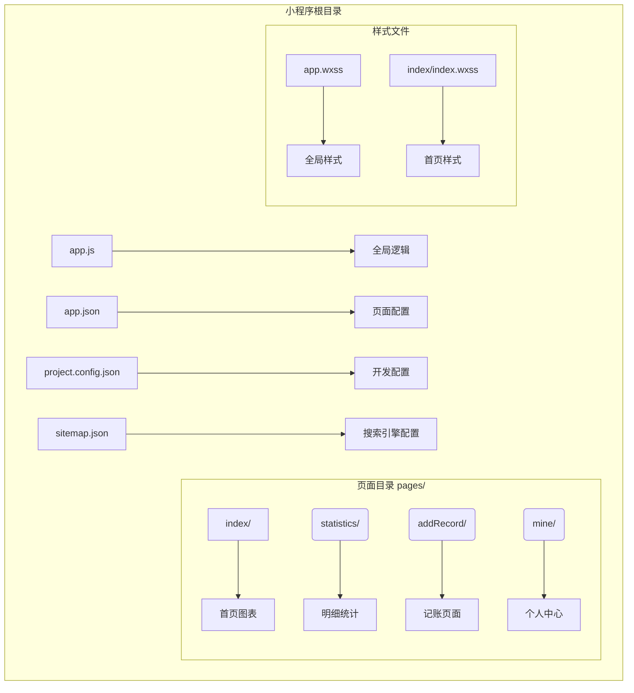
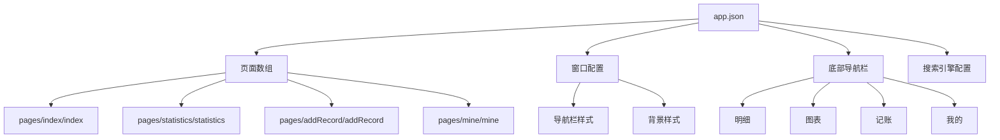
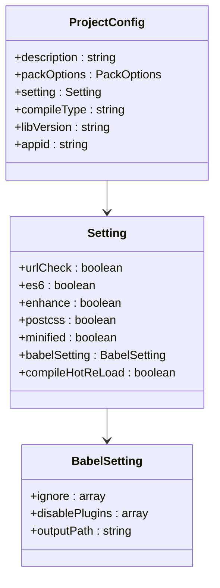
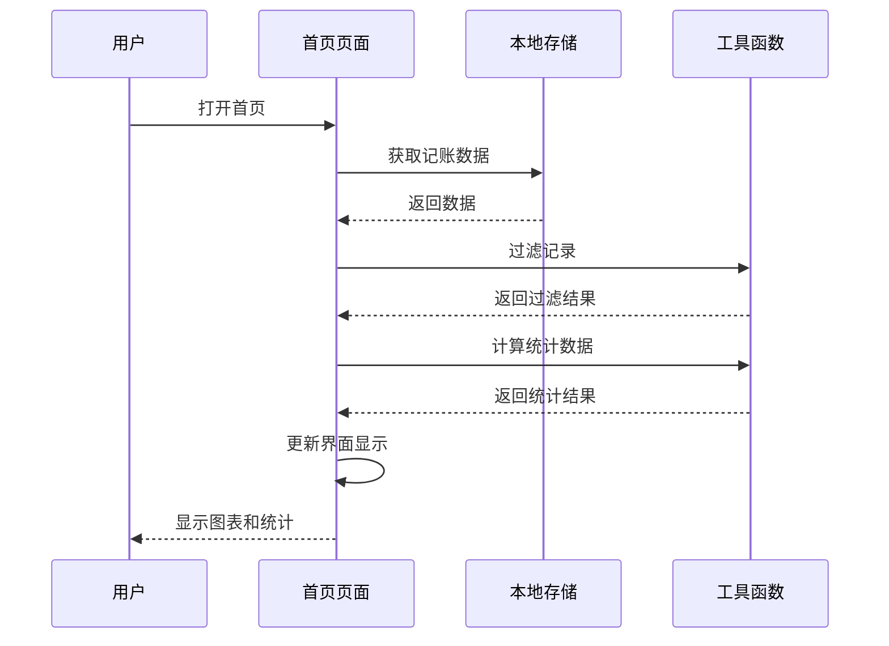
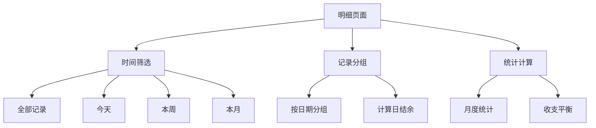
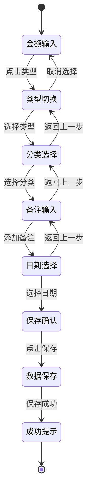
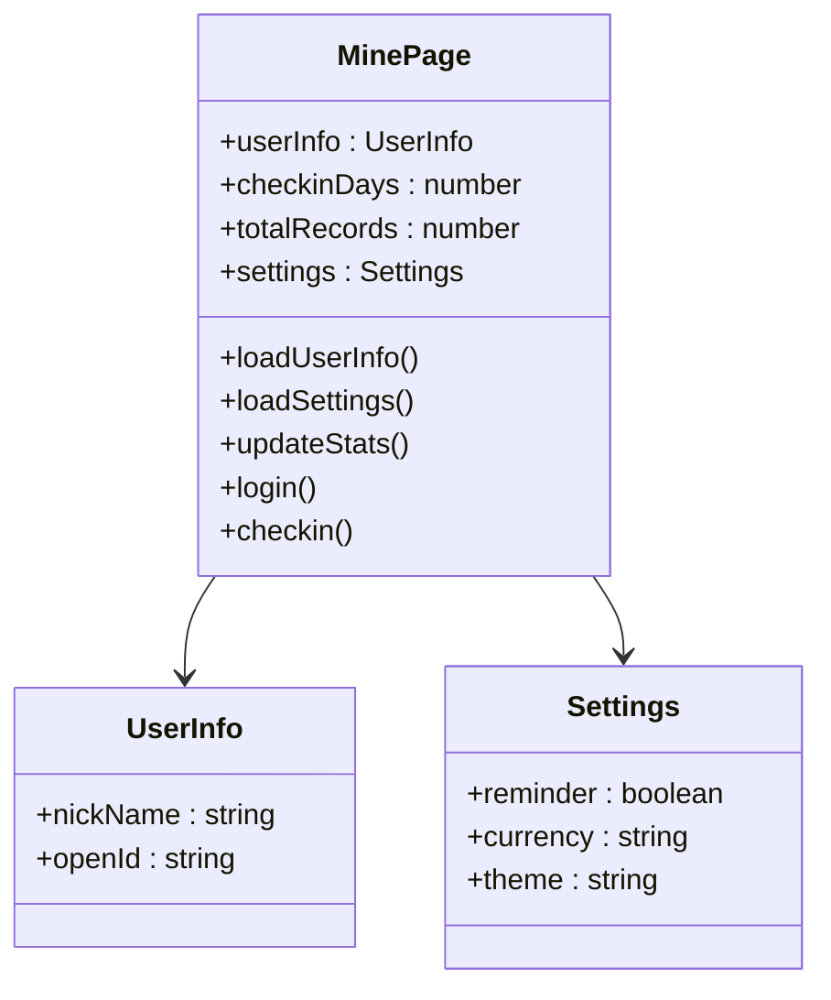

# 快速开始

<cite>
**本文档引用的文件**
- [app.js](file://app.js)
- [app.json](file://app.json)
- [project.config.json](file://project.config.json)
- [project.private.config.json](file://project.private.config.json)
- [sitemap.json](file://sitemap.json)
- [pages/index/index.js](file://pages/index/index.js)
- [pages/statistics/statistics.js](file://pages/statistics/statistics.js)
- [pages/addRecord/addRecord.js](file://pages/addRecord/addRecord.js)
- [pages/mine/mine.js](file://pages/mine/mine.js)
- [pages/index/index.wxml](file://pages/index/index.wxml)
- [pages/statistics/statistics.wxml](file://pages/statistics/statistics.wxml)
- [pages/addRecord/addRecord.wxml](file://pages/addRecord/addRecord.wxml)
- [app.wxss](file://app.wxss)
- [pages/index/index.wxss](file://pages/index/index.wxss)
</cite>

## 目录
1. [简介](#简介)
2. [项目结构](#项目结构)
3. [开发环境准备](#开发环境准备)
4. [项目克隆与初始化](#项目克隆与初始化)
5. [核心配置文件详解](#核心配置文件详解)
6. [功能模块概览](#功能模块概览)
7. [开发工具配置](#开发工具配置)
8. [调试技巧](#调试技巧)
9. [常见问题解决](#常见问题解决)
10. [总结](#总结)

## 简介

杪记是一款基于微信小程序框架开发的个人记账应用，采用原生小程序技术栈构建。该应用提供了完整的记账功能，包括收支记录管理、数据分析统计、分类管理等核心功能，界面简洁美观，用户体验友好。

应用采用模块化设计，主要包含以下核心页面：
- **首页图表页**：展示收支统计图表和分类占比分析
- **明细统计页**：提供详细的交易记录列表和时间筛选功能
- **记账页面**：支持快速记账，包含数字键盘输入和分类选择
- **我的页面**：用户信息展示和基础设置功能

## 项目结构

项目采用标准的小程序目录结构，整体架构清晰合理：



**图表来源**
- [app.js:1-24](file://app.js#L1-L24)
- [app.json:1-39](file://app.json#L1-L39)
- [project.config.json:1-77](file://project.config.json#L1-L77)

**章节来源**
- [app.js:1-24](file://app.js#L1-L24)
- [app.json:1-39](file://app.json#L1-L39)
- [project.config.json:1-77](file://project.config.json#L1-L77)

## 开发环境准备

### 微信开发者工具安装

1. **下载工具**
   - 访问微信公众平台官网
   - 下载最新版本的微信开发者工具
   - 支持Windows、macOS和Linux系统

2. **安装配置**
   - 安装完成后启动工具
   - 使用微信扫码登录
   - 首次使用需要设置项目目录

3. **项目设置**
   - 选择"小程序"类型
   - 设置项目名称：`miaobill`
   - 选择项目目录为解压后的项目文件夹
   - 语言选择JavaScript
   - 不勾选"不使用ES6转ES5"

### Node.js环境要求

- **版本要求**：建议使用Node.js 14.x或更高版本
- **npm版本**：建议使用npm 6.x或更高版本
- **验证安装**：在命令行中执行 `node -v` 和 `npm -v`

### 开发工具推荐

1. **编辑器选择**
   - VS Code（推荐）
   - WebStorm
   - Sublime Text

2. **插件推荐**
   - 微信小程序开发插件
   - WXML格式化插件
   - WXSS格式化插件
   - ESLint JavaScript检查

## 项目克隆与初始化

### 方式一：直接导入现有项目

1. **打开微信开发者工具**
   - 启动微信开发者工具
   - 点击"新建项目"

2. **配置项目信息**
   ```
   项目名称：miaobill
   项目目录：选择项目文件夹路径
   AppID：填写你的小程序AppID（开发版）
   ```

3. **初始化项目**
   - 点击"新建"
   - 工具会自动识别小程序配置文件
   - 等待项目加载完成

### 方式二：Git克隆方式

1. **克隆项目**
   ```bash
   git clone <repository-url>
   cd miaobill
   ```

2. **安装依赖**
   ```bash
   npm install
   # 或
   yarn install
   ```

3. **导入到开发者工具**
   - 在微信开发者工具中选择"导入项目"
   - 选择项目根目录
   - 确认项目配置

### 项目初始化步骤

1. **首次启动检查**
   - 确认所有配置文件存在
   - 检查网络连接状态
   - 验证AppID配置正确

2. **编译项目**
   - 点击工具栏"编译"按钮
   - 等待编译完成
   - 查看控制台是否有错误提示

3. **预览项目**
   - 点击"预览"按钮
   - 使用微信扫描二维码
   - 在手机上查看效果

**章节来源**
- [project.config.json:1-77](file://project.config.json#L1-L77)
- [project.private.config.json:1-22](file://project.private.config.json#L1-L22)

## 核心配置文件详解

### app.json 应用配置

应用配置文件定义了小程序的整体结构和页面路由：



**图表来源**
- [app.json:1-39](file://app.json#L1-L39)

**关键配置项说明**：

1. **pages数组**：定义小程序的所有页面路径
2. **window配置**：设置导航栏外观和背景
3. **tabBar配置**：定义底部导航栏的四个页面
4. **sitemapLocation**：指定搜索引擎配置文件位置

### project.config.json 开发配置

开发配置文件包含了丰富的开发工具设置：



**图表来源**
- [project.config.json:1-77](file://project.config.json#L1-L77)

**重要设置项**：

1. **setting.urlCheck**：启用URL校验功能
2. **setting.es6**：启用ES6转ES5编译
3. **setting.minified**：启用代码压缩
4. **setting.minifyWXSS**：启用WXSS压缩
5. **setting.compileHotReLoad**：热重载功能开关
6. **libVersion**：小程序基础库版本

### project.private.config.json 私有配置

私有配置文件包含本地开发特定的设置：

| 配置项 | 默认值 | 说明 |
|--------|--------|------|
| setting.urlCheck | true | URL校验 |
| setting.coverView | true | 覆盖视图支持 |
| setting.lazyloadPlaceholderEnable | false | 懒加载占位符 |
| setting.skylineRenderEnable | false | Skyline渲染 |
| setting.compileHotReLoad | true | 热重载功能 |
| setting.ignoreDevUnusedFiles | true | 忽略未使用文件 |

**章节来源**
- [app.json:1-39](file://app.json#L1-L39)
- [project.config.json:1-77](file://project.config.json#L1-L77)
- [project.private.config.json:1-22](file://project.private.config.json#L1-L22)
- [sitemap.json:1-7](file://sitemap.json#L1-L7)

## 功能模块概览

### 首页图表模块

首页模块提供收支统计和分类分析功能：



**图表来源**
- [pages/index/index.js:102-170](file://pages/index/index.js#L102-L170)

**核心功能**：
1. **收支统计**：计算总支出、总收入和结余
2. **分类分析**：按类别统计支出和收入占比
3. **时间切换**：支持月度和年度模式切换
4. **数据可视化**：通过图表展示分类占比

### 明细统计模块

明细模块提供详细的交易记录管理和筛选功能：



**图表来源**
- [pages/statistics/statistics.js:19-132](file://pages/statistics/statistics.js#L19-L132)

**功能特性**：
1. **时间筛选**：支持全部、今天、本周、本月四种筛选模式
2. **记录分组**：按日期对交易记录进行分组显示
3. **统计计算**：计算月度收入、支出和结余
4. **排序功能**：按时间倒序排列记录

### 记账模块

记账模块提供直观的记账界面和数据输入功能：



**图表来源**
- [pages/addRecord/addRecord.js:134-189](file://pages/addRecord/addRecord.js#L134-L189)

**输入功能**：
1. **数字键盘**：提供便捷的金额输入界面
2. **分类选择**：支持支出和收入两类分类
3. **备注功能**：可添加交易备注
4. **日期选择**：支持自定义记账日期

### 我的模块

个人中心模块提供用户信息和基础设置功能：



**图表来源**
- [pages/mine/mine.js:1-257](file://pages/mine/mine.js#L1-L257)

**功能模块**：
1. **用户信息**：显示用户昵称和OpenID
2. **签到功能**：连续签到统计
3. **统计信息**：记录总数、天数统计
4. **设置管理**：基础应用设置

**章节来源**
- [pages/index/index.js:1-189](file://pages/index/index.js#L1-L189)
- [pages/statistics/statistics.js:1-160](file://pages/statistics/statistics.js#L1-L160)
- [pages/addRecord/addRecord.js:1-190](file://pages/addRecord/addRecord.js#L1-L190)
- [pages/mine/mine.js:1-257](file://pages/mine/mine.js#L1-L257)

## 开发工具配置

### 编译配置优化

为了提升开发体验，建议调整以下编译配置：

1. **启用热重载**
   ```json
   "compileHotReLoad": true
   ```

2. **禁用代码压缩**
   ```json
   "minified": false
   ```

3. **启用源码映射**
   ```json
   "uploadWithSourceMap": true
   ```

4. **启用ESLint检查**
   ```json
   "checkInvalidKey": true
   ```

### 调试工具配置

1. **网络面板**
   - 启用网络请求监控
   - 查看API调用情况
   - 检查数据传输状态

2. **存储面板**
   - 查看本地存储数据
   - 监控数据变化
   - 调试数据持久化

3. **控制台调试**
   - 使用console.log输出调试信息
   - 监控JavaScript执行状态
   - 捕获异常错误

### 代码规范配置

1. **ESLint配置**
   - 统一代码风格
   - 自动检测语法错误
   - 提供修复建议

2. **格式化工具**
   - WXML自动格式化
   - WXSS样式格式化
   - JavaScript代码美化

**章节来源**
- [project.config.json:1-77](file://project.config.json#L1-L77)
- [project.private.config.json:1-22](file://project.private.config.json#L1-L22)

## 调试技巧

### 常见问题诊断

1. **页面无法显示**
   - 检查app.json中的页面配置
   - 确认文件路径正确
   - 验证文件编码格式

2. **数据不更新**
   - 检查本地存储权限
   - 验证数据格式正确性
   - 监控setData调用时机

3. **样式显示异常**
   - 检查WXSS文件引用
   - 验证选择器优先级
   - 确认响应式布局适配

### 性能优化技巧

1. **数据缓存策略**
   - 合理使用本地存储
   - 避免频繁的数据读写
   - 实现数据懒加载机制

2. **页面渲染优化**
   - 减少不必要的setData调用
   - 使用虚拟列表处理大量数据
   - 优化图片资源加载

3. **内存管理**
   - 及时清理事件监听器
   - 释放定时器资源
   - 避免内存泄漏

### 调试工具使用

1. **微信开发者工具**
   - 使用真机调试功能
   - 检查控制台错误信息
   - 监控网络请求状态

2. **浏览器开发者工具**
   - 使用模拟器调试
   - 检查DOM结构
   - 分析CSS样式

3. **小程序云开发**
   - 使用云函数调试
   - 监控数据库操作
   - 调试云存储功能

**章节来源**
- [app.js:7-19](file://app.js#L7-L19)
- [pages/index/index.js:102-170](file://pages/index/index.js#L102-L170)
- [pages/statistics/statistics.js:19-132](file://pages/statistics/statistics.js#L19-L132)

## 常见问题解决

### 环境配置问题

1. **微信开发者工具无法启动**
   - 检查系统兼容性
   - 确认端口未被占用
   - 重新安装开发者工具

2. **项目导入失败**
   - 验证项目文件完整性
   - 检查文件权限设置
   - 清理缓存后重新导入

3. **AppID配置错误**
   - 确认AppID正确性
   - 检查AppID是否过期
   - 验证开发者权限

### 代码编译问题

1. **编译失败**
   - 检查语法错误
   - 验证文件编码
   - 确认依赖包版本

2. **页面空白**
   - 检查WXML语法
   - 验证WXSS样式
   - 确认JS逻辑正确

3. **功能异常**
   - 使用断点调试
   - 检查API调用
   - 验证数据流

### 数据存储问题

1. **数据丢失**
   - 检查存储权限
   - 验证存储容量
   - 实现数据备份机制

2. **数据同步问题**
   - 检查异步操作
   - 验证数据一致性
   - 实现冲突解决机制

3. **性能问题**
   - 优化数据查询
   - 实现分页加载
   - 使用索引优化

**章节来源**
- [app.js:7-19](file://app.js#L7-L19)
- [pages/addRecord/addRecord.js:134-189](file://pages/addRecord/addRecord.js#L134-L189)

## 总结

通过本快速开始指南，您已经完成了杪记小程序的完整开发环境搭建和项目初始化。项目采用模块化设计，功能完善，界面友好，适合初学者学习和二次开发。

### 关键要点回顾

1. **环境准备**：确保微信开发者工具正确安装和配置
2. **项目导入**：按照标准流程导入项目并验证功能
3. **配置理解**：掌握核心配置文件的作用和关键设置
4. **功能熟悉**：了解各页面的功能特性和交互逻辑
5. **调试技能**：掌握常用的调试方法和问题排查技巧

### 后续学习建议

1. **深入学习小程序框架**
   - 掌握组件化开发模式
   - 学习生命周期管理
   - 了解API使用规范

2. **扩展功能开发**
   - 添加数据导出功能
   - 实现多账本管理
   - 集成图表库增强可视化

3. **性能优化实践**
   - 学习代码分割技术
   - 实现懒加载机制
   - 优化网络请求策略

4. **用户体验提升**
   - 学习交互设计原则
   - 实现动画效果
   - 优化移动端适配

希望本指南能帮助您快速上手小程序开发，享受编程的乐趣！如有任何问题，欢迎随时查阅相关文档或寻求社区帮助。