# 性能优化与最佳实践

<cite>
**本文档引用的文件**
- [app.js](file://app.js)
- [app.json](file://app.json)
- [project.config.json](file://project.config.json)
- [pages/index/index.js](file://pages/index/index.js)
- [pages/addRecord/addRecord.js](file://pages/addRecord/addRecord.js)
- [pages/statistics/statistics.js](file://pages/statistics/statistics.js)
- [pages/mine/mine.js](file://pages/mine/mine.js)
- [pages/budget/budget.js](file://pages/budget/budget.js)
- [.trae/documents/记账小程序技术架构文档.md](file://.trae/documents/记账小程序技术架构文档.md)
</cite>

## 目录
1. [简介](#简介)
2. [项目结构](#项目结构)
3. [核心组件](#核心组件)
4. [架构概览](#架构概览)
5. [详细组件分析](#详细组件分析)
6. [依赖关系分析](#依赖关系分析)
7. [性能考虑因素](#性能考虑因素)
8. [故障排除指南](#故障排除指南)
9. [结论](#结论)
10. [附录](#附录)

## 简介

本指南专注于迷你记账小程序的性能优化与最佳实践。该小程序采用微信小程序原生开发框架，使用本地存储进行数据持久化，提供记账、统计、预算管理和个人中心等功能。本文档将深入分析代码结构，识别性能瓶颈，并提供具体的优化策略和实施方案。

## 项目结构

该项目采用标准的微信小程序目录结构，包含四个主要页面和全局配置文件：

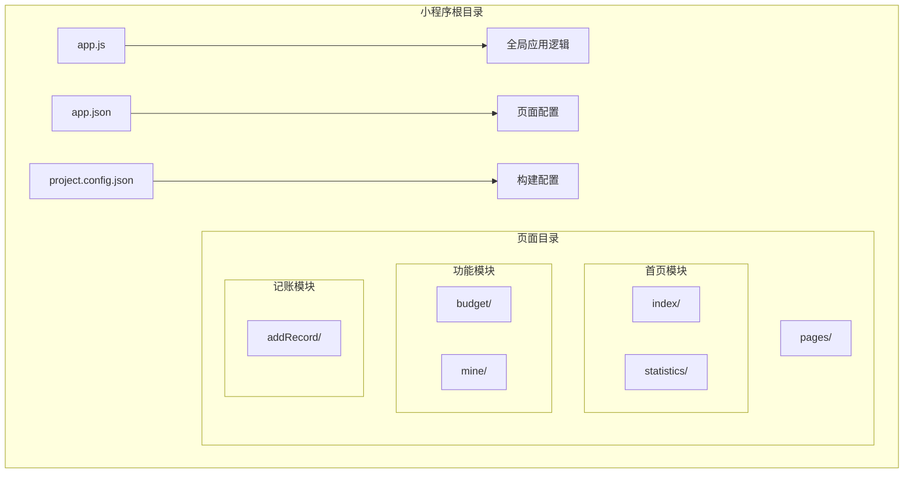

**图表来源**
- [app.json:1-39](file://app.json#L1-L39)
- [project.config.json:1-77](file://project.config.json#L1-L77)

**章节来源**
- [app.json:1-39](file://app.json#L1-L39)
- [project.config.json:1-77](file://project.config.json#L1-L77)

## 核心组件

### 应用初始化与数据管理

应用在启动时执行初始化逻辑，确保必要的数据结构存在：

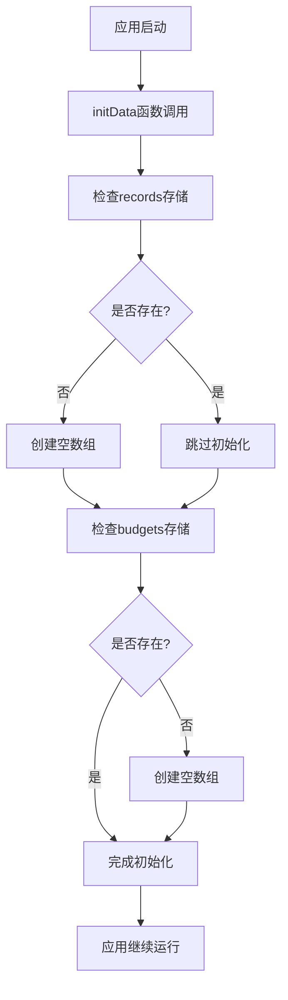

**图表来源**
- [app.js:7-19](file://app.js#L7-L19)

### 页面生命周期管理

小程序采用标准的Page生命周期模式，每个页面都实现了onLoad和onShow方法：

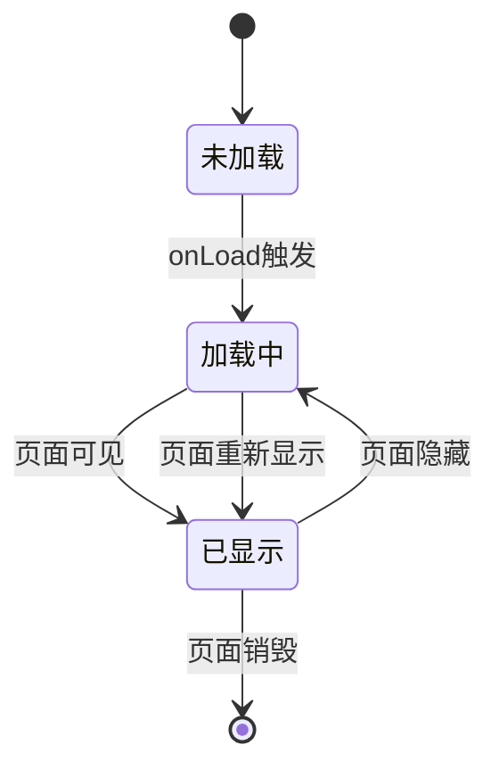

**图表来源**
- [pages/index/index.js:13-27](file://pages/index/index.js#L13-L27)
- [pages/statistics/statistics.js:11-17](file://pages/statistics/statistics.js#L11-L17)

**章节来源**
- [app.js:1-24](file://app.js#L1-L24)
- [pages/index/index.js:1-189](file://pages/index/index.js#L1-L189)
- [pages/statistics/statistics.js:1-160](file://pages/statistics/statistics.js#L1-L160)

## 架构概览

小程序采用本地存储架构，所有数据持久化都在客户端完成：

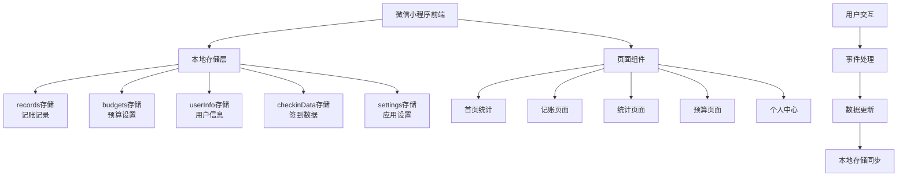

**图表来源**
- [app.js:9-18](file://app.js#L9-L18)
- [pages/mine/mine.js:32-46](file://pages/mine/mine.js#L32-L46)

**章节来源**
- [.trae/documents/记账小程序技术架构文档.md:1-55](file://.trae/documents/记账小程序技术架构文档.md#L1-L55)

## 详细组件分析

### 首页统计组件（index）

首页负责展示收支概览和分类统计：

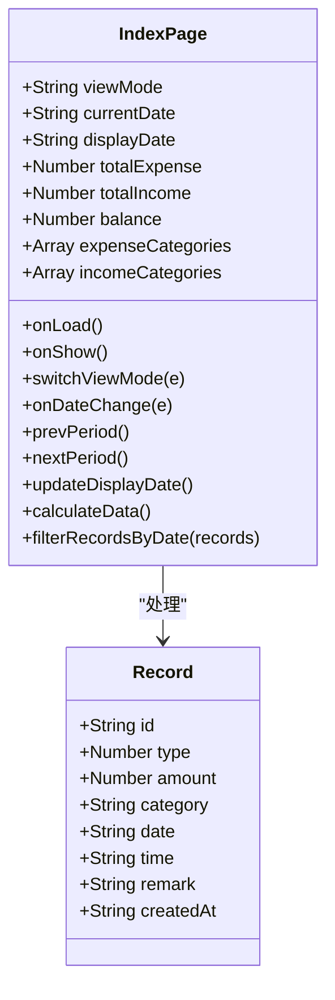

**图表来源**
- [pages/index/index.js:1-189](file://pages/index/index.js#L1-L189)

#### 性能优化要点

1. **数据计算优化**：使用单次遍历完成分类统计
2. **DOM操作最小化**：通过setData批量更新状态
3. **内存管理**：避免创建不必要的临时对象

**章节来源**
- [pages/index/index.js:102-170](file://pages/index/index.js#L102-L170)

### 记账页面组件（addRecord）

记账页面提供完整的记账功能：

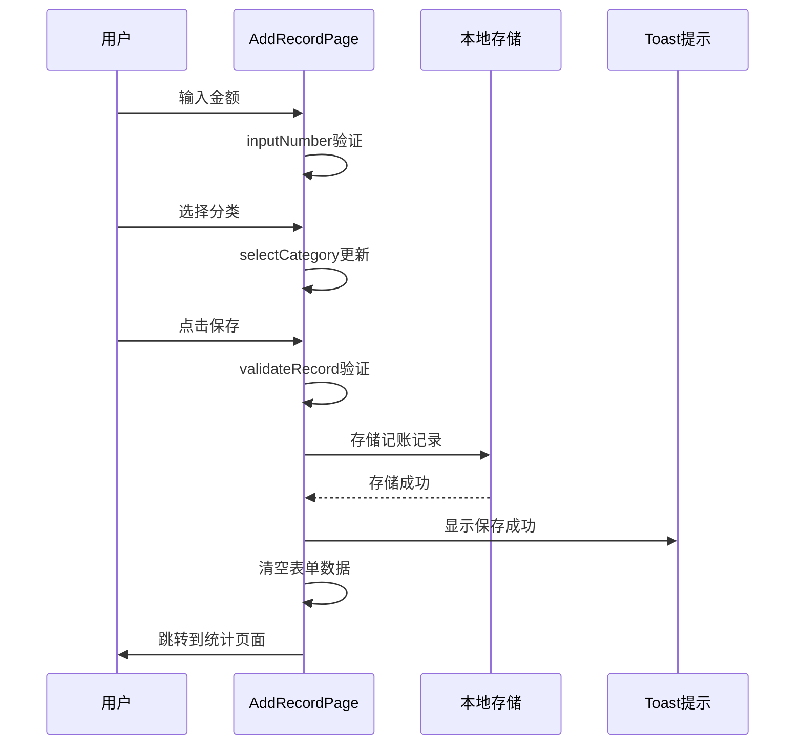

**图表来源**
- [pages/addRecord/addRecord.js:134-189](file://pages/addRecord/addRecord.js#L134-L189)

#### 事件处理优化

1. **输入验证**：实时数字输入验证，防止无效字符
2. **表单重置**：保存成功后自动清空表单
3. **导航优化**：使用switchTab减少页面栈深度

**章节来源**
- [pages/addRecord/addRecord.js:64-99](file://pages/addRecord/addRecord.js#L64-L99)
- [pages/addRecord/addRecord.js:134-189](file://pages/addRecord/addRecord.js#L134-L189)

### 统计页面组件（statistics）

统计页面提供详细的收支分析：

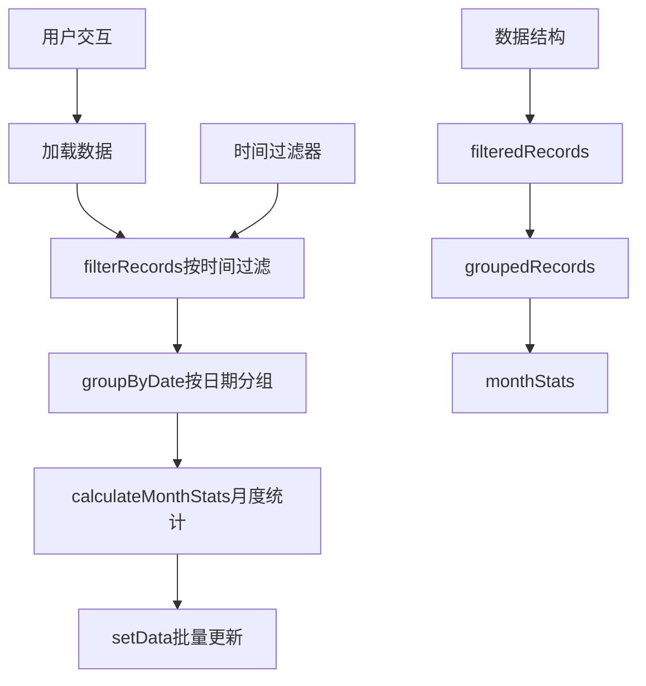

**图表来源**
- [pages/statistics/statistics.js:19-32](file://pages/statistics/statistics.js#L19-L32)

#### 数据处理优化

1. **时间过滤算法**：使用Date对象进行精确的时间比较
2. **分组算法**：利用哈希表实现O(n)分组复杂度
3. **排序优化**：使用原生sort方法进行高效排序

**章节来源**
- [pages/statistics/statistics.js:42-107](file://pages/statistics/statistics.js#L42-L107)

### 预算页面组件（budget）

预算页面管理分类预算和提醒功能：

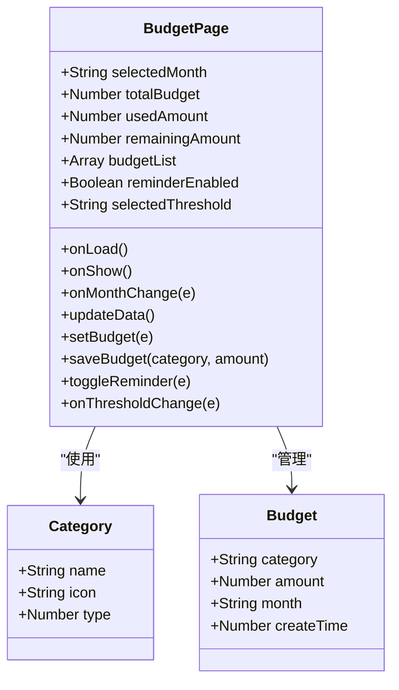

**图表来源**
- [pages/budget/budget.js:14-182](file://pages/budget/budget.js#L14-L182)

**章节来源**
- [pages/budget/budget.js:43-94](file://pages/budget/budget.js#L43-L94)

### 个人中心组件（mine）

个人中心提供用户信息和统计数据：

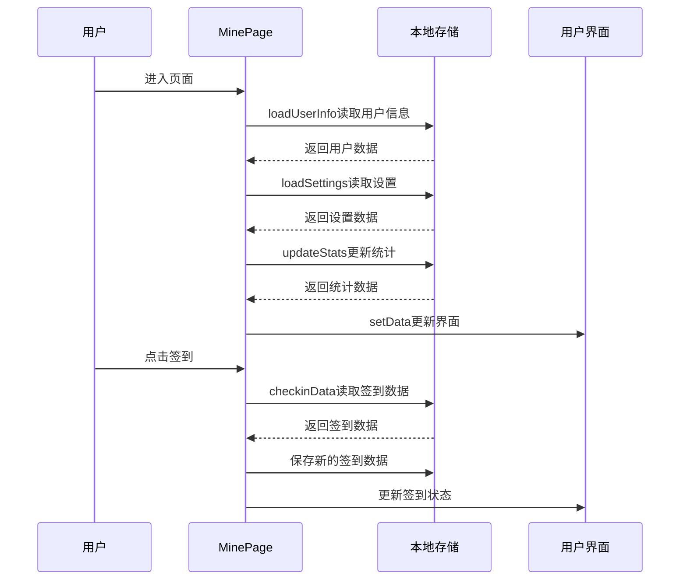

**图表来源**
- [pages/mine/mine.js:19-84](file://pages/mine/mine.js#L19-L84)

**章节来源**
- [pages/mine/mine.js:19-92](file://pages/mine/mine.js#L19-L92)

## 依赖关系分析

小程序采用松耦合的组件架构，各页面相对独立但共享数据存储：

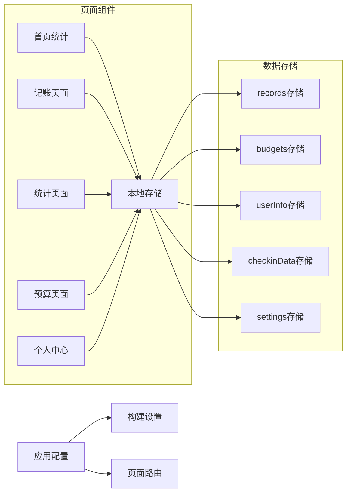

**图表来源**
- [app.json:2-7](file://app.json#L2-L7)
- [project.config.json:7-48](file://project.config.json#L7-L48)

**章节来源**
- [app.json:1-39](file://app.json#L1-L39)
- [project.config.json:1-77](file://project.config.json#L1-L77)

## 性能考虑因素

### 页面生命周期优化

#### 1. 生命周期方法使用策略

- **onLoad**：只执行一次的初始化操作
- **onShow**：每次显示时的数据刷新
- **onHide**：页面隐藏时的资源清理

#### 2. 数据加载时机优化

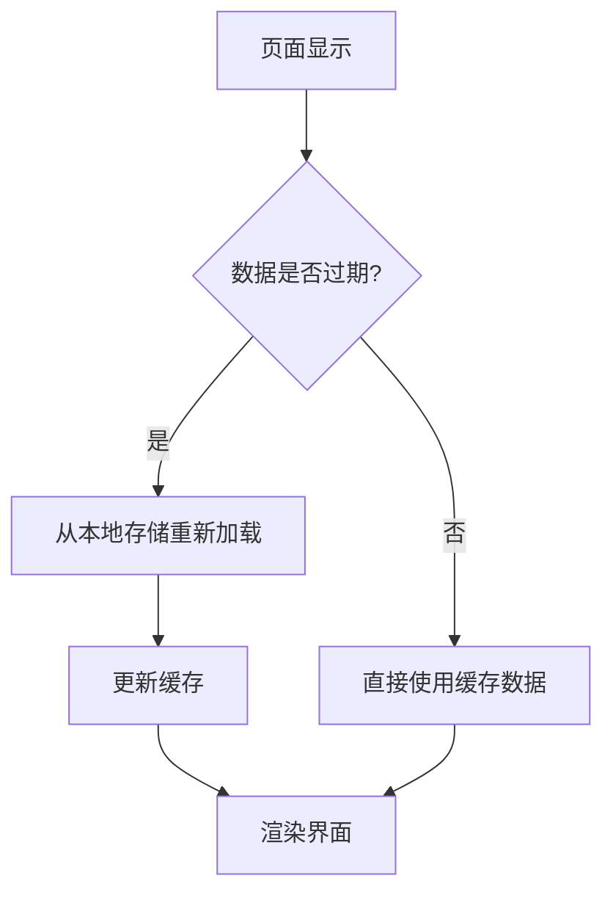

#### 3. 内存管理策略

- **及时释放**：页面隐藏时清理大对象
- **避免泄漏**：移除事件监听器
- **批量更新**：使用setData合并状态更新

### 数据渲染优化

#### 1. 列表渲染优化

- **唯一标识**：为列表项提供稳定的key
- **虚拟滚动**：大量数据时使用虚拟滚动
- **懒加载**：分页加载减少初始渲染压力

#### 2. 图表渲染优化

- **数据预处理**：在后台线程处理复杂计算
- **增量更新**：只更新变化的部分
- **缓存策略**：缓存计算结果避免重复计算

### 事件处理优化

#### 1. 事件绑定优化

- **委托机制**：使用事件委托减少绑定数量
- **防抖节流**：对高频事件进行防抖处理
- **异步处理**：长耗时操作使用异步执行

#### 2. 用户交互优化

- **即时反馈**：用户操作立即给出视觉反馈
- **错误处理**：友好的错误提示和恢复机制
- **无障碍设计**：支持键盘导航和屏幕阅读器

### 本地存储最佳实践

#### 1. 存储策略优化

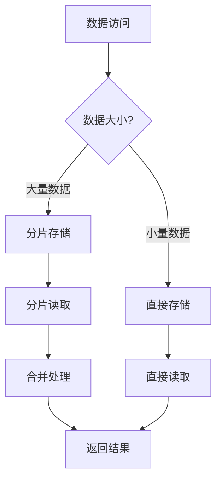

#### 2. 缓存策略

- **LRU缓存**：最近最少使用算法
- **TTL缓存**：基于时间的缓存失效
- **智能缓存**：根据数据访问频率调整缓存策略

#### 3. 异步处理模式

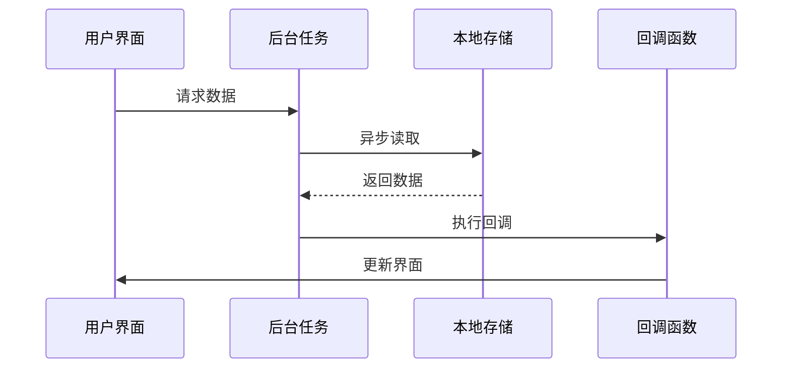

### 性能监控指标

#### 1. 关键性能指标

- **首屏渲染时间**：页面首次可见时间
- **交互响应时间**：用户操作到界面响应的时间
- **内存使用率**：应用内存占用情况
- **CPU使用率**：主线程CPU占用情况
- **网络请求时间**：数据加载耗时

#### 2. 监控实现方案

- **埋点统计**：在关键节点添加性能埋点
- **采样监控**：定期采样关键指标
- **异常告警**：超过阈值时触发告警

### 调试工具使用

#### 1. 微信开发者工具

- **性能面板**：监控渲染性能
- **网络面板**：分析网络请求
- **存储面板**：查看本地存储状态
- **调试面板**：断点调试和日志输出

#### 2. 自定义调试工具

- **性能日志**：记录关键操作耗时
- **内存快照**：分析内存使用情况
- **网络监控**：追踪数据加载过程

## 故障排除指南

### 常见性能问题及解决方案

#### 1. 页面卡顿问题

**问题表现**：
- 页面切换缓慢
- 滑动列表卡顿
- 图表渲染延迟

**解决方案**：
- 减少setData调用次数
- 优化数据结构
- 使用虚拟列表
- 避免在渲染过程中进行复杂计算

#### 2. 内存泄漏问题

**问题表现**：
- 页面切换后内存不释放
- 应用运行时间越长越慢
- 内存使用持续增长

**解决方案**：
- 在onUnload中清理定时器
- 移除事件监听器
- 及时释放大对象引用
- 避免循环引用

#### 3. 数据不同步问题

**问题表现**：
- 不同页面显示不同步的数据
- 刷新后数据丢失
- 本地存储异常

**解决方案**：
- 统一数据源管理
- 实现数据一致性检查
- 添加数据备份机制
- 使用事务性操作

### 优化案例分析

#### 案例1：首页统计性能优化

**优化前问题**：
- 数据计算复杂度高
- DOM操作频繁
- 内存占用大

**优化方案**：
```javascript
// 优化后的计算方法
calculateData: function() {
    const records = wx.getStorageSync('records') || [];
    const filteredRecords = this.filterRecordsByDate(records);
    
    // 使用单次遍历完成统计
    let totalExpense = 0;
    let totalIncome = 0;
    const categoryMap = {};
    
    filteredRecords.forEach(record => {
        const amount = parseFloat(record.amount);
        if (record.type === 2) {
            totalExpense += amount;
        } else {
            totalIncome += amount;
        }
        
        // 合并分类统计
        categoryMap[record.category] = 
            (categoryMap[record.category] || 0) + amount;
    });
    
    // 批量更新状态
    this.setData({
        totalExpense: totalExpense.toFixed(2),
        totalIncome: totalIncome.toFixed(2),
        balance: (totalIncome - totalExpense).toFixed(2)
    });
}
```

#### 案例2：记账页面输入优化

**优化前问题**：
- 数字输入验证复杂
- 表单重置不完整
- 用户体验不佳

**优化方案**：
```javascript
// 优化后的输入验证
inputNumber: function(e) {
    const key = e.currentTarget.dataset.key;
    let amount = this.data.amount;
    
    // 简化的验证逻辑
    if (key === '.' && amount.includes('.')) return;
    if (amount === '0' && key !== '.') amount = '';
    if (key === '.' && amount === '') amount = '0';
    
    // 限制小数位数
    const decimalIndex = amount.indexOf('.');
    if (decimalIndex !== -1 && amount.length - decimalIndex > 2) return;
    
    this.setData({ amount: amount + key });
}
```

### 性能测试方法

#### 1. 基准测试

- **页面加载测试**：测量首屏渲染时间
- **交互响应测试**：测量点击响应延迟
- **内存使用测试**：监控内存峰值和平均值

#### 2. 压力测试

- **大数据量测试**：模拟大量记账记录场景
- **并发操作测试**：同时进行多个操作
- **长时间运行测试**：连续运行7天观察性能变化

#### 3. 兼容性测试

- **设备兼容性**：不同机型性能对比
- **系统版本兼容性**：iOS和Android差异
- **网络环境测试**：弱网条件下的表现

**章节来源**
- [pages/index/index.js:102-170](file://pages/index/index.js#L102-L170)
- [pages/addRecord/addRecord.js:64-99](file://pages/addRecord/addRecord.js#L64-L99)
- [pages/statistics/statistics.js:42-107](file://pages/statistics/statistics.js#L42-L107)

## 结论

通过对迷你记账小程序的深入分析，我们识别了以下关键性能优化点：

1. **数据结构优化**：采用更高效的数据结构和算法
2. **内存管理**：建立完善的内存清理和回收机制
3. **渲染优化**：减少DOM操作和重绘重排
4. **存储策略**：优化本地存储的读写效率
5. **事件处理**：提升用户交互的响应速度

建议在实际开发中重点关注：
- 实施渐进式优化策略
- 建立性能监控体系
- 定期进行性能回归测试
- 持续收集用户反馈

通过这些优化措施，可以显著提升小程序的用户体验和性能表现。

## 附录

### 开发环境配置

#### 构建配置优化

- **压缩设置**：启用代码压缩和混淆
- **资源优化**：图片和字体资源优化
- **缓存策略**：合理设置缓存头
- **CDN配置**：静态资源CDN加速

#### 调试配置

- **开发工具**：使用微信开发者工具
- **性能分析**：启用性能面板监控
- **错误捕获**：实现全局错误处理
- **日志系统**：建立完善的日志记录

### 最佳实践清单

#### 开发规范
- 遵循微信小程序开发规范
- 使用语义化命名
- 编写清晰的注释
- 实现代码复用

#### 性能规范
- 控制页面大小
- 优化资源加载
- 减少网络请求
- 合理使用缓存

#### 用户体验规范
- 提供加载状态
- 错误友好提示
- 响应式设计
- 无障碍支持