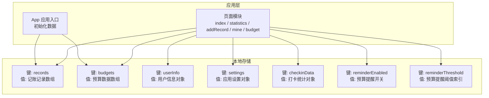
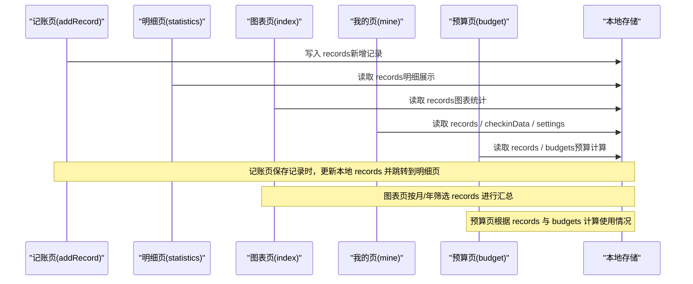
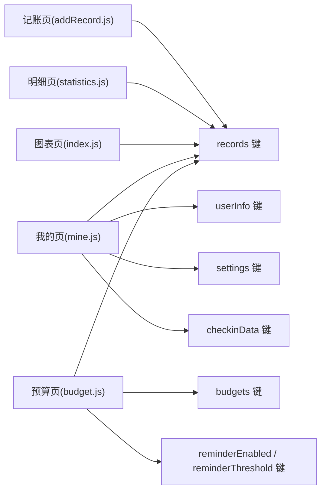

# 数据存储管理

<cite>
**本文档引用的文件**
- [app.js](file://app.js)
- [app.json](file://app.json)
- [pages/addRecord/addRecord.js](file://pages/addRecord/addRecord.js)
- [pages/addRecord/addRecord.wxml](file://pages/addRecord/addRecord.wxml)
- [pages/budget/budget.js](file://pages/budget/budget.js)
- [pages/budget/budget.wxml](file://pages/budget/budget.wxml)
- [pages/index/index.js](file://pages/index/index.js)
- [pages/mine/mine.js](file://pages/mine/mine.js)
- [pages/statistics/statistics.js](file://pages/statistics/statistics.js)
- [pages/statistics/statistics.wxml](file://pages/statistics/statistics.wxml)
</cite>

## 目录
1. [简介](#简介)
2. [项目结构](#项目结构)
3. [核心组件](#核心组件)
4. [架构总览](#架构总览)
5. [详细组件分析](#详细组件分析)
6. [依赖关系分析](#依赖关系分析)
7. [性能考虑](#性能考虑)
8. [故障排除指南](#故障排除指南)
9. [结论](#结论)
10. [附录](#附录)

## 简介
本文件系统性梳理迷你记账小程序的数据存储管理方案，重点覆盖以下方面：
- 本地存储设计理念与实现策略
- 数据模型定义（记账记录、预算数据、用户信息）
- 存储结构设计与数据持久化方案
- 数据验证规则、业务逻辑约束与数据完整性保障
- 数据访问模式、缓存策略与性能优化建议
- 数据迁移、版本管理与备份恢复方案

本项目采用微信小程序原生本地存储能力（Storage）进行数据持久化，所有数据均以键值对形式存储在本地，无需网络请求或后端数据库。

## 项目结构
项目采用按页面组织的目录结构，核心页面包括“记账”、“图表”、“明细”、“我的”。应用启动时初始化三类基础数据集合：记账记录、预算数据与用户设置。

**图表来源**
- [app.js:7-19](file://app.js#L7-L19)
- [pages/index/index.js:102-189](file://pages/index/index.js#L102-L189)
- [pages/statistics/statistics.js:19-32](file://pages/statistics/statistics.js#L19-L32)
- [pages/addRecord/addRecord.js:134-189](file://pages/addRecord/addRecord.js#L134-L189)
- [pages/budget/budget.js:43-94](file://pages/budget/budget.js#L43-L94)
- [pages/mine/mine.js:31-47](file://pages/mine/mine.js#L31-L47)

**章节来源**
- [app.js:1-24](file://app.js#L1-L24)
- [app.json:14-37](file://app.json#L14-L37)

## 核心组件
本项目围绕四大核心数据域构建：
- 记账记录：用于记录每一笔收支流水，包含类型、金额、分类、时间、备注等字段
- 预算数据：按分类与月份维度设定预算，并计算使用率
- 用户信息：用户登录态与个性化设置
- 统计与分析：基于记录进行聚合统计与分组展示

数据访问统一通过 Storage API 完成，页面在生命周期内按需读写，避免跨页面共享全局状态，降低耦合度。

**章节来源**
- [pages/addRecord/addRecord.js:134-166](file://pages/addRecord/addRecord.js#L134-L166)
- [pages/budget/budget.js:122-146](file://pages/budget/budget.js#L122-L146)
- [pages/mine/mine.js:31-47](file://pages/mine/mine.js#L31-L47)
- [pages/index/index.js:102-189](file://pages/index/index.js#L102-L189)
- [pages/statistics/statistics.js:19-32](file://pages/statistics/statistics.js#L19-L32)

## 架构总览
下图展示了数据流从页面到本地存储的整体路径，以及页面间的数据交互方式。

**图表来源**
- [pages/addRecord/addRecord.js:134-189](file://pages/addRecord/addRecord.js#L134-L189)
- [pages/statistics/statistics.js:19-32](file://pages/statistics/statistics.js#L19-L32)
- [pages/index/index.js:102-189](file://pages/index/index.js#L102-L189)
- [pages/mine/mine.js:49-84](file://pages/mine/mine.js#L49-L84)
- [pages/budget/budget.js:43-94](file://pages/budget/budget.js#L43-L94)

## 详细组件分析

### 数据模型定义与字段规范
- 记账记录（records）
  - 字段：id、type、amount、category、remark、date、time、createdAt
  - 类型与约束：id 唯一且递增；type 为收支标识；amount 为数值并保留两位小数；date 为 YYYY-MM-DD；time 为 HH:mm；createdAt 为 ISO 字符串
  - 示例路径：[记录对象构造:157-166](file://pages/addRecord/addRecord.js#L157-L166)

- 预算数据（budgets）
  - 字段：category、amount、month、createTime
  - 类型与约束：category 与 month 唯一组合标识某分类当月预算；amount 为非负数值；month 为 YYYY-MM
  - 示例路径：[预算保存逻辑:122-146](file://pages/budget/budget.js#L122-L146)

- 用户信息（userInfo）
  - 字段：nickName、openId
  - 类型与约束：字符串；用于模拟登录态
  - 示例路径：[用户信息加载:31-36](file://pages/mine/mine.js#L31-L36)

- 应用设置（settings）
  - 字段：reminder、currency、theme
  - 类型与约束：reminder 为布尔；currency 为货币符号；theme 为主题名称
  - 示例路径：[设置加载:38-47](file://pages/mine/mine.js#L38-L47)

- 打卡统计（checkinData）
  - 字段：lastCheckin、checkinDays、totalCheckins
  - 类型与约束：lastCheckin 为日期字符串；checkinDays 为连续天数；totalCheckins 为累计次数
  - 示例路径：[打卡逻辑:120-167](file://pages/mine/mine.js#L120-L167)

- 预算提醒配置（reminderEnabled、reminderThreshold）
  - 字段：reminderEnabled（布尔）、reminderThreshold（阈值索引）
  - 示例路径：[提醒开关与阈值:157-175](file://pages/budget/budget.js#L157-L175)

**章节来源**
- [pages/addRecord/addRecord.js:157-166](file://pages/addRecord/addRecord.js#L157-L166)
- [pages/budget/budget.js:122-146](file://pages/budget/budget.js#L122-L146)
- [pages/mine/mine.js:31-47](file://pages/mine/mine.js#L31-L47)
- [pages/mine/mine.js:120-167](file://pages/mine/mine.js#L120-L167)
- [pages/budget/budget.js:157-175](file://pages/budget/budget.js#L157-L175)

### 数据验证规则与业务约束
- 记账页保存规则
  - 金额必须大于 0，否则提示“请输入金额”
  - 必须选择分类，否则提示“请选择分类”
  - 金额格式限制：最多两位小数，不允许重复小数点
  - 示例路径：[金额输入与校验:64-87](file://pages/addRecord/addRecord.js#L64-L87)，[保存前校验:134-151](file://pages/addRecord/addRecord.js#L134-L151)

- 预算设置规则
  - 预算金额必须为非负数值，否则提示“请输入有效金额”
  - 同分类同月份预算唯一，更新时刷新创建时间
  - 示例路径：[预算设置校验:105-118](file://pages/budget/budget.js#L105-L118)，[保存预算:122-146](file://pages/budget/budget.js#L122-L146)

- 统计与图表规则
  - 日期筛选支持全部、今天、本周、本月
  - 按日期分组并计算日结余
  - 示例路径：[时间筛选与排序:34-70](file://pages/statistics/statistics.js#L34-L70)，[按日期分组:72-107](file://pages/statistics/statistics.js#L72-L107)

- 用户与设置规则
  - 登录为模拟流程，写入 userInfo
  - 设置默认值缺失时自动补全
  - 示例路径：[登录与写入:94-118](file://pages/mine/mine.js#L94-L118)，[设置加载:38-47](file://pages/mine/mine.js#L38-L47)

**章节来源**
- [pages/addRecord/addRecord.js:64-87](file://pages/addRecord/addRecord.js#L64-L87)
- [pages/addRecord/addRecord.js:134-151](file://pages/addRecord/addRecord.js#L134-L151)
- [pages/budget/budget.js:105-118](file://pages/budget/budget.js#L105-L118)
- [pages/budget/budget.js:122-146](file://pages/budget/budget.js#L122-L146)
- [pages/statistics/statistics.js:34-70](file://pages/statistics/statistics.js#L34-L70)
- [pages/statistics/statistics.js:72-107](file://pages/statistics/statistics.js#L72-L107)
- [pages/mine/mine.js:94-118](file://pages/mine/mine.js#L94-L118)
- [pages/mine/mine.js:38-47](file://pages/mine/mine.js#L38-L47)

### 数据持久化与访问模式
- 初始化与默认值
  - 应用启动时检查并初始化 records 与 budgets 的空数组
  - 示例路径：[应用初始化:7-19](file://app.js#L7-L19)

- 页面级读写
  - 读取：通过 Storage 获取数组或对象，未命中返回默认值
  - 写入：更新内存数据后整体替换 Storage 中的数组/对象
  - 示例路径：[明细页读取:20-21](file://pages/statistics/statistics.js#L20-L21)，[图表页读取:103-104](file://pages/index/index.js#L103-L104)，[记账页保存:168-170](file://pages/addRecord/addRecord.js#L168-L170)，[预算页保存:145-146](file://pages/budget/budget.js#L145-L146)，[我的页读取:49-55](file://pages/mine/mine.js#L49-L55)

- 数据完整性保障
  - 使用数组首插法追加新记录，确保时间倒序排列
  - 金额统一格式化为两位小数，避免浮点误差
  - 示例路径：[记录首插](file://pages/addRecord/addRecord.js#L169)，[金额格式化](file://pages/addRecord/addRecord.js#L160)

**章节来源**
- [app.js:7-19](file://app.js#L7-L19)
- [pages/statistics/statistics.js:20-21](file://pages/statistics/statistics.js#L20-L21)
- [pages/index/index.js:103-104](file://pages/index/index.js#L103-L104)
- [pages/addRecord/addRecord.js:168-170](file://pages/addRecord/addRecord.js#L168-L170)
- [pages/budget/budget.js:145-146](file://pages/budget/budget.js#L145-L146)
- [pages/mine/mine.js:49-55](file://pages/mine/mine.js#L49-L55)
- [pages/addRecord/addRecord.js:160](file://pages/addRecord/addRecord.js#L160)

### 缓存策略与性能优化
- 读写分离
  - 页面在 onShow/onLoad 时从 Storage 读取最新数据，避免跨页面共享全局状态
  - 写入后立即 setData 更新视图，减少二次渲染成本

- 聚合计算本地化
  - 图表与明细页在前端完成过滤、分组与统计，避免网络请求
  - 对于大量记录，建议在页面卸载时清理临时数据，释放内存

- 金额处理
  - 统一使用固定两位小数，减少精度问题
  - 在计算百分比时先转换为数值再运算，避免字符串拼接

- 事件绑定与渲染
  - 使用 wx:for 渲染列表，合理设置 wx:key 提升渲染效率
  - 数字键盘与分类选择采用事件委托，减少绑定数量

**章节来源**
- [pages/index/index.js:102-189](file://pages/index/index.js#L102-L189)
- [pages/statistics/statistics.js:19-32](file://pages/statistics/statistics.js#L19-L32)
- [pages/addRecord/addRecord.wxml:35-48](file://pages/addRecord/addRecord.wxml#L35-L48)

### 数据迁移、版本管理与备份恢复
- 版本演进
  - 新增字段：可在读取时检测字段是否存在，不存在则赋予默认值
  - 字段重命名：读取旧键名映射到新键名，随后删除旧键
  - 示例路径：[设置默认值:38-47](file://pages/mine/mine.js#L38-L47)

- 数据迁移
  - 迁移时机：应用启动时执行一次性的迁移脚本
  - 迁移策略：逐条读取旧数据，转换为新结构后写回 Storage
  - 示例路径：[应用初始化:7-19](file://app.js#L7-L19)

- 备份与恢复
  - 备份：将 records、budgets、userInfo、settings、checkinData 等关键键值导出为 JSON 文件
  - 恢复：导入 JSON 后逐键写回 Storage，注意覆盖前确认用户同意
  - 注意：当前代码未实现导出/导入功能，建议在“我的”页扩展相应接口

**章节来源**
- [pages/mine/mine.js:38-47](file://pages/mine/mine.js#L38-L47)
- [app.js:7-19](file://app.js#L7-L19)

## 依赖关系分析
页面与本地存储之间的依赖关系如下：

**图表来源**
- [pages/addRecord/addRecord.js:168-170](file://pages/addRecord/addRecord.js#L168-L170)
- [pages/statistics/statistics.js:20-21](file://pages/statistics/statistics.js#L20-L21)
- [pages/index/index.js:103-104](file://pages/index/index.js#L103-L104)
- [pages/mine/mine.js:49-55](file://pages/mine/mine.js#L49-L55)
- [pages/budget/budget.js:43-94](file://pages/budget/budget.js#L43-L94)

**章节来源**
- [pages/addRecord/addRecord.js:168-170](file://pages/addRecord/addRecord.js#L168-L170)
- [pages/statistics/statistics.js:20-21](file://pages/statistics/statistics.js#L20-L21)
- [pages/index/index.js:103-104](file://pages/index/index.js#L103-L104)
- [pages/mine/mine.js:49-55](file://pages/mine/mine.js#L49-L55)
- [pages/budget/budget.js:43-94](file://pages/budget/budget.js#L43-L94)

## 性能考虑
- 读写频率控制
  - 将频繁读取的数据缓存在页面 data 中，避免重复 Storage IO
  - 写入操作集中处理，批量更新后再 setData

- 计算复杂度
  - 过滤与分组在前端完成，建议记录数超过一定规模时采用分页或懒加载
  - 百分比计算与排序在渲染前完成，减少模板计算开销

- 内存占用
  - 及时清理不再使用的临时变量与中间结果
  - 对超大数组进行分块处理，避免一次性渲染

- 用户体验
  - 金额输入采用本地格式化，减少无效输入
  - Toast 与 Modal 提示及时反馈，避免阻塞主线程

[本节为通用指导，不直接分析具体文件，故无章节来源]

## 故障排除指南
- 无法读取数据
  - 检查 Storage 中对应键是否存在，必要时触发初始化
  - 示例路径：[应用初始化:7-19](file://app.js#L7-L19)

- 金额显示异常
  - 确认金额格式化逻辑是否生效
  - 示例路径：[金额格式化](file://pages/addRecord/addRecord.js#L160)

- 预算设置无效
  - 检查阈值与开关状态是否正确写入
  - 示例路径：[提醒开关与阈值:157-175](file://pages/budget/budget.js#L157-L175)

- 登录信息丢失
  - 确认 userInfo 是否被正确写入与读取
  - 示例路径：[登录与写入:94-118](file://pages/mine/mine.js#L94-L118)

**章节来源**
- [app.js:7-19](file://app.js#L7-L19)
- [pages/addRecord/addRecord.js:160](file://pages/addRecord/addRecord.js#L160)
- [pages/budget/budget.js:157-175](file://pages/budget/budget.js#L157-L175)
- [pages/mine/mine.js:94-118](file://pages/mine/mine.js#L94-L118)

## 结论
本项目采用轻量级本地存储方案，通过统一的 Storage 接口实现数据持久化，页面间通过键值对协作，避免了复杂的跨页面状态同步。数据模型清晰、验证规则明确、业务约束合理，能够满足个人记账场景的核心需求。建议后续增强数据迁移与备份恢复能力，并在大数据量场景下引入分页与缓存策略以提升性能。

[本节为总结性内容，不直接分析具体文件，故无章节来源]

## 附录

### 数据模型字段对照表
- 记账记录（records）
  - id：数字，唯一标识
  - type：数字，1=收入，2=支出
  - amount：数值，保留两位小数
  - category：字符串，分类名称
  - remark：字符串，备注
  - date：字符串，YYYY-MM-DD
  - time：字符串，HH:mm
  - createdAt：字符串，ISO 时间戳

- 预算数据（budgets）
  - category：字符串，分类名称
  - amount：数值，预算金额
  - month：字符串，YYYY-MM
  - createTime：数字，时间戳

- 用户信息（userInfo）
  - nickName：字符串，昵称
  - openId：字符串，标识

- 应用设置（settings）
  - reminder：布尔，是否启用提醒
  - currency：字符串，货币符号
  - theme：字符串，主题

- 打卡统计（checkinData）
  - lastCheckin：字符串，最近打卡日期
  - checkinDays：数字，连续天数
  - totalCheckins：数字，累计次数

- 预算提醒配置
  - reminderEnabled：布尔，是否启用预算提醒
  - reminderThreshold：数字，阈值索引

**章节来源**
- [pages/addRecord/addRecord.js:157-166](file://pages/addRecord/addRecord.js#L157-L166)
- [pages/budget/budget.js:122-146](file://pages/budget/budget.js#L122-L146)
- [pages/mine/mine.js:31-47](file://pages/mine/mine.js#L31-L47)
- [pages/mine/mine.js:120-167](file://pages/mine/mine.js#L120-L167)
- [pages/budget/budget.js:157-175](file://pages/budget/budget.js#L157-L175)