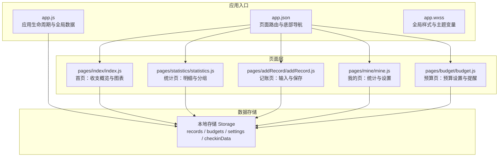
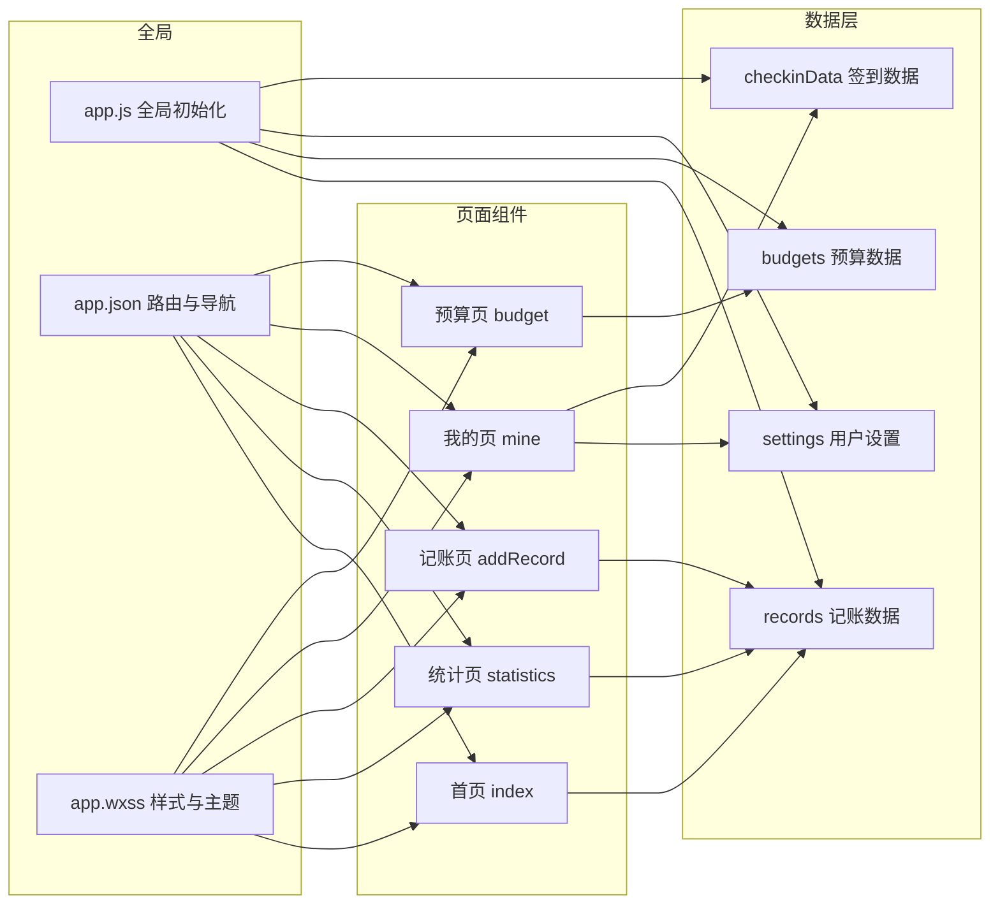
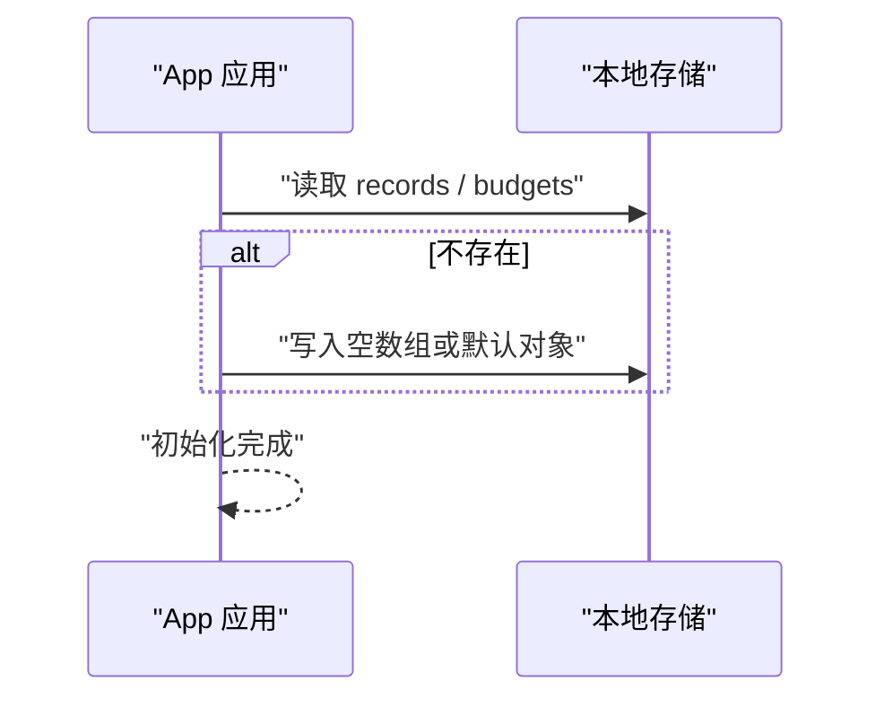
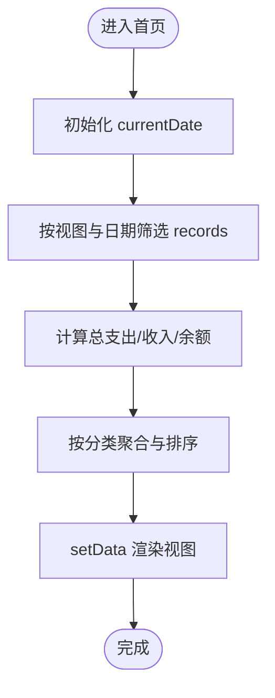
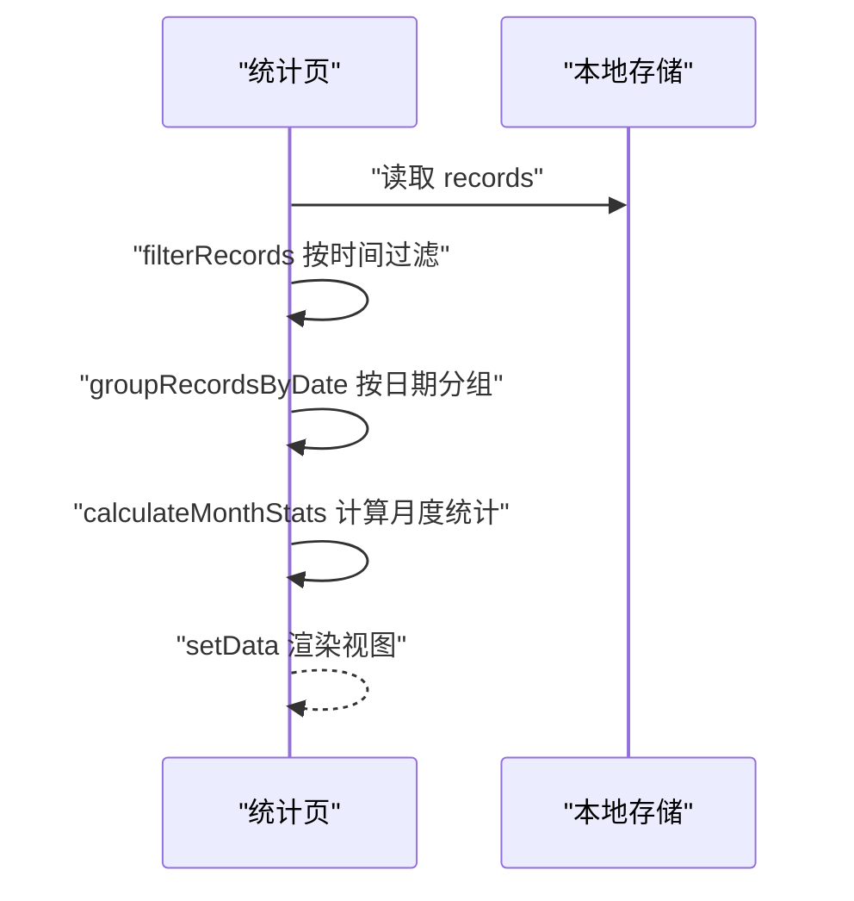
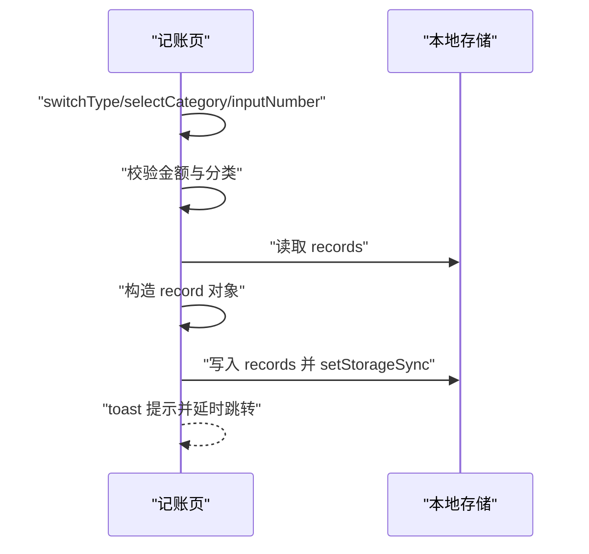
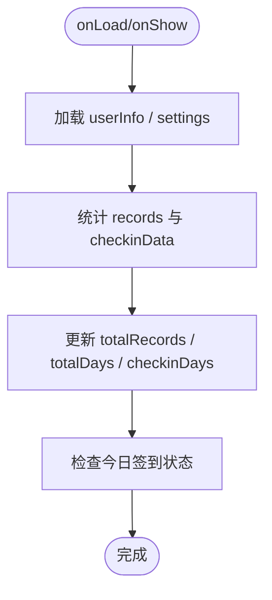
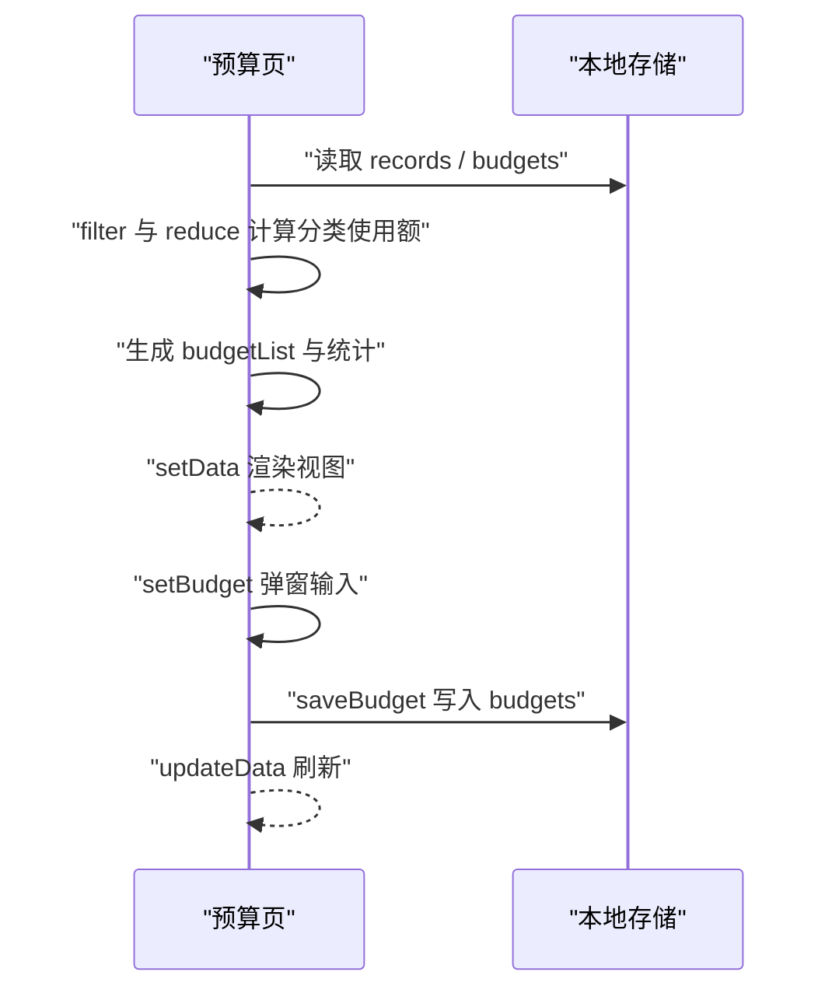

# 架构设计

<cite>
**本文引用的文件**
- [app.js](file://app.js)
- [app.json](file://app.json)
- [app.wxss](file://app.wxss)
- [pages/index/index.js](file://pages/index/index.js)
- [pages/statistics/statistics.js](file://pages/statistics/statistics.js)
- [pages/addRecord/addRecord.js](file://pages/addRecord/addRecord.js)
- [pages/mine/mine.js](file://pages/mine/mine.js)
- [pages/budget/budget.js](file://pages/budget/budget.js)
- [.trae/documents/记账小程序技术架构文档.md](file://.trae/documents/记账小程序技术架构文档.md)
</cite>

## 目录
1. [简介](#简介)
2. [项目结构](#项目结构)
3. [核心组件](#核心组件)
4. [架构总览](#架构总览)
5. [详细组件分析](#详细组件分析)
6. [依赖分析](#依赖分析)
7. [性能考虑](#性能考虑)
8. [故障排查指南](#故障排查指南)
9. [结论](#结论)
10. [附录](#附录)

## 简介
本架构设计文档面向“迷你记账”小程序，系统采用微信小程序原生框架与本地存储方案，围绕“页面组件化 + 事件驱动”的交互模式构建。应用入口负责全局初始化与数据准备；页面层通过 Page 生命周期与事件回调实现数据计算与视图更新；数据持久化基于本地存储（Storage）实现，避免外部依赖，便于快速迭代与部署。本文从整体架构、组件关系、数据流、MVC 应用方式、路由与全局状态、性能与可扩展性等方面进行系统化阐述，并提供可视化图示帮助开发者理解设计思路。

## 项目结构
项目采用按页面分层的组织方式，每个页面由 JS、WXML、WXSS 三部分组成，配合全局样式与应用配置文件共同构成完整的小程序结构。



**图表来源**
- [app.js:1-24](file://app.js#L1-L24)
- [app.json:1-39](file://app.json#L1-L39)
- [app.wxss:1-335](file://app.wxss#L1-L335)
- [pages/index/index.js:1-189](file://pages/index/index.js#L1-L189)
- [pages/statistics/statistics.js:1-160](file://pages/statistics/statistics.js#L1-L160)
- [pages/addRecord/addRecord.js:1-190](file://pages/addRecord/addRecord.js#L1-L190)
- [pages/mine/mine.js:1-257](file://pages/mine/mine.js#L1-L257)
- [pages/budget/budget.js:1-182](file://pages/budget/budget.js#L1-L182)

**章节来源**
- [app.js:1-24](file://app.js#L1-L24)
- [app.json:1-39](file://app.json#L1-L39)
- [app.wxss:1-335](file://app.wxss#L1-L335)

## 核心组件
- 应用入口与全局初始化
  - 负责应用启动时的数据准备（记账数据与预算数据的默认初始化），以及 userInfo 的全局持有。
- 页面组件
  - 首页：收支概览、分类统计、日期切换与视图模式切换。
  - 统计页：按时间过滤、按日期分组、月度收支统计。
  - 记账页：收支类型切换、分类选择、数字键盘输入、备注弹窗、保存与跳转。
  - 我的页：用户信息、签到统计、设置加载与占位功能。
  - 预算页：预算设置、预算使用情况、提醒阈值与开关。
- 全局样式与主题
  - 提供统一的主题色、卡片、按钮、输入框、导航栏、表格、预算环形图等通用样式。

**章节来源**
- [app.js:1-24](file://app.js#L1-L24)
- [pages/index/index.js:1-189](file://pages/index/index.js#L1-L189)
- [pages/statistics/statistics.js:1-160](file://pages/statistics/statistics.js#L1-L160)
- [pages/addRecord/addRecord.js:1-190](file://pages/addRecord/addRecord.js#L1-L190)
- [pages/mine/mine.js:1-257](file://pages/mine/mine.js#L1-L257)
- [pages/budget/budget.js:1-182](file://pages/budget/budget.js#L1-L182)
- [app.wxss:1-335](file://app.wxss#L1-L335)

## 架构总览
系统采用“页面组件化 + 事件驱动 + 本地存储”的轻量级架构：
- 页面层通过 Page 生命周期（onLoad/onShow）触发数据加载与计算。
- 事件回调（点击、输入、日期变更等）驱动视图更新与数据持久化。
- 全局样式与主题变量统一视觉风格。
- 应用入口负责初始化与全局数据持有，页面间通过路由与本地存储协作。



**图表来源**
- [app.js:1-24](file://app.js#L1-L24)
- [app.json:1-39](file://app.json#L1-L39)
- [app.wxss:1-335](file://app.wxss#L1-L335)
- [pages/index/index.js:1-189](file://pages/index/index.js#L1-L189)
- [pages/statistics/statistics.js:1-160](file://pages/statistics/statistics.js#L1-L160)
- [pages/addRecord/addRecord.js:1-190](file://pages/addRecord/addRecord.js#L1-L190)
- [pages/mine/mine.js:1-257](file://pages/mine/mine.js#L1-L257)
- [pages/budget/budget.js:1-182](file://pages/budget/budget.js#L1-L182)

## 详细组件分析

### 应用入口与全局数据管理
- 初始化逻辑
  - 在应用启动时检查并初始化两类核心数据：records（记账记录）与 budgets（预算设置），确保首次使用无需手动创建。
- 全局数据
  - 通过 globalData 持有 userInfo，便于页面共享用户信息。
- 路由与导航
  - app.json 定义了页面路由与底部 tabBar，包含“明细/图表/记账/我的”四个页面，其中“图表”对应首页，“明细”对应统计页。



**图表来源**
- [app.js:7-19](file://app.js#L7-L19)

**章节来源**
- [app.js:1-24](file://app.js#L1-L24)
- [app.json:14-37](file://app.json#L14-L37)

### 首页（index）——收支概览与图表
- 视图模式与日期控制
  - 支持“月/年”两种视图模式，通过日期选择器与上一周期/下一周期按钮切换当前显示期。
- 数据计算
  - 从本地存储读取 records，按当前视图与日期筛选，计算总支出、总收入、余额，并生成分类汇总（含百分比与图标）。
- 事件驱动
  - 通过 switchViewMode、onDateChange、prevPeriod、nextPeriod 等事件回调更新视图与重新计算。



**图表来源**
- [pages/index/index.js:102-188](file://pages/index/index.js#L102-L188)

**章节来源**
- [pages/index/index.js:1-189](file://pages/index/index.js#L1-L189)

### 统计页（statistics）——明细与分组
- 时间过滤
  - 支持“全部/今日/本周/本月”四种过滤条件，按时间范围筛选并排序。
- 数据分组
  - 将记录按日期分组，计算每日结余，生成带星期的日期文本。
- 月度统计
  - 计算当月收入、支出与结余，用于展示在页面顶部卡片。
- 事件驱动
  - setTimeFilter 切换过滤器并刷新数据；viewRecord 为占位交互。



**图表来源**
- [pages/statistics/statistics.js:19-132](file://pages/statistics/statistics.js#L19-L132)

**章节来源**
- [pages/statistics/statistics.js:1-160](file://pages/statistics/statistics.js#L1-L160)

### 记账页（addRecord）——输入与保存
- 输入与校验
  - 收支类型切换、分类选择、数字键盘输入（限制小数点与位数）、备注弹窗。
- 保存流程
  - 校验金额与分类，构造记录对象（含 id、时间戳、分类图标等），写入本地存储并提示成功。
  - 成功后清空输入并跳转至统计页。
- 事件驱动
  - switchType、selectCategory、inputNumber、deleteNumber、clearAmount、onDateChange、showRemarkModal、hideRemarkModal、confirmRemark、saveRecord 等。



**图表来源**
- [pages/addRecord/addRecord.js:134-189](file://pages/addRecord/addRecord.js#L134-L189)

**章节来源**
- [pages/addRecord/addRecord.js:1-190](file://pages/addRecord/addRecord.js#L1-L190)

### 我的页（mine）——统计与设置
- 用户信息与设置
  - 从本地存储加载 userInfo 与 settings，若不存在则使用默认值。
- 统计与签到
  - 统计总记录数、总天数（去重日期），计算连续签到天数与累计签到次数；检查今日是否已签到。
- 事件驱动
  - login、checkin、upgradeVIP、showNotifications、showBadges、showPoints、showSettings、showMyBooks、showFamilyBill、showSecurity、showFeedback、rateApp、showAbout 等占位交互。



**图表来源**
- [pages/mine/mine.js:19-92](file://pages/mine/mine.js#L19-L92)

**章节来源**
- [pages/mine/mine.js:1-257](file://pages/mine/mine.js#L1-L257)

### 预算页（budget）——预算设置与提醒
- 预算数据
  - 从本地存储读取 records 与 budgets，按所选月份筛选支出，计算分类使用金额与总预算、剩余预算。
- 预算设置
  - 通过弹窗输入预算金额，支持更新或新增预算记录，并持久化保存。
- 提醒与阈值
  - 提供提醒开关与阈值选择，保存到本地存储并在页面中读取。
- 事件驱动
  - onMonthChange、updateData、setBudget、saveBudget、toggleReminder、onThresholdChange、getCategoryIcon 等。



**图表来源**
- [pages/budget/budget.js:43-155](file://pages/budget/budget.js#L43-L155)

**章节来源**
- [pages/budget/budget.js:1-182](file://pages/budget/budget.js#L1-L182)

## 依赖分析
- 页面与数据存储
  - 所有页面均通过 wx.getStorageSync/wx.setStorageSync 与本地存储交互，形成松耦合的数据访问层。
- 页面与路由
  - app.json 中的 pages 与 tabBar 定义了页面注册与底部导航，页面间通过 wx.switchTab 或页面栈管理进行导航。
- 样式与主题
  - app.wxss 提供全局样式与主题变量，页面通过类名复用统一风格，降低维护成本。
- 组件内聚与耦合
  - 页面内部函数职责清晰（数据计算、事件处理、UI 更新），页面之间通过数据共享而非直接调用，保持低耦合。

```mermaid
graph TB
subgraph "页面"
IDX["index"]
STAT["statistics"]
ADD["addRecord"]
MINE["mine"]
BUDGET["budget"]
end
ST["Storage"]:::data
JSON["app.json"]:::cfg
WXSS["app.wxss"]:::style
IDX --> ST
STAT --> ST
ADD --> ST
MINE --> ST
BUDGET --> ST
JSON --> IDX
JSON --> STAT
JSON --> ADD
JSON --> MINE
JSON --> BUDGET
WXSS --> IDX
WXSS --> STAT
WXSS --> ADD
WXSS --> MINE
WXSS --> BUDGET
classDef cfg fill:#fff,stroke:#333,color:#000;
classDef data fill:#fff,stroke:#333,color:#000;
classDef style fill:#fff,stroke:#333,color:#000;
```

**图表来源**
- [app.json:1-39](file://app.json#L1-L39)
- [app.wxss:1-335](file://app.wxss#L1-L335)
- [pages/index/index.js:1-189](file://pages/index/index.js#L1-L189)
- [pages/statistics/statistics.js:1-160](file://pages/statistics/statistics.js#L1-L160)
- [pages/addRecord/addRecord.js:1-190](file://pages/addRecord/addRecord.js#L1-L190)
- [pages/mine/mine.js:1-257](file://pages/mine/mine.js#L1-L257)
- [pages/budget/budget.js:1-182](file://pages/budget/budget.js#L1-L182)

**章节来源**
- [app.json:1-39](file://app.json#L1-L39)
- [app.wxss:1-335](file://app.wxss#L1-L335)

## 性能考虑
- 数据计算与渲染
  - 首页与统计页的数据计算在页面生命周期中执行，建议对大数据量场景增加节流/防抖与缓存策略，避免重复计算。
- 本地存储访问
  - 所有读写操作集中在页面内部，建议在批量写入时合并 setData，减少多次渲染开销。
- 图表与动画
  - 预算页的环形进度条使用 CSS 动画，建议在数据变化时仅更新必要字段，避免全量重绘。
- 页面切换
  - 使用 wx.switchTab 进行底部导航切换，减少页面栈深度，提升切换性能。
- 样式体积
  - 全局样式集中管理，避免重复定义，有助于减小包体与提升渲染效率。

[本节为通用性能建议，不直接分析具体文件，故无“章节来源”]

## 故障排查指南
- 记账保存失败
  - 检查金额输入是否为空或非正数；确认分类是否选择；查看本地存储 records 是否存在且可写。
- 统计数据异常
  - 确认时间过滤条件与日期格式；检查本地存储 records 是否被意外清理。
- 预算设置无效
  - 确认 selectedMonth 与 records 的月份匹配；检查 budgets 是否正确写入与读取。
- 登录/签到状态异常
  - 检查 userInfo 与 checkinData 的本地存储键值；确认日期比较逻辑与时间戳转换。

**章节来源**
- [pages/addRecord/addRecord.js:134-189](file://pages/addRecord/addRecord.js#L134-L189)
- [pages/statistics/statistics.js:42-70](file://pages/statistics/statistics.js#L42-L70)
- [pages/budget/budget.js:122-155](file://pages/budget/budget.js#L122-L155)
- [pages/mine/mine.js:94-167](file://pages/mine/mine.js#L94-L167)

## 结论
本系统以“页面组件化 + 事件驱动 + 本地存储”为核心架构，通过 app.json 统一路由与导航，app.js 负责全局初始化，页面内部实现数据计算与交互逻辑。整体设计具备良好的可维护性与扩展性：新增页面只需遵循现有生命周期与事件模式；数据层通过本地存储解耦，便于后续接入后端服务。建议在后续版本中引入数据校验、错误处理与图表库集成，进一步提升用户体验与功能完整性。

[本节为总结性内容，不直接分析具体文件，故无“章节来源”]

## 附录

### MVC 设计模式应用
- Model（模型）
  - 本地存储中的 records、budgets、settings、checkinData 等数据结构作为数据源。
- View（视图）
  - WXML 模板与 WXSS 样式组合，呈现页面内容与交互元素。
- Controller（控制器）
  - Page 的事件回调与生命周期函数承担控制器职责，协调数据读写与视图更新。

[本节为概念性说明，不直接分析具体文件，故无“章节来源”]

### 页面路由与导航
- 路由配置
  - app.json 中 pages 定义页面路径，tabBar 定义底部导航项与选中态。
- 页面跳转
  - 记账成功后通过 wx.switchTab 切换至统计页，实现底部导航的页面切换。

**章节来源**
- [app.json:2-37](file://app.json#L2-L37)
- [pages/addRecord/addRecord.js:185-188](file://pages/addRecord/addRecord.js#L185-L188)

### 数据模型与存储约定
- 记账记录
  - 字段包括 id、type、amount、category、remark、date、time、createdAt 等。
- 预算设置
  - 字段包括 category、amount、month、createTime 等。
- 存储键名
  - records、budgets、settings、checkinData 等键名在多个页面中被使用，需保持一致。

**章节来源**
- [.trae/documents/记账小程序技术架构文档.md:42-85](file://.trae/documents/记账小程序技术架构文档.md#L42-L85)