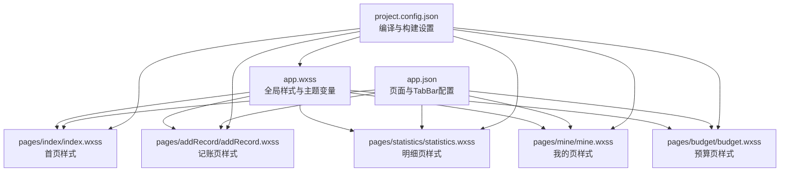
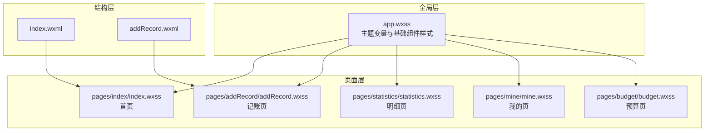
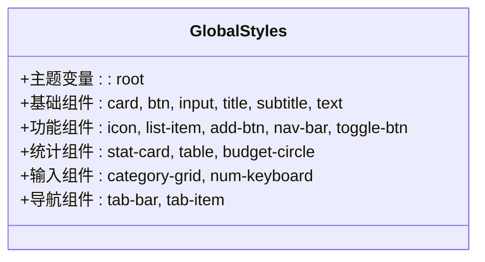
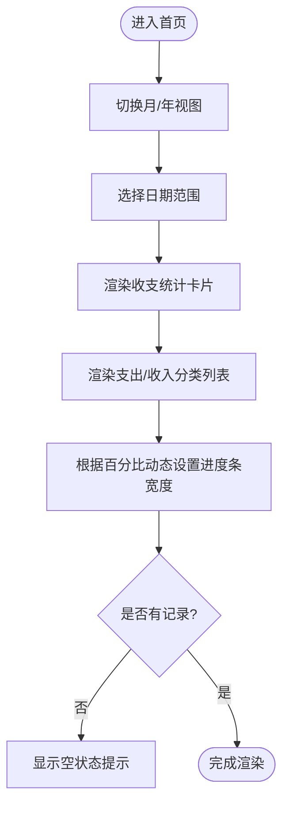
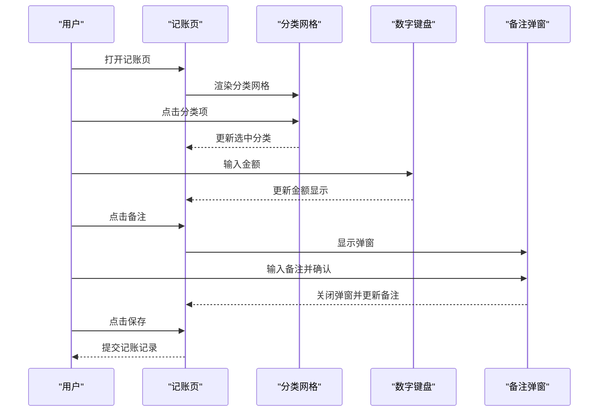
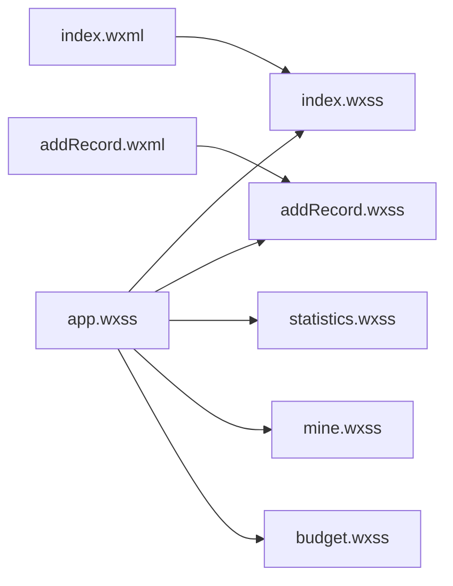

# 样式与界面设计

<cite>
**本文档引用的文件**
- [app.wxss](file://app.wxss)
- [index.wxss](file://pages/index/index.wxss)
- [addRecord.wxss](file://pages/addRecord/addRecord.wxss)
- [budget.wxss](file://pages/budget/budget.wxss)
- [mine.wxss](file://pages/mine/mine.wxss)
- [statistics.wxss](file://pages/statistics/statistics.wxss)
- [index.wxml](file://pages/index/index.wxml)
- [addRecord.wxml](file://pages/addRecord/addRecord.wxml)
- [app.json](file://app.json)
- [project.config.json](file://project.config.json)
</cite>

## 目录
1. [简介](#简介)
2. [项目结构](#项目结构)
3. [核心组件](#核心组件)
4. [架构总览](#架构总览)
5. [详细组件分析](#详细组件分析)
6. [依赖关系分析](#依赖关系分析)
7. [性能考虑](#性能考虑)
8. [故障排查指南](#故障排查指南)
9. [结论](#结论)
10. [附录](#附录)

## 简介
本文件面向“迷你记账小程序”的样式与界面设计，系统梳理全局样式规范、组件样式设计与响应式布局策略，解释 WXSS 语法特点、样式继承机制与选择器使用方式，并提供页面布局设计原则、颜色搭配方案与字体排版规范。同时给出组件样式的复用策略、主题定制方法与兼容性处理建议，以及样式调试技巧与性能优化建议，确保界面在不同设备上的一致与良好显示效果。

## 项目结构
项目采用按页面组织的结构，每个页面拥有独立的 WXSS 文件用于局部样式定义，同时通过全局 app.wxss 提供统一的主题变量、基础组件样式与通用布局规范。底部导航由 app.json 的 tabBar 配置统一管理，页面间通过路由进行跳转。

**图表来源**
- [app.wxss](file://app.wxss)
- [index.wxss](file://pages/index/index.wxss)
- [addRecord.wxss](file://pages/addRecord/addRecord.wxss)
- [statistics.wxss](file://pages/statistics/statistics.wxss)
- [mine.wxss](file://pages/mine/mine.wxss)
- [budget.wxss](file://pages/budget/budget.wxss)
- [app.json](file://app.json)
- [project.config.json](file://project.config.json)

**章节来源**
- [app.wxss](file://app.wxss)
- [app.json](file://app.json)
- [project.config.json](file://project.config.json)

## 核心组件
本项目的核心样式组件包括：
- 全局主题变量：通过 CSS 自定义属性集中管理主色、辅助色、文本色、背景色等，便于主题切换与一致性维护。
- 基础组件样式：卡片、按钮、输入框、标题、副标题、文本、图标、列表项、导航栏、切换按钮、统计卡片、表格、预算环形图、数字键盘、底部导航栏等。
- 页面级样式：首页、记账页、明细页、我的页、预算页各自定义的容器、布局与业务相关样式。

这些组件通过类名组合与层级嵌套实现复用，避免重复定义，提升可维护性。

**章节来源**
- [app.wxss](file://app.wxss)
- [index.wxss](file://pages/index/index.wxss)
- [addRecord.wxss](file://pages/addRecord/addRecord.wxss)
- [statistics.wxss](file://pages/statistics/statistics.wxss)
- [mine.wxss](file://pages/mine/mine.wxss)
- [budget.wxss](file://pages/budget/budget.wxss)

## 架构总览
全局样式通过 app.wxss 定义，页面样式在各页面 WXSS 中扩展或覆盖。页面结构由 WXML 负责，WXSS 负责视觉表现。底部导航由 app.json 的 tabBar 统一配置，页面间通过路由跳转。

**图表来源**
- [app.wxss](file://app.wxss)
- [index.wxss](file://pages/index/index.wxss)
- [addRecord.wxss](file://pages/addRecord/addRecord.wxss)
- [statistics.wxss](file://pages/statistics/statistics.wxss)
- [mine.wxss](file://pages/mine/mine.wxss)
- [budget.wxss](file://pages/budget/budget.wxss)
- [index.wxml](file://pages/index/index.wxml)
- [addRecord.wxml](file://pages/addRecord/addRecord.wxml)

## 详细组件分析

### 全局样式与主题变量
- 字体与背景：全局 page 设置了系统字体栈与浅灰背景，配合抗锯齿优化文字显示。
- 主题变量：通过 :root 定义主色、辅助色、文本色、背景色、卡片背景、边框色、收支色等，统一命名与取值，便于主题切换。
- 基础组件：提供 card、btn、input、title、subtitle、text、income、expense、icon、list-item、add-btn、nav-bar、toggle-btn、stat-card、table、budget-circle、category-grid、num-keyboard、tab-bar、tab-item 等通用样式类，页面可直接复用。

**图表来源**
- [app.wxss](file://app.wxss)

**章节来源**
- [app.wxss](file://app.wxss)

### 首页样式（index.wxss）
- 容器与布局：container 使用最小高度与背景色，保证页面占满屏幕并有统一背景。
- 切换按钮：toggle-btn 采用 Flex 布局，子项使用 flex: 1 实现均分；active 状态通过背景色与阴影突出选中态。
- 日期选择器：date-selector 居中对齐，左右箭头与中间日期文本形成交互区域，点击反馈通过伪元素与过渡动画增强。
- 统计卡片：stat-card 采用渐变背景与圆角，内部使用 Flex 布局展示三列统计信息。
- 卡片与分类：card 内部使用 subtitle 与 ::before 伪元素实现左侧强调线；category-list 使用 Flex 列表展示分类条目，bar 与 amount/percent 动态宽度与颜色控制。
- 空状态：empty-category 通过伪元素与文字提示空数据场景。

**图表来源**
- [index.wxss](file://pages/index/index.wxss)
- [index.wxml](file://pages/index/index.wxml)

**章节来源**
- [index.wxss](file://pages/index/index.wxss)
- [index.wxml](file://pages/index/index.wxml)

### 记账页样式（addRecord.wxss）
- 金额显示：amount-section 居中展示货币符号与金额，字号与字重突出数值。
- 类型切换：type-switch 使用 Flex 均分两块区域，active 状态改变边框色与字重。
- 分类选择：category-section 使用 scroll-view 实现纵向滚动，category-grid 采用网格布局展示分类图标与名称；active 状态通过渐变背景与阴影强调选中项。
- 信息区：info-section 使用 Flex 布局展示备注与日期，右侧箭头指示可交互。
- 数字键盘：keyboard 使用网格布局，key 项设置圆角与阴影，按键按下时的缩放与背景变化提供触控反馈；save 键采用渐变与加粗突出确认操作。
- 弹窗：modal-mask 作为遮罩层，modal-content 容器内含 header/body/footer，输入框与按钮样式清晰分离。

**图表来源**
- [addRecord.wxss](file://pages/addRecord/addRecord.wxss)
- [addRecord.wxml](file://pages/addRecord/addRecord.wxml)

**章节来源**
- [addRecord.wxss](file://pages/addRecord/addRecord.wxss)
- [addRecord.wxml](file://pages/addRecord/addRecord.wxml)

### 明细页样式（statistics.wxss）
- 时间筛选：time-filter 使用 Flex 均分选项，active 状态以主色背景与阴影强调当前选中。
- 月度汇总：month-summary 采用渐变背景与圆角，三列信息居中展示。
- 记录列表：record-list 包含日期分组，date-header 展示日期与余额；record-item 使用 Flex 布局展示分类图标、名称与备注、金额与时间；income/expense 通过类名控制颜色。
- 空状态：empty-state 通过大号图标与提示文字营造空列表体验。

**章节来源**
- [statistics.wxss](file://pages/statistics/statistics.wxss)

### 我的页样式（mine.wxss）
- 用户区：user-section 使用渐变背景，user-info 展示头像、昵称与 ID，checkin-btn 提供签到入口。
- 统计区：stats-section 使用半透明背景与圆角，四列信息展示用户统计数据。
- VIP 区：vip-section 使用暖色调渐变背景与描边，展示会员等级与描述。
- 菜单网格：menu-grid 与 menu-list 使用网格与列表两种布局，支持徽章提醒；菜单项包含图标、文字与箭头。
- 卡片菜单：card 内部使用 menu-item 展示带图标与分割线的菜单项，支持风险等级标签。

**章节来源**
- [mine.wxss](file://pages/mine/mine.wxss)

### 预算页样式（budget.wxss）
- 月份选择器：month-selector 使用 picker 控件，样式简洁并带有阴影。
- 收支概览：overview 三列信息展示当月收支情况。
- 预算列表：category-info 展示分类图标、名称与预算金额；progress-container 与 progress-bar 展示预算进度条；progress-text 显示进度说明。
- 提醒设置：reminder-setting 使用设置项布局，右侧 picker 控件用于调整提醒阈值。

**章节来源**
- [budget.wxss](file://pages/budget/budget.wxss)

## 依赖关系分析
- 全局依赖：所有页面样式均依赖 app.wxss 中的主题变量与基础组件样式，确保风格一致。
- 页面依赖：各页面样式相互独立，仅共享全局样式，降低耦合度。
- 结构依赖：WXML 通过类名绑定样式，WXSS 通过选择器应用到对应节点，形成结构与表现的解耦。

**图表来源**
- [app.wxss](file://app.wxss)
- [index.wxss](file://pages/index/index.wxss)
- [addRecord.wxss](file://pages/addRecord/addRecord.wxss)
- [statistics.wxss](file://pages/statistics/statistics.wxss)
- [mine.wxss](file://pages/mine/mine.wxss)
- [budget.wxss](file://pages/budget/budget.wxss)
- [index.wxml](file://pages/index/index.wxml)
- [addRecord.wxml](file://pages/addRecord/addRecord.wxml)

**章节来源**
- [app.wxss](file://app.wxss)
- [index.wxss](file://pages/index/index.wxss)
- [addRecord.wxss](file://pages/addRecord/addRecord.wxss)
- [statistics.wxss](file://pages/statistics/statistics.wxss)
- [mine.wxss](file://pages/mine/mine.wxss)
- [budget.wxss](file://pages/budget/budget.wxss)
- [index.wxml](file://pages/index/index.wxml)
- [addRecord.wxml](file://pages/addRecord/addRecord.wxml)

## 性能考虑
- 样式体积控制：启用 WXSS 压缩与最小化，减少网络传输与解析开销。
- 选择器复杂度：优先使用类选择器与简单层级选择器，避免深层后代选择器导致的重绘与回流。
- 动画与过渡：合理使用 transition 与 transform，避免频繁触发布局抖动；如需动画，尽量使用 transform 与 opacity。
- 图标与渐变：使用 Unicode 字符或 SVG 图标，减少图片资源加载；渐变背景通过 CSS 实现，避免额外资源。
- 响应式与单位：统一使用 rpx 单位，适配不同屏幕密度；Flex 与 Grid 布局减少绝对定位带来的布局计算成本。
- 缓存与复用：通过全局样式与组件类名复用，避免重复定义，提升维护效率与运行时性能。

[本节为通用指导，无需特定文件来源]

## 故障排查指南
- 样式不生效
  - 检查类名拼写与大小写是否与 WXSS 定义一致。
  - 确认页面是否正确引入对应 WXSS，或是否被全局样式覆盖。
  - 使用开发者工具的“样式检查”面板查看最终计算样式。
- 布局错位
  - 检查 Flex/ Grid 的方向与对齐方式，确保容器与子项的尺寸与间距设置合理。
  - 对于固定定位元素，确认 z-index 与安全区域（env(safe-area-inset-* )）设置。
- 主题色不一致
  - 确认使用 var(--xxx) 变量而非硬编码颜色值，避免遗漏更新。
  - 在需要深色/浅色模式时，通过 :root 变量切换实现主题切换。
- 动画卡顿
  - 将频繁动画属性限制在 transform 与 opacity 上，避免影响布局与绘制。
  - 减少动画期间的重排与重绘，必要时使用 will-change 或分层合成。
- 兼容性问题
  - 关注不同设备与系统版本的字体渲染差异，必要时提供 fallback 字体。
  - 对于新特性（如 CSS Grid、Flex 的某些属性），提供降级方案或条件判断。

[本节为通用指导，无需特定文件来源]

## 结论
本项目通过全局主题变量与基础组件样式实现了统一的视觉语言，页面样式在局部扩展的基础上保持高复用性与低耦合。结合合理的布局策略、颜色与字体规范以及性能优化建议，能够在多设备上提供一致且良好的用户体验。建议在后续迭代中持续完善主题切换能力与无障碍访问支持，并通过自动化测试与代码审查保障样式质量。

[本节为总结性内容，无需特定文件来源]

## 附录

### WXSS 语法与选择器要点
- 语法特点：支持 CSS 选择器、伪元素、媒体查询、自定义属性（CSS 变量）、Flex/Grid 布局等。
- 继承机制：文本颜色、字号等可继承属性会从父元素传递到子元素，但盒模型与定位等属性不会继承。
- 选择器使用：推荐使用类选择器与简单层级选择器，避免深层后代选择器；利用 :root 定义主题变量，提升可维护性。

[本节为通用知识，无需特定文件来源]

### 颜色搭配与字体排版规范
- 颜色搭配：主色用于重要按钮与选中态，辅助色用于次要按钮与进度条；文本色区分主次与禁用状态；收支色分别用于正负金额展示。
- 字体排版：标题使用较大字号与较粗字重，正文使用适中字号与行高；强调信息使用加粗或强调色。

[本节为通用规范，无需特定文件来源]

### 响应式布局策略
- 单位：统一使用 rpx，适配不同屏幕密度与分辨率。
- 布局：优先使用 Flex 与 Grid，配合 gap、justify-content、align-items 等属性实现灵活布局。
- 安全区域：底部 TabBar 与固定定位元素注意 env(safe-area-inset-bottom) 的使用，避免被刘海屏遮挡。

[本节为通用策略，无需特定文件来源]

### 组件样式复用与主题定制
- 复用策略：将通用样式抽象为基础类（如 .card、.btn、.input、.icon 等），页面通过组合类名实现复用。
- 主题定制：通过 :root 自定义属性集中管理主题色与语义色，必要时提供暗色/亮色主题变量切换。

[本节为通用实践，无需特定文件来源]

### 样式调试与性能优化建议
- 调试技巧：使用开发者工具的“样式检查”、“布局检查”与“性能面板”，定位样式冲突与性能瓶颈。
- 优化建议：减少选择器层级、避免频繁重排重绘、使用 transform 与 opacity 实现动画、启用 WXSS 压缩与最小化。

[本节为通用建议，无需特定文件来源]