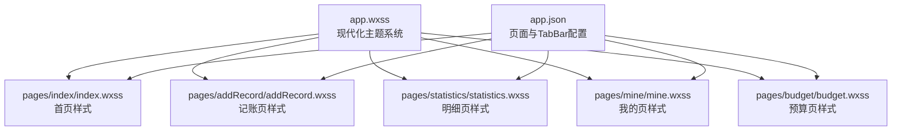
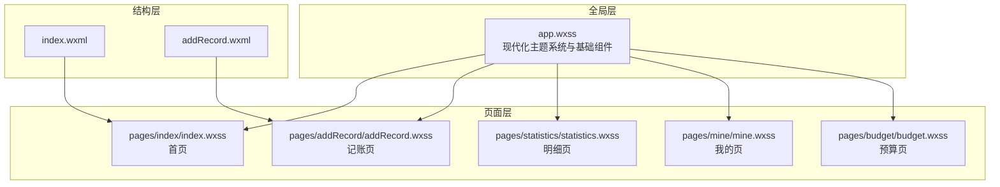
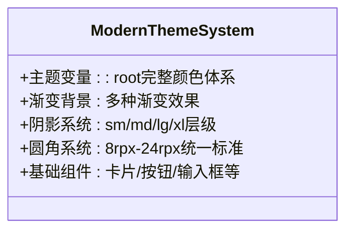
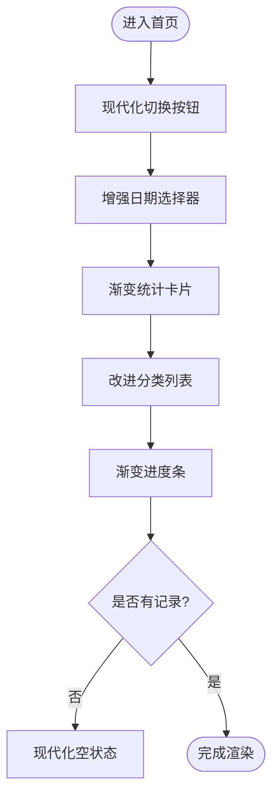
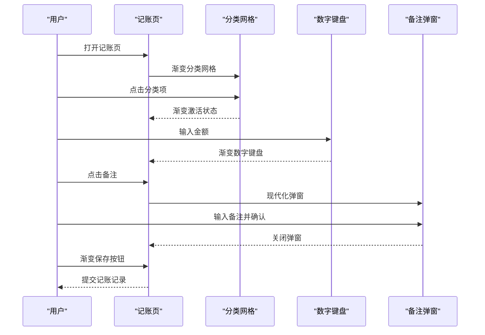
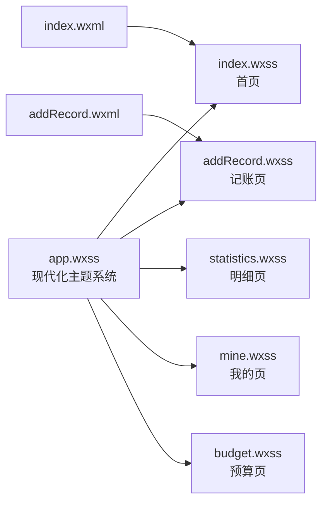

# 样式与界面设计

<cite>
**本文档引用的文件**
- [app.wxss](file://app.wxss)
- [index.wxss](file://pages/index/index.wxss)
- [addRecord.wxss](file://pages/addRecord/addRecord.wxss)
- [statistics.wxss](file://pages/statistics/statistics.wxss)
- [mine.wxss](file://pages/mine/mine.wxss)
- [budget.wxss](file://pages/budget/budget.wxss)
- [index.wxml](file://pages/index/index.wxml)
- [addRecord.wxml](file://pages/addRecord/addRecord.wxml)
- [app.json](file://app.json)
</cite>

## 更新摘要
**变更内容**
- 全面升级主题颜色系统，建立现代化设计体系
- 优化卡片样式，新增多种卡片类型和阴影效果
- 增强导航栏设计，提升视觉层次和交互体验
- 改进各页面组件样式，统一设计语言
- 优化响应式布局和交互反馈机制

## 目录
1. [简介](#简介)
2. [项目结构](#项目结构)
3. [核心组件](#核心组件)
4. [架构总览](#架构总览)
5. [详细组件分析](#详细组件分析)
6. [依赖关系分析](#依赖关系分析)
7. [性能考虑](#性能考虑)
8. [故障排查指南](#故障排查指南)
9. [结论](#结论)
10. [附录](#附录)

## 简介
本文件面向"迷你记账小程序"的样式与界面设计，系统梳理全面升级后的全局样式规范、组件样式设计与响应式布局策略。本次样式系统升级建立了现代化的设计体系，包括优化的主题颜色、改进的卡片样式、增强的导航栏和各页面的视觉效果提升。文档详细解释WXSS语法特点、样式继承机制与选择器使用方式，并提供页面布局设计原则、颜色搭配方案与字体排版规范。同时给出组件样式的复用策略、主题定制方法与兼容性处理建议，以及样式调试技巧与性能优化建议，确保界面在不同设备上的一致与良好显示效果。

## 项目结构
项目采用按页面组织的结构，每个页面拥有独立的WXSS文件用于局部样式定义，同时通过全局app.wxss提供统一的主题变量、基础组件样式与通用布局规范。底部导航由app.json的tabBar配置统一管理，页面间通过路由进行跳转。

**图表来源**
- [app.wxss](file://app.wxss)
- [index.wxss](file://pages/index/index.wxss)
- [addRecord.wxss](file://pages/addRecord/addRecord.wxss)
- [statistics.wxss](file://pages/statistics/statistics.wxss)
- [mine.wxss](file://pages/mine/mine.wxss)
- [budget.wxss](file://pages/budget/budget.wxss)
- [app.json](file://app.json)

**章节来源**
- [app.wxss](file://app.wxss)
- [app.json](file://app.json)

## 核心组件
本次样式系统升级后，核心样式组件包括：

### 现代化主题系统
- **完整颜色体系**：通过CSS自定义属性建立主色、辅助色、中性色、功能色的完整设计系统
- **渐变色彩**：广泛使用渐变背景增强视觉层次和现代感
- **阴影系统**：提供多层级阴影效果（sm/md/lg/xl）

### 增强的基础组件样式
- **卡片系统**：普通卡片、轻量级卡片、边框卡片三种类型
- **按钮系统**：主按钮、次按钮、轮廓按钮、圆形按钮、大小按钮变体
- **输入组件**：优化的输入框样式，支持焦点状态
- **导航组件**：现代化导航栏，支持渐变背景
- **统计组件**：增强的统计卡片，支持多种布局
- **交互组件**：改进的切换按钮、分段控制器、进度条

### 页面级样式
- **首页**：现代化统计卡片、分类列表、图表容器
- **记账页**：增强的金额显示、分类选择、数字键盘
- **明细页**：优化的交易记录列表、空状态设计
- **我的页**：改进的用户信息展示、菜单布局
- **预算页**：增强的预算进度显示

这些组件通过类名组合与层级嵌套实现复用，避免重复定义，提升可维护性。

**章节来源**
- [app.wxss](file://app.wxss)
- [index.wxss](file://pages/index/index.wxss)
- [addRecord.wxss](file://pages/addRecord/addRecord.wxss)
- [statistics.wxss](file://pages/statistics/statistics.wxss)
- [mine.wxss](file://pages/mine/mine.wxss)
- [budget.wxss](file://pages/budget/budget.wxss)

## 架构总览
全局样式通过app.wxss定义现代化主题系统，页面样式在各页面WXSS中扩展或覆盖。页面结构由WXML负责，WXSS负责视觉表现。底部导航由app.json的tabBar统一配置，页面间通过路由跳转。

**图表来源**
- [app.wxss](file://app.wxss)
- [index.wxss](file://pages/index/index.wxss)
- [addRecord.wxss](file://pages/addRecord/addRecord.wxss)
- [statistics.wxss](file://pages/statistics/statistics.wxss)
- [mine.wxss](file://pages/mine/mine.wxss)
- [budget.wxss](file://pages/budget/budget.wxss)
- [index.wxml](file://pages/index/index.wxml)
- [addRecord.wxml](file://pages/addRecord/addRecord.wxml)

## 详细组件分析

### 现代化主题系统（app.wxss）
**更新** 主题系统已全面升级，建立完整的现代化设计体系

- **主题颜色体系**：通过:root定义完整的颜色变量系统，包括主色（活力橙色）、收入/支出色、中性色、功能色等
- **渐变背景**：大量使用渐变背景增强视觉层次，特别是统计卡片和按钮
- **阴影系统**：提供多层级阴影效果（sm/md/lg/xl），营造立体感
- **圆角系统**：统一使用rpx单位的圆角半径，从8rpx到24rpx不等
- **基础组件**：提供完整的组件库，包括卡片、按钮、输入框、图标、列表项等

**图表来源**
- [app.wxss](file://app.wxss)

**章节来源**
- [app.wxss](file://app.wxss)

### 首页样式（index.wxss）
**更新** 首页样式全面现代化，增强了视觉层次和交互体验

- **统计卡片**：采用渐变背景和装饰线条，支持多种布局方式
- **分类列表**：改进的分类展示，支持收入/支出不同样式
- **进度条**：增强的进度条设计，支持渐变色彩
- **卡片系统**：使用现代化的圆角和阴影效果
- **空状态**：优化的空状态设计，使用emoji图标

**图表来源**
- [index.wxss](file://pages/index/index.wxss)
- [index.wxml](file://pages/index/index.wxml)

**章节来源**
- [index.wxss](file://pages/index/index.wxss)
- [index.wxml](file://pages/index/index.wxml)

### 记账页样式（addRecord.wxss）
**更新** 记账页样式大幅优化，提升了用户体验和视觉效果

- **金额显示**：现代化的大字号金额显示，支持货币符号和数值分离
- **类型切换**：增强的类型切换按钮，支持收入/支出不同样式
- **分类选择**：改进的分类网格，支持渐变背景和激活状态
- **数字键盘**：优化的数字键盘布局，支持渐变保存按钮
- **备注弹窗**：现代化的弹窗设计，支持渐变背景

**图表来源**
- [addRecord.wxss](file://pages/addRecord/addRecord.wxss)
- [addRecord.wxml](file://pages/addRecord/addRecord.wxml)

**章节来源**
- [addRecord.wxss](file://pages/addRecord/addRecord.wxss)
- [addRecord.wxml](file://pages/addRecord/addRecord.wxml)

### 明细页样式（statistics.wxss）
**更新** 明细页样式现代化，增强了统计展示和交互体验

- **顶部统计区域**：使用渐变背景和装饰线条
- **月份选择器**：现代化的选择器设计，支持模糊背景
- **交易记录列表**：改进的列表样式，支持收入/支出不同颜色
- **空状态设计**：优化的空状态展示，使用大图标和提示文字
- **悬浮按钮**：现代化的悬浮添加按钮

**章节来源**
- [statistics.wxss](file://pages/statistics/statistics.wxss)

### 我的页样式（mine.wxss）
**更新** 我的页样式保持原有设计，专注于用户信息展示

- **用户区**：使用绿色渐变背景，支持头像和签到功能
- **统计区**：现代化的统计展示，使用白色半透明背景
- **VIP区**：暖色调渐变背景，支持会员等级展示
- **菜单网格**：改进的菜单布局，支持徽章提醒

**章节来源**
- [mine.wxss](file://pages/mine/mine.wxss)

### 预算页样式（budget.wxss）
**更新** 预算页样式相对简化，专注于预算功能展示

- **月份选择器**：现代化的选择器设计
- **收支概览**：简化的收支统计展示
- **预算列表**：基础的预算进度显示
- **提醒设置**：简单的设置项布局

**章节来源**
- [budget.wxss](file://pages/budget/budget.wxss)

## 依赖关系分析
- **全局依赖**：所有页面样式均依赖app.wxss中的现代化主题变量与基础组件样式
- **页面依赖**：各页面样式相互独立，仅共享全局样式，降低耦合度
- **结构依赖**：WXML通过类名绑定样式，WXSS通过选择器应用到对应节点

**图表来源**
- [app.wxss](file://app.wxss)
- [index.wxss](file://pages/index/index.wxss)
- [addRecord.wxss](file://pages/addRecord/addRecord.wxss)
- [statistics.wxss](file://pages/statistics/statistics.wxss)
- [mine.wxss](file://pages/mine/mine.wxss)
- [budget.wxss](file://pages/budget/budget.wxss)
- [index.wxml](file://pages/index/index.wxml)
- [addRecord.wxml](file://pages/addRecord/addRecord.wxml)

**章节来源**
- [app.wxss](file://app.wxss)
- [index.wxss](file://pages/index/index.wxss)
- [addRecord.wxss](file://pages/addRecord/addRecord.wxss)
- [statistics.wxss](file://pages/statistics/statistics.wxss)
- [mine.wxss](file://pages/mine/mine.wxss)
- [budget.wxss](file://pages/budget/budget.wxss)
- [index.wxml](file://pages/index/index.wxml)
- [addRecord.wxml](file://pages/addRecord/addRecord.wxml)

## 性能考虑
- **样式体积控制**：启用WXSS压缩与最小化，减少网络传输与解析开销
- **选择器复杂度**：优先使用类选择器与简单层级选择器，避免深层后代选择器
- **动画与过渡**：合理使用transition与transform，避免频繁触发布局抖动
- **渐变与阴影**：使用CSS渐变和阴影替代图片资源，提升性能
- **响应式与单位**：统一使用rpx单位，适配不同屏幕密度
- **缓存与复用**：通过全局样式与组件类名复用，提升维护效率与运行时性能

## 故障排查指南
- **样式不生效**
  - 检查类名拼写与大小写是否与WXSS定义一致
  - 确认页面是否正确引入对应WXSS，或是否被全局样式覆盖
  - 使用开发者工具的"样式检查"面板查看最终计算样式
- **布局错位**
  - 检查Flex/Grid的方向与对齐方式，确保容器与子项的尺寸合理
  - 对于固定定位元素，确认z-index与安全区域设置
- **主题色不一致**
  - 确认使用var(--xxx)变量而非硬编码颜色值
  - 检查CSS变量是否正确定义和使用
- **动画卡顿**
  - 将频繁动画属性限制在transform与opacity上
  - 减少动画期间的重排与重绘
- **兼容性问题**
  - 关注不同设备与系统版本的样式渲染差异
  - 对于新特性提供降级方案

## 结论
本次样式系统全面升级建立了现代化的设计体系，通过完整的主题颜色系统、改进的组件样式和增强的交互体验，实现了统一的视觉语言。新的设计系统在保持功能完整性的同时，显著提升了用户体验和界面美观度。建议在后续迭代中继续完善主题定制能力和无障碍访问支持，并通过自动化测试保障样式质量。

## 附录

### WXSS语法与选择器要点
- **语法特点**：支持CSS选择器、伪元素、媒体查询、自定义属性、Flex/Grid布局等
- **继承机制**：文本颜色、字号等可继承属性会从父元素传递到子元素
- **选择器使用**：推荐使用类选择器与简单层级选择器，利用:root定义主题变量

### 现代化颜色搭配与字体排版规范
- **颜色体系**：主色用于重要按钮与选中态，辅助色用于次要元素，中性色区分主次状态
- **渐变设计**：广泛使用渐变背景增强视觉层次
- **字体排版**：标题使用较大字号与较粗字重，正文使用适中字号与行高

### 响应式布局策略
- **单位**：统一使用rpx，适配不同屏幕密度与分辨率
- **布局**：优先使用Flex与Grid，配合gap、justify-content等属性
- **安全区域**：注意env(safe-area-inset-bottom)的使用

### 组件样式复用与主题定制
- **复用策略**：将通用样式抽象为基础类，页面通过组合类名实现复用
- **主题定制**：通过:root自定义属性集中管理主题色，支持主题切换

### 样式调试与性能优化建议
- **调试技巧**：使用开发者工具的"样式检查"、"布局检查"与"性能面板"
- **优化建议**：减少选择器层级、避免频繁重排重绘、使用transform与opacity实现动画