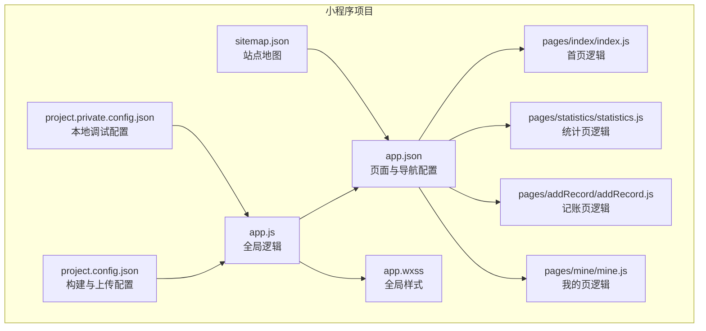
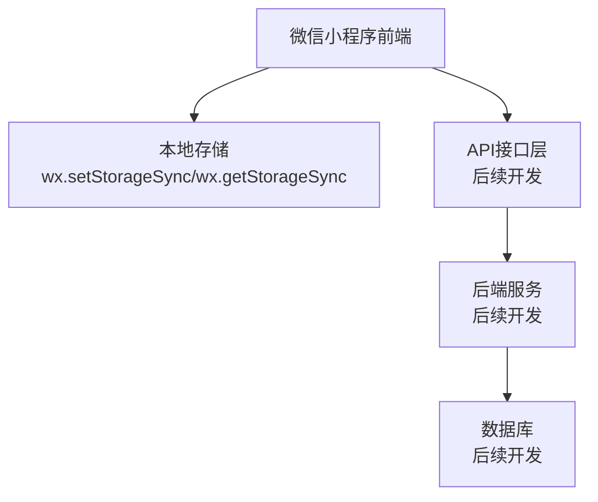
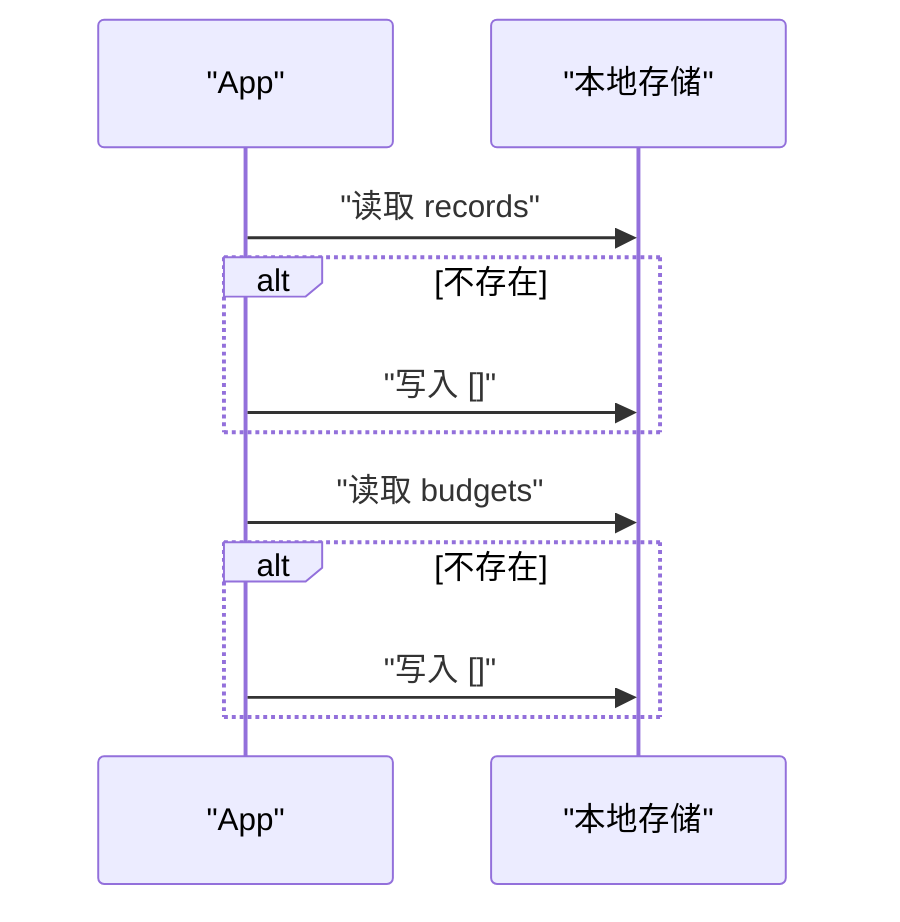
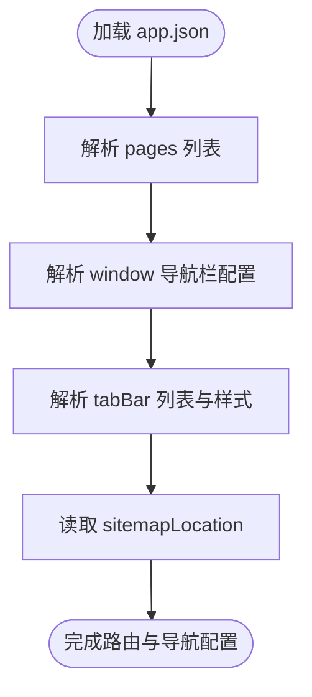
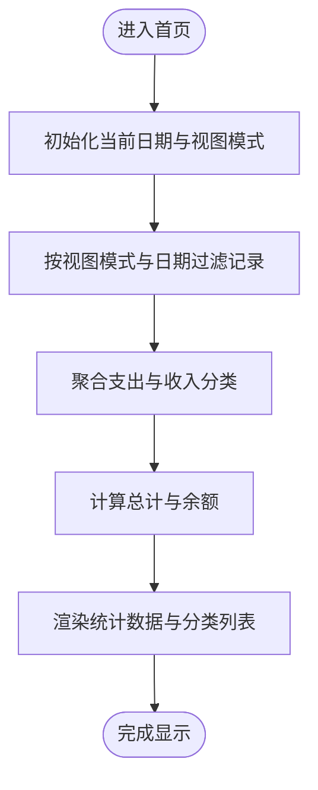
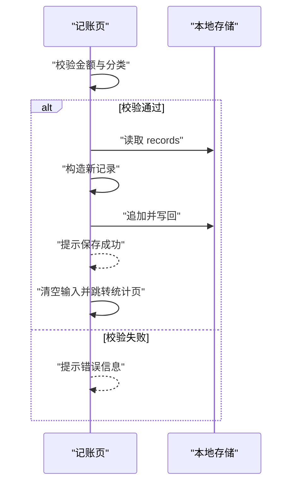
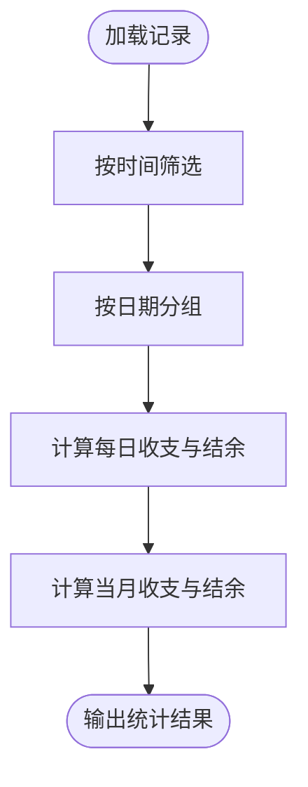
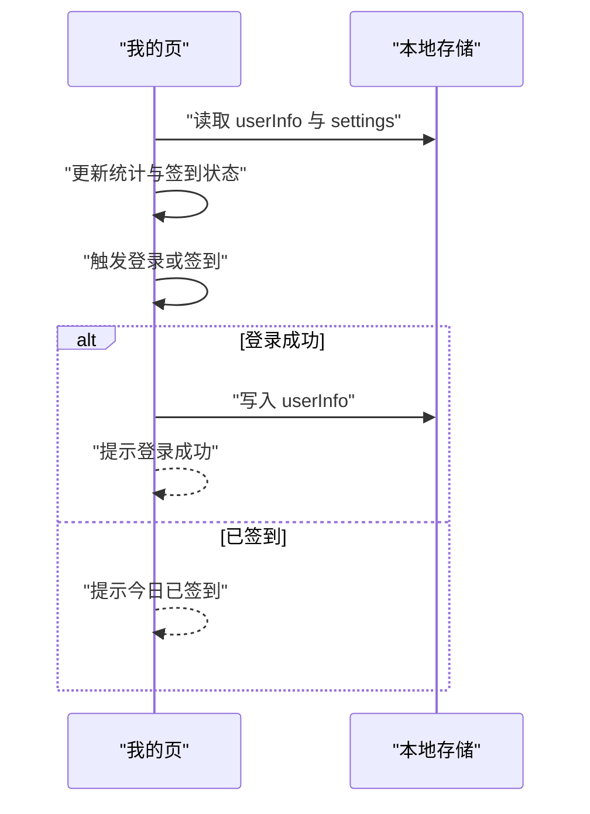
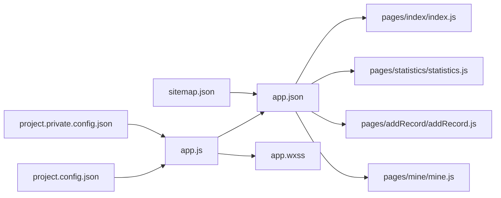

# 部署与发布

<cite>
**本文引用的文件**
- [app.js](file://app.js)
- [app.json](file://app.json)
- [app.wxss](file://app.wxss)
- [project.config.json](file://project.config.json)
- [project.private.config.json](file://project.private.config.json)
- [sitemap.json](file://sitemap.json)
- [pages/index/index.js](file://pages/index/index.js)
- [pages/index/index.wxss](file://pages/index/index.wxss)
- [pages/addRecord/addRecord.js](file://pages/addRecord/addRecord.js)
- [pages/addRecord/addRecord.wxss](file://pages/addRecord/addRecord.wxss)
- [pages/statistics/statistics.js](file://pages/statistics/statistics.js)
- [pages/mine/mine.js](file://pages/mine/mine.js)
- [.trae/documents/记账小程序技术架构文档.md](file://.trae/documents/记账小程序技术架构文档.md)
</cite>

## 目录
1. [简介](#简介)
2. [项目结构](#项目结构)
3. [核心组件](#核心组件)
4. [架构总览](#架构总览)
5. [详细组件分析](#详细组件分析)
6. [依赖关系分析](#依赖关系分析)
7. [性能考量](#性能考量)
8. [故障排查指南](#故障排查指南)
9. [结论](#结论)
10. [附录](#附录)

## 简介
本指南面向“迷你记账”小程序的部署与发布全流程，覆盖开发工具配置、项目打包、微信小程序平台发布步骤、配置文件作用与关键参数、版本管理与更新机制、回滚方案、发布前测试清单、审核注意事项以及上线后的监控与运维建议。文档以仓库现有源码为基础，结合微信小程序官方规范与最佳实践，提供可操作的交付与运维管理建议。

## 项目结构
该项目采用微信小程序标准目录结构，包含全局入口、页面与样式资源、构建配置与站点地图等关键文件。页面按功能划分为首页、统计页、记账页、我的页；全局样式统一管理主题色与通用组件样式；项目配置文件控制编译、上传与调试行为；sitemap 控制搜索引擎收录范围。

**图表来源**
- [app.js:1-24](file://app.js#L1-L24)
- [app.json:1-39](file://app.json#L1-L39)
- [app.wxss:1-335](file://app.wxss#L1-L335)
- [project.config.json:1-77](file://project.config.json#L1-L77)
- [project.private.config.json:1-22](file://project.private.config.json#L1-L22)
- [sitemap.json:1-7](file://sitemap.json#L1-L7)
- [pages/index/index.js:1-189](file://pages/index/index.js#L1-L189)
- [pages/statistics/statistics.js:1-160](file://pages/statistics/statistics.js#L1-L160)
- [pages/addRecord/addRecord.js:1-190](file://pages/addRecord/addRecord.js#L1-L190)
- [pages/mine/mine.js:1-257](file://pages/mine/mine.js#L1-L257)

**章节来源**
- [app.js:1-24](file://app.js#L1-L24)
- [app.json:1-39](file://app.json#L1-L39)
- [app.wxss:1-335](file://app.wxss#L1-L335)
- [project.config.json:1-77](file://project.config.json#L1-L77)
- [project.private.config.json:1-22](file://project.private.config.json#L1-L22)
- [sitemap.json:1-7](file://sitemap.json#L1-L7)

## 核心组件
- 全局入口与初始化
  - 在全局生命周期中进行本地数据初始化，确保首次运行时存在空的记账与预算数据结构，避免后续读取异常。
- 页面路由与导航
  - app.json 定义了四个页面与底部 tabbar，分别对应统计、图表、记账、我的功能区域。
- 样式体系
  - 全局样式集中定义主题变量与通用组件样式，页面样式遵循统一风格，保证视觉一致性。
- 配置文件
  - project.config.json 控制构建优化、压缩、编译热重载、插件与多帧运行等；project.private.config.json 提供本地调试偏好（如热重载、网络调试等）。
- 站点地图
  - sitemap.json 控制页面收录范围，便于搜索引擎抓取与索引。

**章节来源**
- [app.js:1-24](file://app.js#L1-L24)
- [app.json:1-39](file://app.json#L1-L39)
- [app.wxss:1-335](file://app.wxss#L1-L335)
- [project.config.json:1-77](file://project.config.json#L1-L77)
- [project.private.config.json:1-22](file://project.private.config.json#L1-L22)
- [sitemap.json:1-7](file://sitemap.json#L1-L7)

## 架构总览
从技术架构文档可知，当前为前端小程序+本地存储模式，后续可扩展后端服务与数据库。下图展示当前与未来可能的演进关系。

**图表来源**
- [.trae/documents/记账小程序技术架构文档.md:1-86](file://.trae/documents/记账小程序技术架构文档.md#L1-L86)

**章节来源**
- [.trae/documents/记账小程序技术架构文档.md:1-86](file://.trae/documents/记账小程序技术架构文档.md#L1-L86)

## 详细组件分析

### 全局初始化与数据准备
- 初始化逻辑在 App 生命周期中执行，检查并创建默认的记账与预算存储键值，确保页面读取安全。
- 全局数据对象用于跨页面共享用户信息等状态。

**图表来源**
- [app.js:1-24](file://app.js#L1-L24)

**章节来源**
- [app.js:1-24](file://app.js#L1-L24)

### 页面路由与导航配置
- app.json 中 pages 字段声明页面路径，window 定义导航栏外观，tabBar 定义底部导航列表与选中态样式。
- sitemapLocation 指向 sitemap.json，控制页面收录。

**图表来源**
- [app.json:1-39](file://app.json#L1-L39)
- [sitemap.json:1-7](file://sitemap.json#L1-L7)

**章节来源**
- [app.json:1-39](file://app.json#L1-L39)
- [sitemap.json:1-7](file://sitemap.json#L1-L7)

### 首页统计与图表数据计算
- 首页负责切换视图模式（月/年）、日期选择、前后周期跳转，并基于本地存储的数据进行筛选与聚合计算，生成收支总计、分类占比与图标等结果。
- 使用本地存储进行数据持久化，避免网络依赖。

**图表来源**
- [pages/index/index.js:1-189](file://pages/index/index.js#L1-L189)

**章节来源**
- [pages/index/index.js:1-189](file://pages/index/index.js#L1-L189)

### 记账页输入与保存流程
- 记账页支持收入/支出切换、分类选择、金额输入（含小数点限制与退格处理）、备注弹窗、日期选择与保存。
- 保存时校验金额与分类，构造记录对象并写入本地存储，提示成功后自动跳转到统计页。

**图表来源**
- [pages/addRecord/addRecord.js:1-190](file://pages/addRecord/addRecord.js#L1-L190)

**章节来源**
- [pages/addRecord/addRecord.js:1-190](file://pages/addRecord/addRecord.js#L1-L190)

### 统计页筛选与分组
- 统计页支持按今日/本周/本月筛选，对记录按日期分组并计算日结余，同时计算当月收支与结余。
- 使用本地存储读取数据，排序与分组逻辑在前端完成。

**图表来源**
- [pages/statistics/statistics.js:1-160](file://pages/statistics/statistics.js#L1-L160)

**章节来源**
- [pages/statistics/statistics.js:1-160](file://pages/statistics/statistics.js#L1-L160)

### 我的页用户与签到
- 我的页负责加载用户信息与设置、统计总记录数与天数、签到逻辑与提示。
- 登录流程使用模拟登录，写入本地存储并提示成功。

**图表来源**
- [pages/mine/mine.js:1-257](file://pages/mine/mine.js#L1-L257)

**章节来源**
- [pages/mine/mine.js:1-257](file://pages/mine/mine.js#L1-L257)

## 依赖关系分析
- 页面依赖全局样式与配置文件：
  - app.wxss 提供全局主题与通用组件样式，各页面样式文件继承与扩展。
  - app.json 决定页面注册与导航结构，影响页面间跳转与 tabbar 行为。
- 构建与上传依赖：
  - project.config.json 控制编译选项、压缩、插件与运行时特性。
  - project.private.config.json 控制本地调试偏好（如热重载、局域网调试等）。
- 数据依赖：
  - 所有页面均依赖本地存储进行数据持久化，减少对外部服务的耦合。

**图表来源**
- [app.js:1-24](file://app.js#L1-L24)
- [app.json:1-39](file://app.json#L1-L39)
- [app.wxss:1-335](file://app.wxss#L1-L335)
- [project.config.json:1-77](file://project.config.json#L1-L77)
- [project.private.config.json:1-22](file://project.private.config.json#L1-L22)
- [sitemap.json:1-7](file://sitemap.json#L1-L7)
- [pages/index/index.js:1-189](file://pages/index/index.js#L1-L189)
- [pages/statistics/statistics.js:1-160](file://pages/statistics/statistics.js#L1-L160)
- [pages/addRecord/addRecord.js:1-190](file://pages/addRecord/addRecord.js#L1-L190)
- [pages/mine/mine.js:1-257](file://pages/mine/mine.js#L1-L257)

**章节来源**
- [app.js:1-24](file://app.js#L1-L24)
- [app.json:1-39](file://app.json#L1-L39)
- [app.wxss:1-335](file://app.wxss#L1-L335)
- [project.config.json:1-77](file://project.config.json#L1-L77)
- [project.private.config.json:1-22](file://project.private.config.json#L1-L22)
- [sitemap.json:1-7](file://sitemap.json#L1-L7)

## 性能考量
- 编译与压缩
  - 启用 ES6 转译、CSS/JS 压缩、WXML/WXSS 压缩，提升包体体积与运行效率。
  - 关闭热重载与静态服务器，避免开发期性能开销影响生产包质量。
- 运行时优化
  - 使用本地存储替代网络请求，降低首屏延迟与失败风险。
  - 合理拆分页面逻辑，避免单页数据量过大导致渲染卡顿。
- 样式与资源
  - 统一使用全局样式变量，减少重复定义与样式冲突。
  - 图标与图片采用合适尺寸，避免大图占用过多内存。

[本节为通用指导，无需具体文件分析]

## 故障排查指南
- 本地调试问题
  - 若出现页面无法热更新，检查 project.private.config.json 的 compileHotReLoad 与 useLanDebug 设置。
  - 若样式未生效，确认 app.wxss 是否正确引入且页面样式未被覆盖。
- 构建与上传问题
  - 若上传失败，检查 project.config.json 的 appid 与 libVersion 是否匹配当前开发者工具版本。
  - 若包体过大，调整 packOptions 的忽略规则或关闭不必要的插件与多帧运行。
- 数据异常
  - 若记录为空或丢失，检查 app.js 初始化逻辑是否正常写入默认数组。
  - 若分类或金额显示异常，核对页面数据结构与本地存储键名一致。

**章节来源**
- [project.private.config.json:1-22](file://project.private.config.json#L1-L22)
- [project.config.json:1-77](file://project.config.json#L1-L77)
- [app.js:1-24](file://app.js#L1-L24)

## 结论
本指南基于现有代码与配置，提供了从开发工具到微信平台发布的完整流程与运维建议。当前项目以本地存储为核心，具备清晰的页面结构与统一的样式体系。建议在后续迭代中完善后端服务与数据库，逐步引入版本管理、灰度发布与自动化测试，以支撑更稳定的线上交付与持续运营。

[本节为总结性内容，无需具体文件分析]

## 附录

### 开发工具配置与关键参数
- appid 配置
  - 在 project.config.json 中设置 appid，确保与微信公众平台账号一致。
- 编译选项
  - setting 中的 es6、minified、minifyWXSS、minifyWXML 等参数控制代码压缩与编译优化。
- 调试设置
  - project.private.config.json 提供本地调试偏好，如 compileHotReLoad、useLanDebug、skylineRenderEnable 等。
- 版本与库版本
  - libVersion 指定基础库版本，需与目标设备兼容性匹配。

**章节来源**
- [project.config.json:1-77](file://project.config.json#L1-L77)
- [project.private.config.json:1-22](file://project.private.config.json#L1-L22)

### 项目打包与发布流程
- 准备阶段
  - 确认 app.json 页面与 tabbar 配置正确，sitemap.json 收录策略符合预期。
  - 检查 project.config.json 的 appid、libVersion、编译选项与上传参数。
- 本地预览与真机调试
  - 使用微信开发者工具进行本地预览与真机调试，验证页面交互与数据流。
- 上传与发布
  - 在开发者工具中点击上传，填写版本号与变更说明，提交审核。
  - 审核通过后在微信公众平台发布版本。

**章节来源**
- [app.json:1-39](file://app.json#L1-L39)
- [sitemap.json:1-7](file://sitemap.json#L1-L7)
- [project.config.json:1-77](file://project.config.json#L1-L77)

### 版本管理策略、更新机制与回滚方案
- 版本管理
  - 采用语义化版本号（主.次.修订），每次重大功能或修复发布一个新版本。
- 更新机制
  - 通过微信公众平台的“开发版本”与“体验版”进行灰度发布，逐步扩大用户覆盖面。
- 回滚方案
  - 若发现严重问题，及时回退至上一个稳定版本；若涉及数据结构变更，需提供迁移脚本或兼容读取逻辑。

[本节为通用指导，无需具体文件分析]

### 发布前测试检查清单
- 功能测试
  - 验证首页统计、记账保存、统计筛选、我的页登录与签到等核心流程。
- 兼容性测试
  - 在不同机型与系统版本上测试页面布局与交互。
- 性能测试
  - 检查页面加载速度与内存占用，避免大数组渲染导致卡顿。
- 安全与隐私
  - 确保不收集敏感信息，遵守平台隐私政策。

[本节为通用指导，无需具体文件分析]

### 审核注意事项
- 内容合规
  - 页面不得包含违规信息，图标与文案应符合平台规范。
- 功能完整性
  - 页面功能应完整可用，避免引导用户到外部链接或未实现功能。
- 用户体验
  - 界面清晰、操作流畅，避免误导性提示。

[本节为通用指导，无需具体文件分析]

### 上线后的监控与运维
- 监控指标
  - 关注启动耗时、页面渲染耗时、崩溃率与用户反馈。
- 日志与埋点
  - 可在后续版本引入基础埋点与错误上报，辅助定位问题。
- 迭代与维护
  - 建立定期维护计划，修复已知问题并优化用户体验。

[本节为通用指导，无需具体文件分析]