# 个人中心页面

<cite>
**本文档引用的文件**
- [mine.js](file://pages/mine/mine.js)
- [mine.wxml](file://pages/mine/mine.wxml)
- [mine.wxss](file://pages/mine/mine.wxss)
- [app.js](file://app.js)
- [app.json](file://app.json)
- [statistics.js](file://pages/statistics/statistics.js)
- [statistics.wxml](file://pages/statistics/statistics.wxml)
- [index.js](file://pages/index/index.js)
- [addRecord.js](file://pages/addRecord/addRecord.js)
</cite>

## 目录
1. [简介](#简介)
2. [项目结构](#项目结构)
3. [核心组件](#核心组件)
4. [架构概览](#架构概览)
5. [详细组件分析](#详细组件分析)
6. [依赖关系分析](#依赖关系分析)
7. [性能考虑](#性能考虑)
8. [故障排除指南](#故障排除指南)
9. [结论](#结论)
10. [附录](#附录)

## 简介

个人中心页面是杪记记账小程序的核心功能模块之一，为用户提供个人信息管理、统计数据显示、功能导航和设置入口等功能。该页面采用微信小程序框架开发，通过本地存储实现数据持久化，提供直观的用户界面和流畅的交互体验。

个人中心页面主要包含以下核心功能：
- 用户信息展示和登录状态管理
- 记账统计数据实时更新（连续打卡天数、记账总天数、记账总笔数）
- 打卡签到功能和VIP升级入口
- 多功能导航菜单和设置入口
- 账户安全中心和反馈系统

## 项目结构

杪记小程序采用模块化的页面组织方式，个人中心页面位于pages/mine目录下，与其他核心页面形成完整的功能体系。

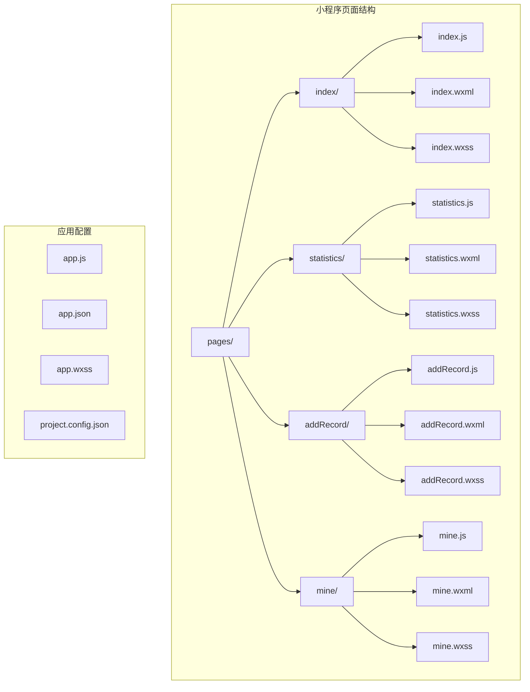

**图表来源**
- [app.json:1-39](file://app.json#L1-L39)
- [mine.js:1-257](file://pages/mine/mine.js#L1-L257)

**章节来源**
- [app.json:1-39](file://app.json#L1-L39)
- [mine.js:1-257](file://pages/mine/mine.js#L1-L257)

## 核心组件

个人中心页面由三个主要部分组成：用户信息区、统计数据显示区和功能导航区。

### 数据模型

页面使用响应式数据模型管理所有显示内容：

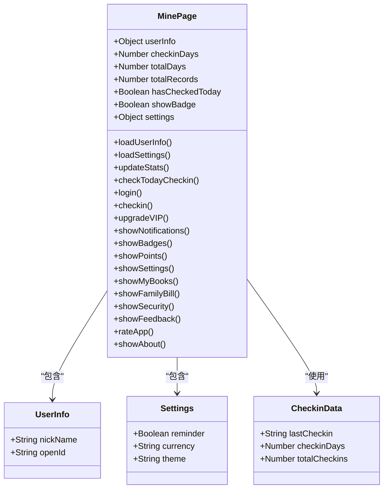

**图表来源**
- [mine.js:2-16](file://pages/mine/mine.js#L2-L16)

### 页面生命周期管理

个人中心页面采用标准的微信小程序生命周期管理：

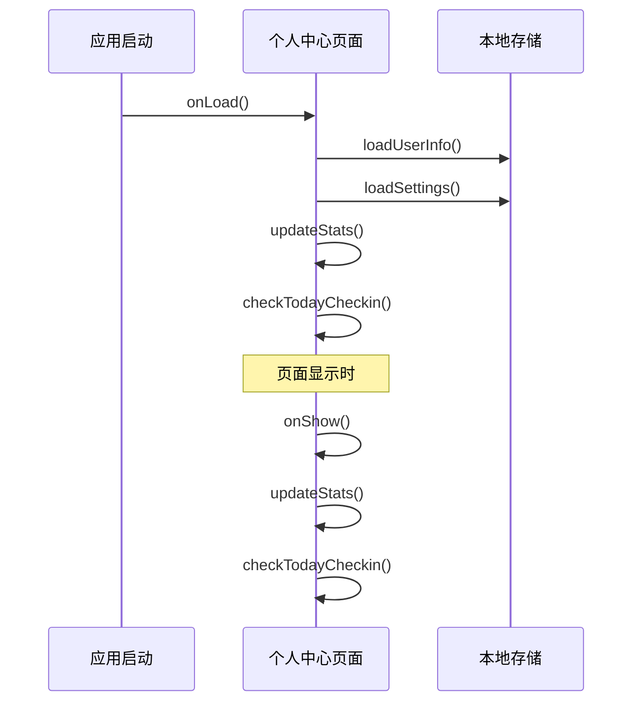

**图表来源**
- [mine.js:19-29](file://pages/mine/mine.js#L19-L29)

**章节来源**
- [mine.js:1-257](file://pages/mine/mine.js#L1-L257)

## 架构概览

个人中心页面采用MVVM架构模式，通过数据绑定实现视图与逻辑层的解耦。

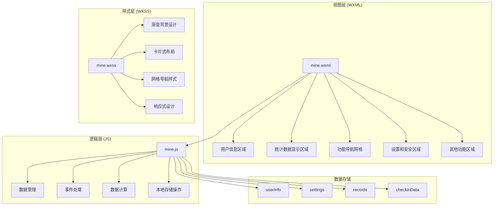

**图表来源**
- [mine.wxml:1-121](file://pages/mine/mine.wxml#L1-L121)
- [mine.wxss:1-211](file://pages/mine/mine.wxss#L1-L211)
- [mine.js:1-257](file://pages/mine/mine.js#L1-L257)

## 详细组件分析

### 用户信息管理组件

用户信息管理是个人中心的核心功能，负责展示用户基本信息和处理登录状态。

#### 用户信息展示逻辑

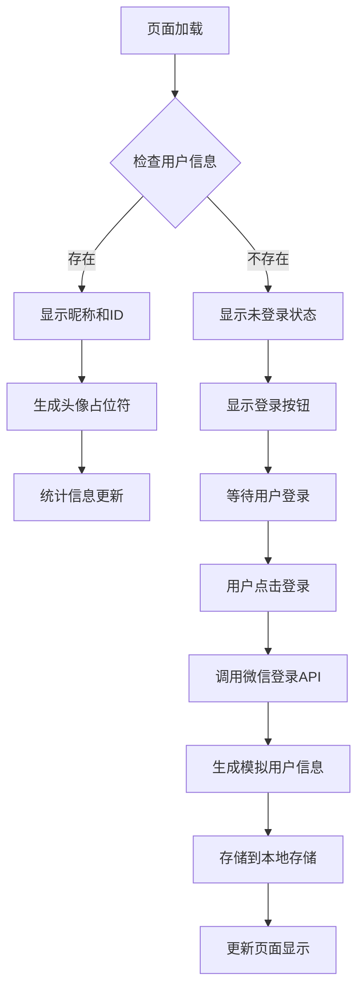

**图表来源**
- [mine.js:31-118](file://pages/mine/mine.js#L31-L118)
- [mine.wxml:8-20](file://pages/mine/mine.wxml#L8-L20)

#### 登录流程处理

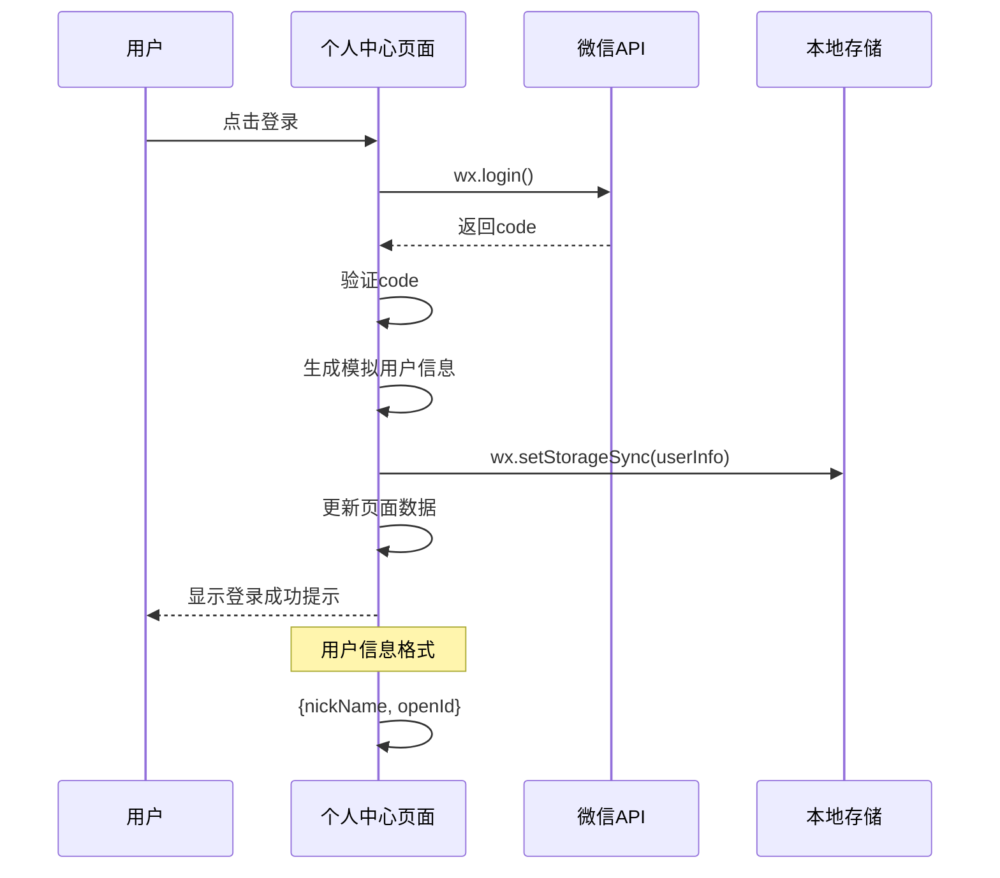

**图表来源**
- [mine.js:94-118](file://pages/mine/mine.js#L94-L118)

**章节来源**
- [mine.js:31-118](file://pages/mine/mine.js#L31-L118)
- [mine.wxml:8-20](file://pages/mine/mine.wxml#L8-L20)

### 统计数据显示组件

统计数据显示组件负责实时计算和展示用户的记账统计数据，包括连续打卡天数、记账总天数和记账总笔数。

#### 统计数据计算逻辑

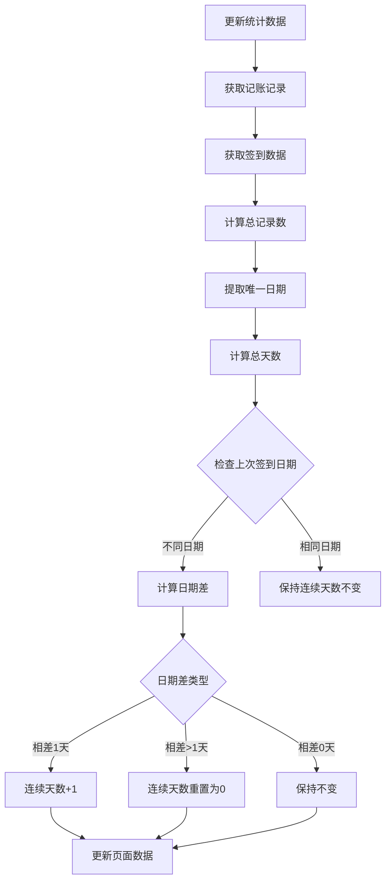

**图表来源**
- [mine.js:49-84](file://pages/mine/mine.js#L49-L84)

#### 连续打卡算法实现

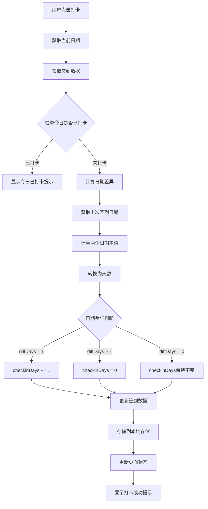

**图表来源**
- [mine.js:120-167](file://pages/mine/mine.js#L120-L167)

**章节来源**
- [mine.js:49-84](file://pages/mine/mine.js#L49-L84)
- [mine.js:120-167](file://pages/mine/mine.js#L120-L167)

### 功能导航组件

功能导航组件提供用户快速访问各个功能模块的入口，采用网格布局设计。

#### 导航菜单结构

个人中心页面包含三个主要的功能区域：

1. **快捷功能网格**：包含消息、徽章、积分、设置四个常用功能
2. **我的账本区域**：包含我的账本和家庭账单功能
3. **设置和安全区域**：包含设置和账户安全中心
4. **其他功能区域**：包含意见反馈、评分和关于页面

每个功能项都采用统一的图标+文字+箭头的布局设计，支持点击交互和状态指示。

**章节来源**
- [mine.wxml:49-120](file://pages/mine/mine.wxml#L49-L120)
- [mine.wxss:135-211](file://pages/mine/mine.wxss#L135-L211)

### 样式设计组件

个人中心页面采用现代化的视觉设计，注重用户体验和品牌一致性。

#### 视觉设计特点

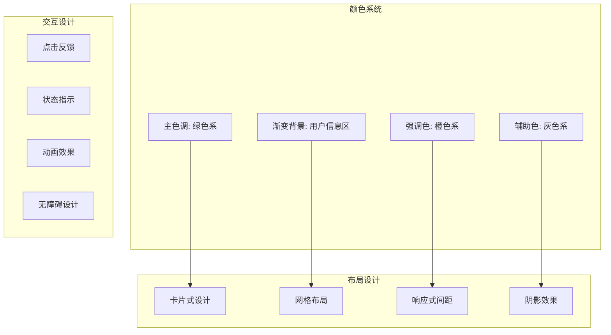

**图表来源**
- [mine.wxss:1-211](file://pages/mine/mine.wxss#L1-L211)

**章节来源**
- [mine.wxss:1-211](file://pages/mine/mine.wxss#L1-L211)

## 依赖关系分析

个人中心页面与其他页面和全局配置存在紧密的依赖关系。

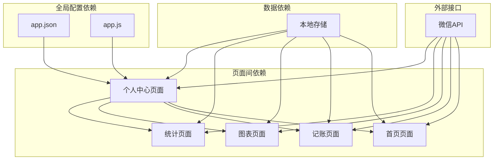

**图表来源**
- [app.json:2-39](file://app.json#L2-L39)
- [app.js:1-24](file://app.js#L1-L24)

### 数据流依赖

个人中心页面的数据流主要依赖于本地存储中的各种数据集合：

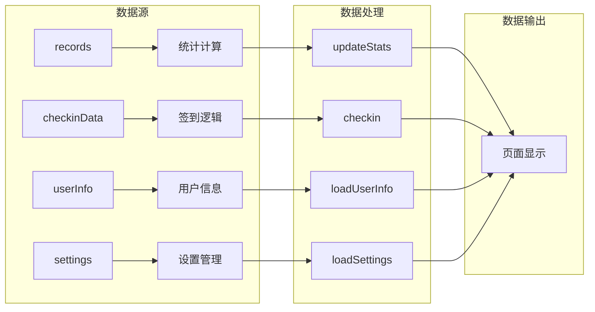

**图表来源**
- [mine.js:49-84](file://pages/mine/mine.js#L49-L84)
- [mine.js:120-167](file://pages/mine/mine.js#L120-L167)

**章节来源**
- [app.json:2-39](file://app.json#L2-L39)
- [app.js:1-24](file://app.js#L1-L24)
- [mine.js:49-84](file://pages/mine/mine.js#L49-L84)

## 性能考虑

个人中心页面在设计时充分考虑了性能优化，采用多种策略确保流畅的用户体验。

### 数据缓存策略

- **本地存储优化**：所有数据都存储在本地，避免网络请求开销
- **按需加载**：统计数据在页面显示时动态计算，减少初始加载时间
- **数据更新机制**：通过onShow生命周期确保数据实时性

### 渲染性能优化

- **虚拟DOM优化**：合理使用数据绑定，避免不必要的重新渲染
- **条件渲染**：使用wx:if控制元素显示，减少DOM节点数量
- **样式优化**：采用CSS3硬件加速属性提升渲染性能

### 内存管理

- **数据清理**：及时清理不需要的数据引用
- **事件解绑**：避免内存泄漏
- **图片优化**：使用合适的图片格式和尺寸

## 故障排除指南

### 常见问题及解决方案

#### 用户信息显示异常

**问题描述**：用户昵称或ID显示不正确

**可能原因**：
- 本地存储中的用户信息格式错误
- 用户信息为空或未初始化

**解决方法**：
1. 检查本地存储中的userInfo格式
2. 重新登录获取正确的用户信息
3. 清除本地存储后重新初始化

#### 统计数据计算错误

**问题描述**：连续打卡天数或记账天数显示不正确

**可能原因**：
- 记账记录格式不正确
- 日期格式处理错误
- 本地存储数据损坏

**解决方法**：
1. 检查records数组中的数据格式
2. 验证日期字符串格式
3. 重新计算统计数据

#### 打卡功能失效

**问题描述**：打卡按钮无法正常工作

**可能原因**：
- 本地存储权限问题
- 日期计算逻辑错误
- 网络请求超时

**解决方法**：
1. 检查本地存储权限设置
2. 验证日期计算逻辑
3. 重新初始化checkinData

**章节来源**
- [mine.js:31-118](file://pages/mine/mine.js#L31-L118)
- [mine.js:120-167](file://pages/mine/mine.js#L120-L167)

## 结论

个人中心页面作为杪记小程序的核心功能模块，成功实现了用户信息管理、统计数据显示和功能导航的完整功能体系。通过合理的架构设计和优化策略，页面提供了良好的用户体验和稳定的性能表现。

### 设计优势

1. **模块化设计**：清晰的功能分区和职责分离
2. **数据驱动**：基于本地存储的数据驱动架构
3. **用户体验**：直观的界面设计和流畅的交互体验
4. **扩展性强**：易于添加新功能和修改现有功能

### 技术亮点

1. **MVVM架构**：实现了视图与逻辑的完全解耦
2. **响应式设计**：适配不同屏幕尺寸的设备
3. **性能优化**：采用多种策略确保页面性能
4. **错误处理**：完善的异常处理和容错机制

## 附录

### 使用示例

#### 基本使用流程

1. **页面加载**：自动加载用户信息和统计数据
2. **用户交互**：点击功能按钮进行相应操作
3. **数据更新**：页面自动更新显示最新的统计数据

#### 开发建议

1. **代码维护**：保持代码结构清晰，注释完整
2. **测试覆盖**：增加单元测试和集成测试
3. **性能监控**：定期监控页面性能指标
4. **用户体验**：持续收集用户反馈并改进功能

### 扩展功能建议

1. **个性化设置**：增加更多主题和个性化选项
2. **社交功能**：添加好友系统和分享功能
3. **数据分析**：增强统计图表和趋势分析
4. **通知系统**：实现消息推送和提醒功能