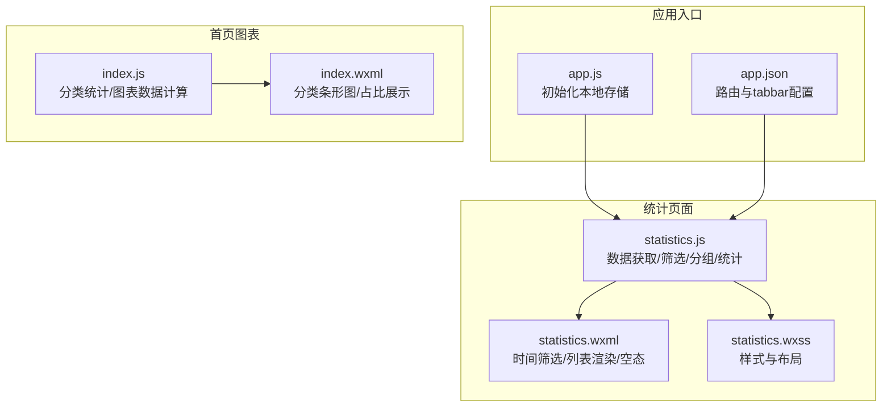
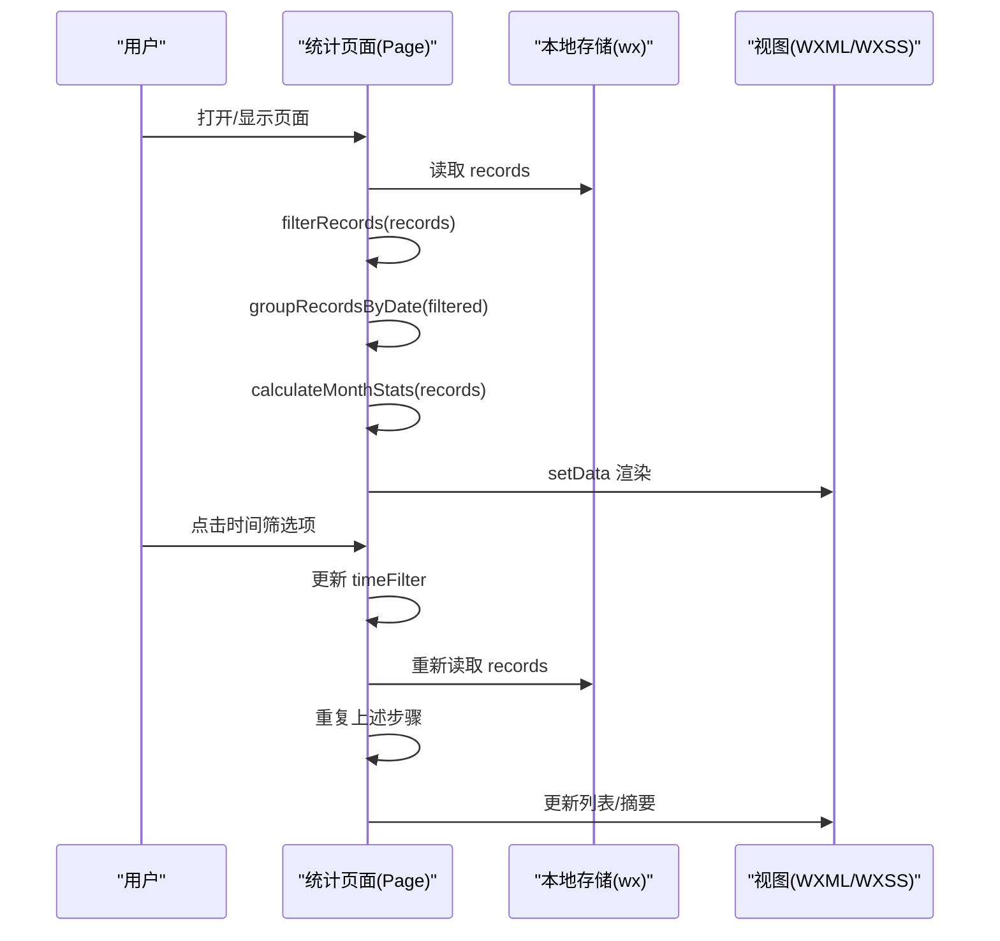
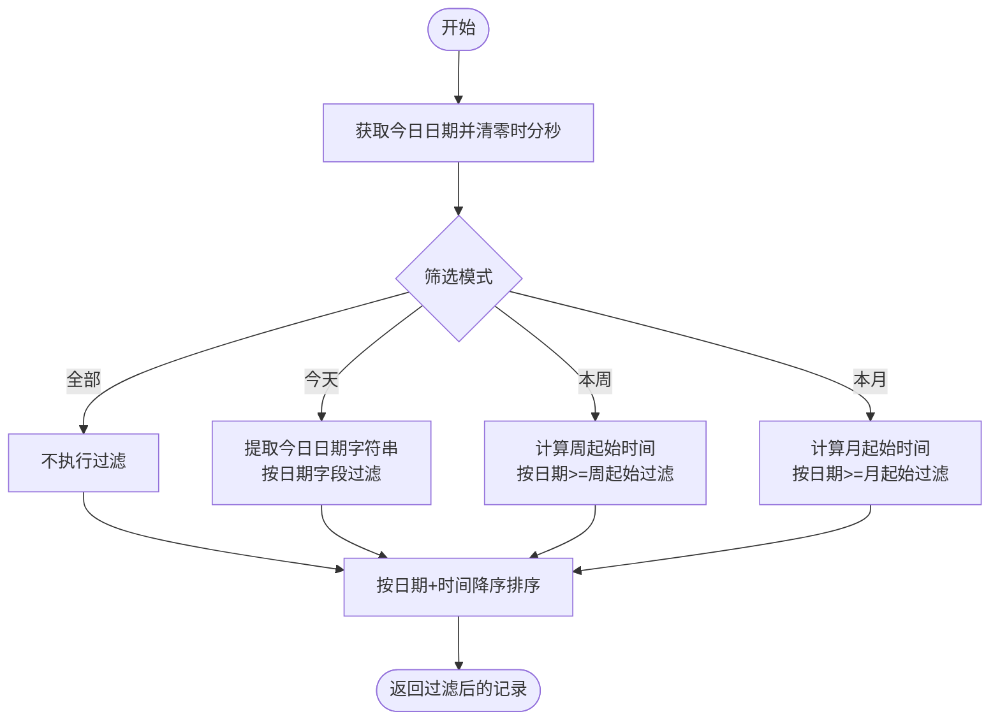
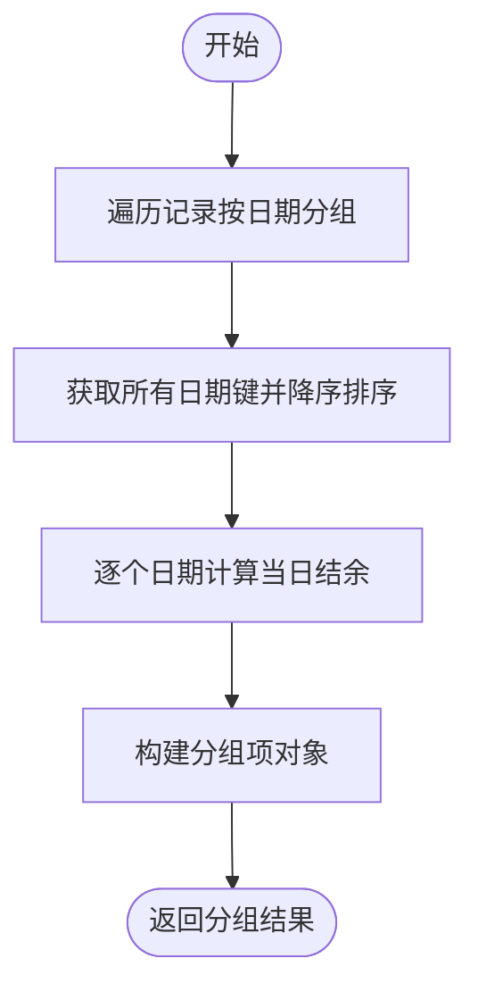
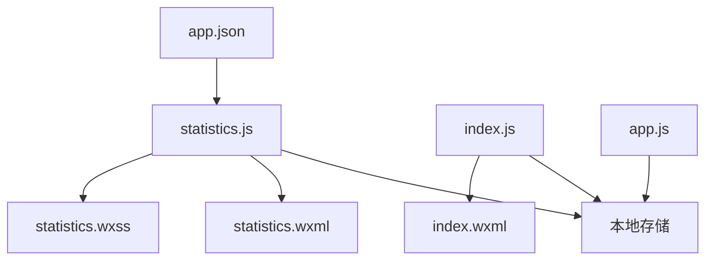

# 统计页面

<cite>
**本文引用的文件**
- [statistics.js](file://pages/statistics/statistics.js)
- [statistics.wxml](file://pages/statistics/statistics.wxml)
- [statistics.wxss](file://pages/statistics/statistics.wxss)
- [index.js](file://pages/index/index.js)
- [index.wxml](file://pages/index/index.wxml)
- [app.js](file://app.js)
- [app.json](file://app.json)
- [记账小程序技术架构文档.md](file://.trae/documents/记账小程序技术架构文档.md)
</cite>

## 目录
1. [简介](#简介)
2. [项目结构](#项目结构)
3. [核心组件](#核心组件)
4. [架构总览](#架构总览)
5. [详细组件分析](#详细组件分析)
6. [依赖关系分析](#依赖关系分析)
7. [性能考虑](#性能考虑)
8. [故障排查指南](#故障排查指南)
9. [结论](#结论)
10. [附录](#附录)

## 简介
本文件面向统计页面（明细页）的完整技术文档，聚焦历史记录展示与时间筛选功能，涵盖：
- 按日期分组、记录排序与数据过滤算法
- 页面数据获取机制、分页加载与性能优化策略
- 用户交互事件处理、筛选条件设置与结果显示逻辑
- 数据可视化方案与图表集成方法
- 实际代码实现与使用示例

统计页面以“本地存储”为核心数据源，通过时间筛选器控制显示范围，并对记录进行分组与汇总，最终在视图层以卡片化列表呈现。

## 项目结构
统计页面位于 pages/statistics 目录，采用标准的三件套结构：逻辑层（statistics.js）、视图层（statistics.wxml）、样式层（statistics.wxss）。同时，应用入口 app.js 负责初始化本地存储；路由配置 app.json 将统计页加入 tabbar；首页 index 提供了图表与分类统计能力，可作为图表集成参考。

**图表来源**
- [statistics.js:1-160](file://pages/statistics/statistics.js#L1-L160)
- [statistics.wxml:1-98](file://pages/statistics/statistics.wxml#L1-L98)
- [statistics.wxss:1-199](file://pages/statistics/statistics.wxss#L1-L199)
- [index.js:1-189](file://pages/index/index.js#L1-L189)
- [index.wxml:1-120](file://pages/index/index.wxml#L1-L120)
- [app.js:1-24](file://app.js#L1-L24)
- [app.json:1-39](file://app.json#L1-L39)

**章节来源**
- [statistics.js:1-160](file://pages/statistics/statistics.js#L1-L160)
- [statistics.wxml:1-98](file://pages/statistics/statistics.wxml#L1-L98)
- [statistics.wxss:1-199](file://pages/statistics/statistics.wxss#L1-L199)
- [index.js:1-189](file://pages/index/index.js#L1-L189)
- [index.wxml:1-120](file://pages/index/index.wxml#L1-L120)
- [app.js:1-24](file://app.js#L1-L24)
- [app.json:1-39](file://app.json#L1-L39)

## 核心组件
- 页面生命周期与数据流
  - 生命周期：onLoad/onShow 触发数据加载与刷新
  - 数据流：从本地存储读取 records -> 过滤 -> 分组 -> 统计 -> setData 渲染
- 时间筛选器
  - 支持全部/今天/本周/本月四种模式，切换即重载数据
- 记录分组
  - 按日期字符串分组，生成带星期与当日结余的分组项
- 月度统计
  - 计算当月收入、支出与结余，用于顶部摘要展示
- 交互与空态
  - 点击筛选项高亮当前模式；无记录时显示空态提示

**章节来源**
- [statistics.js:11-32](file://pages/statistics/statistics.js#L11-L32)
- [statistics.js:34-40](file://pages/statistics/statistics.js#L34-L40)
- [statistics.js:42-70](file://pages/statistics/statistics.js#L42-L70)
- [statistics.js:72-107](file://pages/statistics/statistics.js#L72-L107)
- [statistics.js:109-132](file://pages/statistics/statistics.js#L109-L132)
- [statistics.wxml:7-37](file://pages/statistics/statistics.wxml#L7-L37)
- [statistics.wxml:59-97](file://pages/statistics/statistics.wxml#L59-L97)

## 架构总览
统计页面的数据流与交互流程如下：

**图表来源**
- [statistics.js:11-32](file://pages/statistics/statistics.js#L11-L32)
- [statistics.js:34-40](file://pages/statistics/statistics.js#L34-L40)
- [statistics.js:42-132](file://pages/statistics/statistics.js#L42-L132)
- [statistics.wxml:1-98](file://pages/statistics/statistics.wxml#L1-L98)

## 详细组件分析

### 数据获取与本地存储
- 初始化与数据持久化
  - 应用启动时确保本地存储存在 records 与 budgets 键值
  - 记账页新增记录时写入 records 列表头部，保证最新记录优先
- 统计页数据读取
  - 从本地存储读取 records 数组，若为空则返回空数组
  - 使用浅拷贝避免修改原始数组
- 性能考量
  - 仅在页面显示时加载，减少不必要的 IO
  - 过滤与分组为纯内存操作，复杂度 O(n)

**章节来源**
- [app.js:7-19](file://app.js#L7-L19)
- [addRecord.js:167-170](file://pages/addRecord/addRecord.js#L167-L170)
- [statistics.js:19-32](file://pages/statistics/statistics.js#L19-L32)

### 时间筛选与数据过滤算法
- 筛选模式
  - 全部：不过滤，直接进入排序与分组
  - 今天：按日期字符串精确匹配
  - 本周：计算周起始时间（周日 00:00:00），筛选大于等于该时间的记录
  - 本月：计算月起始时间（1号 00:00:00），筛选大于等于该时间的记录
- 排序规则
  - 按日期+时间降序排列，确保最新记录在前
- 复杂度
  - 过滤 O(n)，排序 O(n log n)，整体 O(n log n)

**图表来源**
- [statistics.js:42-70](file://pages/statistics/statistics.js#L42-L70)

**章节来源**
- [statistics.js:42-70](file://pages/statistics/statistics.js#L42-L70)

### 按日期分组与结果聚合
- 分组策略
  - 以 record.date 为键进行分组，形成 {date: [records]} 的映射
  - 对日期键进行降序排序，确保日期新到旧
- 分组项内容
  - date：原始日期字符串
  - dateText：格式化为“月日 星期”
  - records：该日的所有记录
  - dayBalance：当日结余（收入-支出）
- 复杂度
  - 分组 O(n)，排序 O(d log d)，聚合 O(n)，整体 O(n log n)

**图表来源**
- [statistics.js:72-107](file://pages/statistics/statistics.js#L72-L107)

**章节来源**
- [statistics.js:72-107](file://pages/statistics/statistics.js#L72-L107)

### 月度统计与摘要展示
- 统计范围
  - 以当月起始时间为阈值，统计当月收入、支出与结余
- 展示位置
  - 顶部摘要卡片，分别显示收入、支出与结余
- 复杂度
  - 单次遍历 O(n)，整体 O(n)

**章节来源**
- [statistics.js:109-132](file://pages/statistics/statistics.js#L109-L132)
- [statistics.wxml:39-57](file://pages/statistics/statistics.wxml#L39-L57)

### 视图渲染与交互
- 时间筛选区
  - 四个筛选项，点击后更新 timeFilter 并触发数据重载
  - 当前激活项高亮
- 记录列表
  - 日期分组标题显示日期文本与当日结余
  - 每条记录包含分类图标、分类名、备注、金额与时间
  - 点击记录项弹出“查看详情功能开发中”提示
- 空态
  - 无记录时显示空图标、提示文字与引导语

**章节来源**
- [statistics.wxml:7-37](file://pages/statistics/statistics.wxml#L7-L37)
- [statistics.wxml:59-97](file://pages/statistics/statistics.wxml#L59-L97)
- [statistics.js:153-159](file://pages/statistics/statistics.js#L153-L159)

### 样式与布局
- 时间筛选区：圆角背景、间距与过渡动画
- 月度摘要：渐变背景、分隔线与金额颜色区分
- 记录卡片：圆角、阴影、左右布局、金额正负颜色
- 空态：居中布局、半透明图标与提示文字

**章节来源**
- [statistics.wxss:7-31](file://pages/statistics/statistics.wxss#L7-L31)
- [statistics.wxss:33-66](file://pages/statistics/statistics.wxss#L33-L66)
- [statistics.wxss:68-174](file://pages/statistics/statistics.wxss#L68-L174)
- [statistics.wxss:176-199](file://pages/statistics/statistics.wxss#L176-L199)

### 图表集成与可视化方案
- 现状
  - 统计页当前未集成图表，首页 index 已具备分类统计与占比展示能力
- 可选方案
  - wx-charts：轻量图表库，适合小程序环境
  - ECharts：功能更全面，需考虑体积与性能
- 集成建议
  - 在首页 index 的分类统计基础上，复用数据结构（分类名、金额、百分比）
  - 将统计页的“全部/今天/本周/本月”筛选状态同步到图表页，实现联动
  - 图表页可保留首页的“月账单/年账单”切换与日期选择控件

**图表来源**
- [index.js:102-189](file://pages/index/index.js#L102-L189)
- [index.wxml:59-119](file://pages/index/index.wxml#L59-L119)
- [记账小程序技术架构文档.md:1-86](file://.trae/documents/记账小程序技术架构文档.md#L1-L86)

**章节来源**
- [index.js:102-189](file://pages/index/index.js#L102-L189)
- [index.wxml:59-119](file://pages/index/index.wxml#L59-L119)
- [记账小程序技术架构文档.md:1-86](file://.trae/documents/记账小程序技术架构文档.md#L1-L86)

## 依赖关系分析
- 组件内聚与耦合
  - 统计页内部函数职责清晰：数据获取、筛选、分组、统计、图标映射
  - 与本地存储强耦合，但无外部 API 依赖，便于离线使用
- 外部依赖
  - 微信小程序本地存储 API
  - 微信小程序基础组件（picker、block、text、view 等）
- 可能的循环依赖
  - 无循环依赖，模块间为单向调用

**图表来源**
- [statistics.js:1-160](file://pages/statistics/statistics.js#L1-L160)
- [statistics.wxml:1-98](file://pages/statistics/statistics.wxml#L1-L98)
- [statistics.wxss:1-199](file://pages/statistics/statistics.wxss#L1-L199)
- [index.js:1-189](file://pages/index/index.js#L1-L189)
- [index.wxml:1-120](file://pages/index/index.wxml#L1-L120)
- [app.js:1-24](file://app.js#L1-L24)
- [app.json:1-39](file://app.json#L1-L39)

**章节来源**
- [statistics.js:1-160](file://pages/statistics/statistics.js#L1-L160)
- [index.js:1-189](file://pages/index/index.js#L1-L189)
- [app.js:1-24](file://app.js#L1-L24)
- [app.json:1-39](file://app.json#L1-L39)

## 性能考虑
- 内存与时间复杂度
  - 筛选：O(n)
  - 排序：O(n log n)
  - 分组：O(n)
  - 月度统计：O(n)
  - 整体：O(n log n)
- 优化建议
  - 避免重复读取本地存储：在单次页面生命周期内缓存 records
  - 减少 setData 次数：合并多个字段更新
  - 列表渲染优化：使用 wx:for 与 wx:key，避免大列表全量重排
  - 图表集成：按需渲染，避免在切换筛选时重复计算图表数据
- 分页加载
  - 当前未实现分页；如数据量增长，可在分组结果上做虚拟滚动或分段渲染

[本节为通用性能指导，无需特定文件引用]

## 故障排查指南
- 无记录显示
  - 检查本地存储是否存在 records 键，必要时由应用初始化写入空数组
  - 确认筛选模式是否过严（例如“本周/本月”导致无数据）
- 金额显示异常
  - 确保金额字段为数值类型，避免字符串拼接导致排序错误
  - 检查分组时的正负号逻辑与格式化精度
- 图标不显示
  - 确认分类名称与图标映射表一致
- 交互无效
  - 检查事件绑定与 data-* 属性是否正确传递
  - 确认页面生命周期钩子已触发数据加载

**章节来源**
- [app.js:7-19](file://app.js#L7-L19)
- [statistics.js:134-151](file://pages/statistics/statistics.js#L134-L151)
- [statistics.js:34-40](file://pages/statistics/statistics.js#L34-L40)
- [statistics.js:153-159](file://pages/statistics/statistics.js#L153-L159)

## 结论
统计页面以简洁高效的本地存储为基础，实现了时间筛选、记录分组与月度统计的核心功能。通过清晰的生命周期与数据流设计，页面在易用性与性能之间取得平衡。未来可结合首页的图表能力，在统计页引入可视化图表，进一步提升数据分析体验。

[本节为总结性内容，无需特定文件引用]

## 附录

### 使用示例与最佳实践
- 新增记录后自动回到统计页
  - 记账页保存成功后，使用 switchTab 切换至统计页，确保数据刷新
- 筛选条件设置
  - 通过点击“全部/今天/本周/本月”，实时更新列表与摘要
- 结果显示逻辑
  - 列表按日期分组，每组显示当日结余；顶部显示当月汇总

**章节来源**
- [addRecord.js:185-188](file://pages/addRecord/addRecord.js#L185-L188)
- [statistics.wxml:7-37](file://pages/statistics/statistics.wxml#L7-L37)
- [statistics.wxml:39-57](file://pages/statistics/statistics.wxml#L39-L57)

### 数据模型参考
- 记账记录字段
  - id、type、amount、category、date、time、remark、createdAt
- 分类与图标映射
  - 收入/支出分类与对应图标，用于列表与图表展示

**章节来源**
- [记账小程序技术架构文档.md:42-86](file://.trae/documents/记账小程序技术架构文档.md#L42-L86)