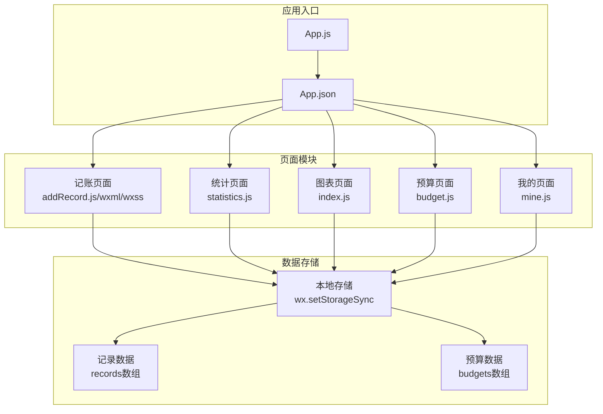
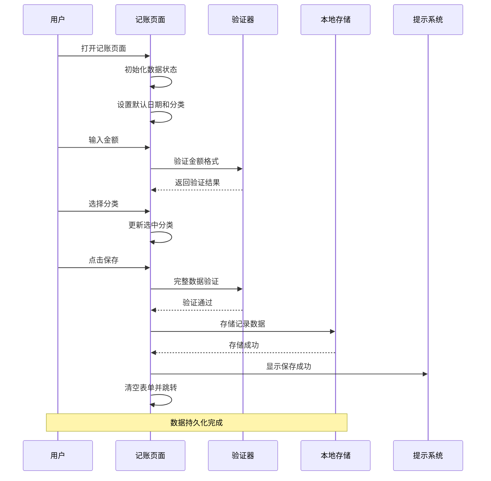
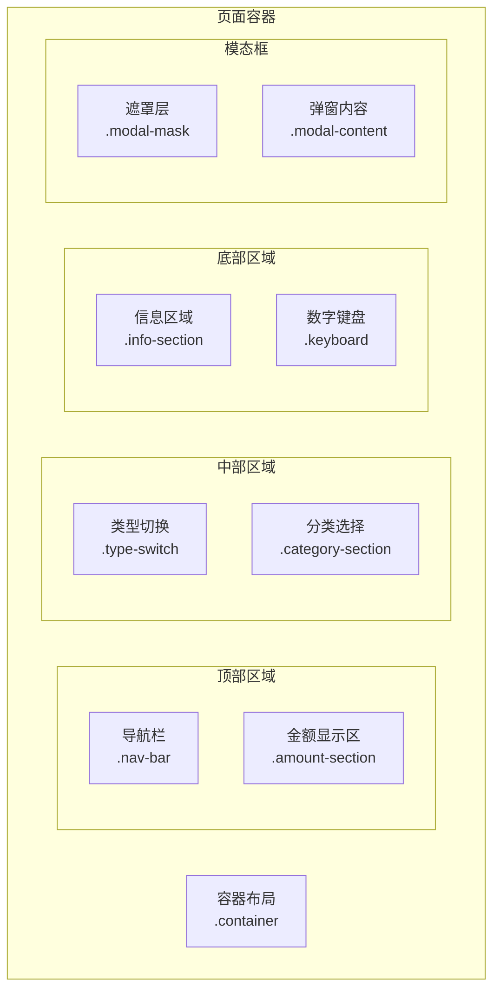
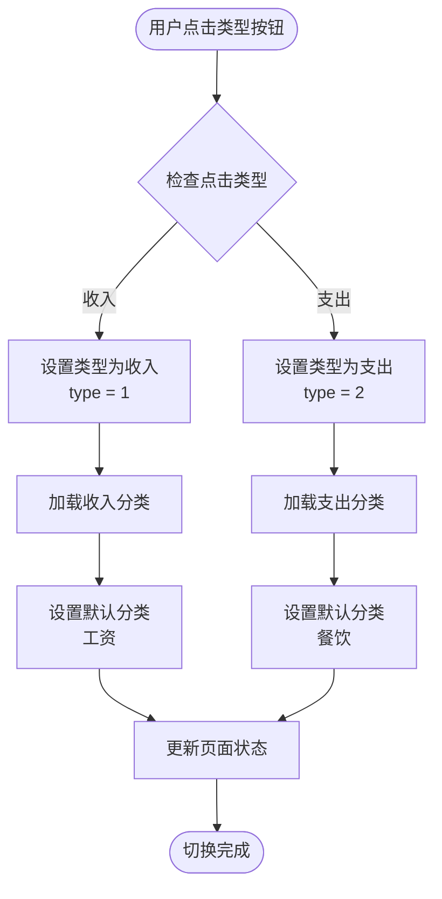
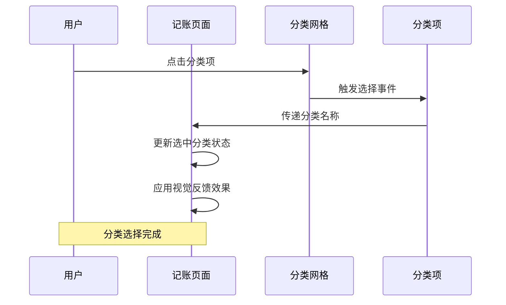
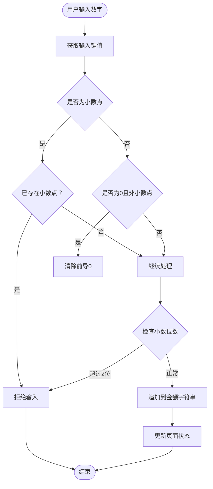
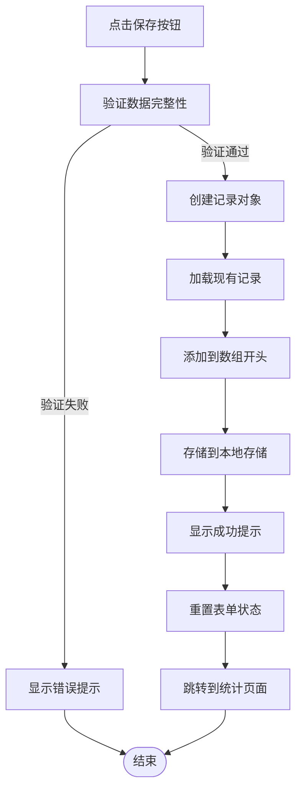
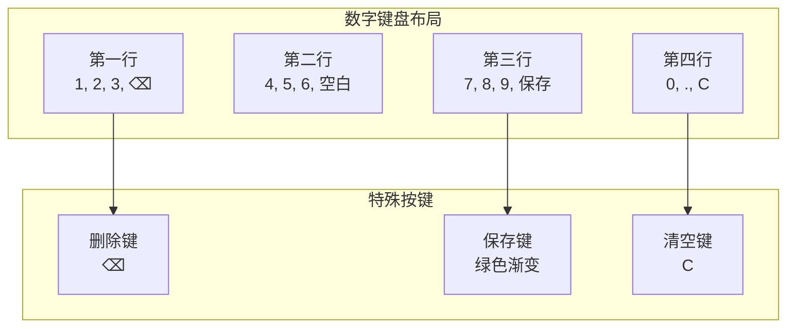
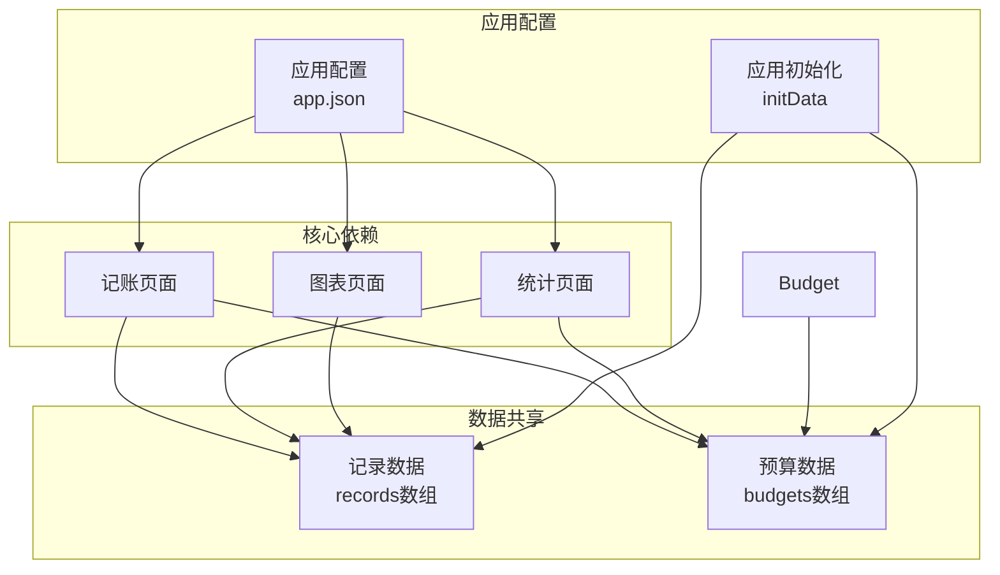

# 记账页面

<cite>
**本文档引用的文件**
- [addRecord.js](file://pages/addRecord/addRecord.js)
- [addRecord.wxml](file://pages/addRecord/addRecord.wxml)
- [addRecord.wxss](file://pages/addRecord/addRecord.wxss)
- [statistics.js](file://pages/statistics/statistics.js)
- [index.js](file://pages/index/index.js)
- [app.js](file://app.js)
- [app.json](file://app.json)
- [budget.js](file://pages/budget/budget.js)
- [mine.js](file://pages/mine/mine.js)
</cite>

## 目录
1. [简介](#简介)
2. [项目结构](#项目结构)
3. [核心组件](#核心组件)
4. [架构概览](#架构概览)
5. [详细组件分析](#详细组件分析)
6. [依赖关系分析](#依赖关系分析)
7. [性能考虑](#性能考虑)
8. [故障排除指南](#故障排除指南)
9. [结论](#结论)

## 简介

记账页面是杪记（miaobill）微信小程序的核心功能模块，为用户提供便捷的收支记录功能。该页面实现了完整的记账工作流程，包括收入/支出类型切换、分类选择、金额输入和数据验证，以及本地存储操作。系统采用微信小程序框架开发，具有良好的用户体验和数据持久化能力。

## 项目结构

杪记项目采用模块化组织方式，各个功能页面独立封装，通过底部导航栏进行统一访问。记账页面位于 `pages/addRecord/` 目录下，包含完整的页面逻辑、视图和样式文件。

**图表来源**
- [app.json:1-39](file://app.json#L1-L39)
- [app.js:1-24](file://app.js#L1-L24)

**章节来源**
- [app.json:1-39](file://app.json#L1-L39)
- [app.js:1-24](file://app.js#L1-L24)

## 核心组件

记账页面由多个核心组件构成，每个组件都有明确的功能职责和交互逻辑：

### 数据模型组件
- **状态管理**：维护页面状态，包括收支类型、金额、分类、备注、日期等
- **分类数据**：预定义收入和支出分类，支持动态切换
- **时间处理**：自动填充当前日期，支持手动修改

### 输入处理组件
- **数字键盘**：虚拟数字键盘，支持整数和小数输入
- **删除功能**：支持逐位删除和清空操作
- **格式化显示**：金额格式化显示，确保两位小数

### 验证组件
- **必填验证**：金额和分类的非空验证
- **数值验证**：确保金额为正数
- **格式验证**：限制小数点后最多两位

**章节来源**
- [addRecord.js:1-190](file://pages/addRecord/addRecord.js#L1-L190)

## 架构概览

记账页面采用MVVM架构模式，结合微信小程序的响应式数据绑定机制，实现了高效的用户交互体验。

**图表来源**
- [addRecord.js:134-189](file://pages/addRecord/addRecord.js#L134-L189)

**章节来源**
- [addRecord.js:1-190](file://pages/addRecord/addRecord.js#L1-L190)

## 详细组件分析

### 页面布局组件

记账页面采用卡片式布局设计，整体结构清晰，功能分区明确：

**图表来源**
- [addRecord.wxml:1-118](file://pages/addRecord/addRecord.wxml#L1-L118)
- [addRecord.wxss:1-303](file://pages/addRecord/addRecord.wxss#L1-L303)

#### 导航栏组件
- **标题显示**："记一笔" 文字标识
- **样式设计**：白色背景，居中对齐
- **功能作用**：页面标识和返回导航

#### 金额显示组件
- **货币符号**：¥ 符号显示
- **金额格式**：80rpx 字体大小，居中显示
- **默认值**：0.00 占位符

#### 类型切换组件
- **布局设计**：双按钮水平排列
- **状态指示**：通过 active 类名标识当前状态
- **颜色设计**：绿色主题，符合财务应用风格

**章节来源**
- [addRecord.wxml:1-118](file://pages/addRecord/addRecord.wxml#L1-L118)
- [addRecord.wxss:1-303](file://pages/addRecord/addRecord.wxss#L1-L303)

### 交互处理组件

#### 收支类型切换机制

**图表来源**
- [addRecord.js:45-55](file://pages/addRecord/addRecord.js#L45-L55)

#### 分类选择机制

**图表来源**
- [addRecord.js:57-62](file://pages/addRecord/addRecord.js#L57-L62)

**章节来源**
- [addRecord.js:45-62](file://pages/addRecord/addRecord.js#L45-L62)

### 数据验证组件

#### 金额输入验证机制

**图表来源**
- [addRecord.js:64-87](file://pages/addRecord/addRecord.js#L64-L87)

#### 表单验证规则

系统实现了多层次的数据验证机制：

1. **必填验证**：确保金额和分类都已填写
2. **数值验证**：金额必须大于0
3. **格式验证**：限制小数点后最多两位
4. **输入限制**：防止重复小数点输入

**章节来源**
- [addRecord.js:64-87](file://pages/addRecord/addRecord.js#L64-L87)
- [addRecord.js:134-151](file://pages/addRecord/addRecord.js#L134-L151)

### 本地存储组件

#### 数据持久化策略

**图表来源**
- [addRecord.js:134-189](file://pages/addRecord/addRecord.js#L134-L189)

#### 存储数据结构

记录对象包含以下字段：
- **id**: 唯一标识符（时间戳）
- **type**: 收支类型（1=收入，2=支出）
- **amount**: 金额（固定两位小数）
- **category**: 分类名称
- **remark**: 备注信息
- **date**: 日期字符串
- **time**: 时间字符串
- **createdAt**: 创建时间ISO格式

**章节来源**
- [addRecord.js:157-166](file://pages/addRecord/addRecord.js#L157-L166)
- [addRecord.js:168-170](file://pages/addRecord/addRecord.js#L168-L170)

### 用户界面组件

#### 数字键盘设计

数字键盘采用四列网格布局，提供直观的输入体验：

**图表来源**
- [addRecord.wxml:68-93](file://pages/addRecord/addRecord.wxml#L68-L93)

#### 分类选择界面

分类选择采用滚动视图和网格布局相结合的方式：

- **滚动区域**：支持垂直滚动，显示所有分类
- **网格布局**：4列等分布局，适配不同屏幕尺寸
- **视觉反馈**：选中状态通过颜色变化和阴影效果体现

**章节来源**
- [addRecord.wxml:31-49](file://pages/addRecord/addRecord.wxml#L31-L49)
- [addRecord.wxss:66-121](file://pages/addRecord/addRecord.wxss#L66-L121)

## 依赖关系分析

记账页面与其他页面存在紧密的依赖关系，形成了完整的应用生态系统：

**图表来源**
- [app.json:1-39](file://app.json#L1-L39)
- [app.js:7-19](file://app.js#L7-L19)

### 数据流关系

记账页面产生的数据会直接影响其他页面的展示：

1. **实时更新**：保存记录后，统计页面和图表页面会在下次显示时更新数据
2. **数据一致性**：所有页面共享同一份本地存储数据
3. **状态同步**：页面间的导航和状态切换保持数据同步

**章节来源**
- [statistics.js:19-32](file://pages/statistics/statistics.js#L19-L32)
- [index.js:102-106](file://pages/index/index.js#L102-L106)

## 性能考虑

### 内存管理
- **数据缓存**：仅在需要时从本地存储读取数据
- **状态优化**：合理使用setData减少不必要的页面渲染
- **事件处理**：避免重复绑定事件监听器

### 用户体验优化
- **即时反馈**：输入操作提供即时视觉反馈
- **错误预防**：通过输入限制减少无效操作
- **操作便利性**：提供一键清空和删除功能

### 数据处理效率
- **批量操作**：记录保存时一次性写入，避免频繁I/O操作
- **数据过滤**：统计页面按需过滤和计算数据
- **缓存策略**：合理利用微信小程序的缓存机制

## 故障排除指南

### 常见问题及解决方案

#### 金额输入异常
**问题描述**：金额输入出现格式错误或超出限制
**解决方法**：
1. 检查小数点输入限制（最多两位小数）
2. 确认金额必须为正数
3. 避免重复输入小数点

#### 分类选择失效
**问题描述**：分类选择后状态不更新
**解决方法**：
1. 确认分类项的data-category属性正确
2. 检查selectCategory函数绑定
3. 验证CSS样式类名匹配

#### 数据保存失败
**问题描述**：点击保存后数据未持久化
**解决方法**：
1. 检查本地存储权限
2. 确认records数组存在且可写
3. 验证网络连接状态

#### 页面跳转异常
**问题描述**：保存成功后无法跳转到统计页面
**解决方法**：
1. 检查tabBar配置中的页面路径
2. 确认目标页面存在且可访问
3. 验证wx.switchTab调用参数

**章节来源**
- [addRecord.js:134-189](file://pages/addRecord/addRecord.js#L134-L189)
- [app.json:29-31](file://app.json#L29-L31)

## 结论

记账页面作为杪记小程序的核心功能模块，展现了优秀的用户体验设计和稳健的技术实现。通过精心设计的界面布局、完善的交互机制和可靠的数据持久化策略，为用户提供了流畅的记账体验。

### 主要优势
- **界面友好**：采用卡片式布局和直观的交互设计
- **功能完整**：涵盖记账的所有核心需求
- **数据安全**：基于本地存储，确保用户隐私
- **扩展性强**：模块化设计便于功能扩展

### 技术亮点
- **响应式设计**：适配不同屏幕尺寸
- **性能优化**：合理的数据处理和缓存策略
- **错误处理**：完善的验证和异常处理机制
- **用户体验**：即时反馈和流畅的操作体验

该记账页面为用户提供了简洁高效的收支管理工具，是个人财务管理的理想选择。