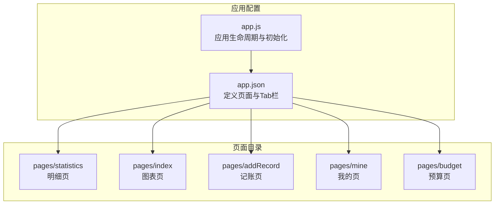
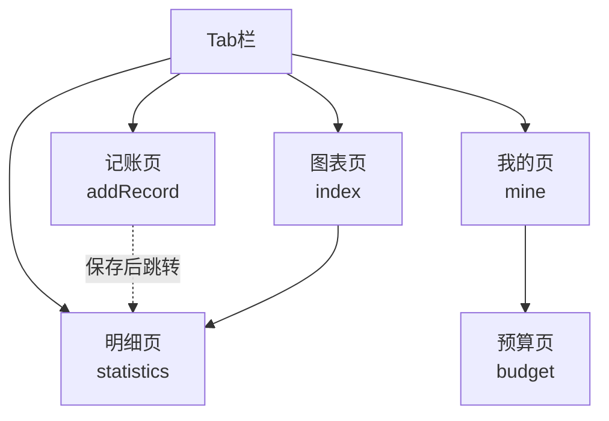
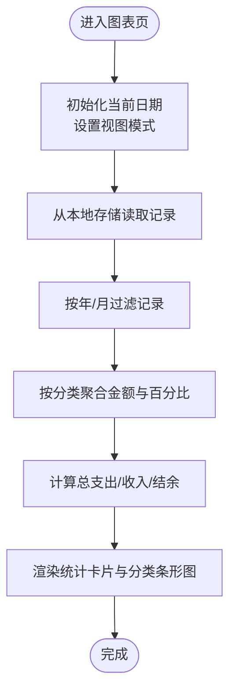
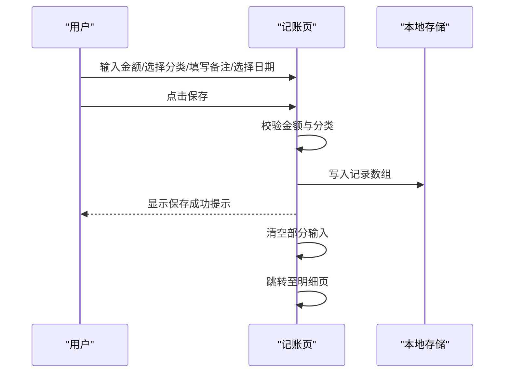
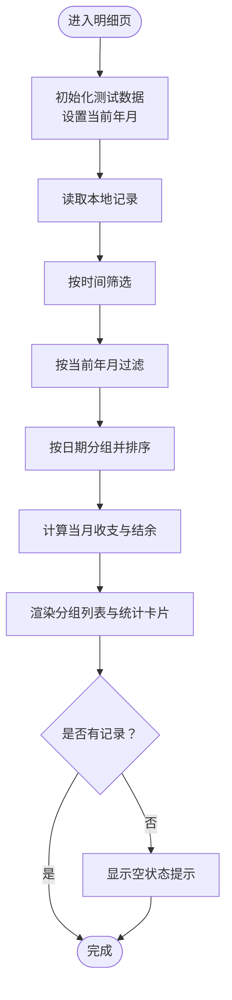
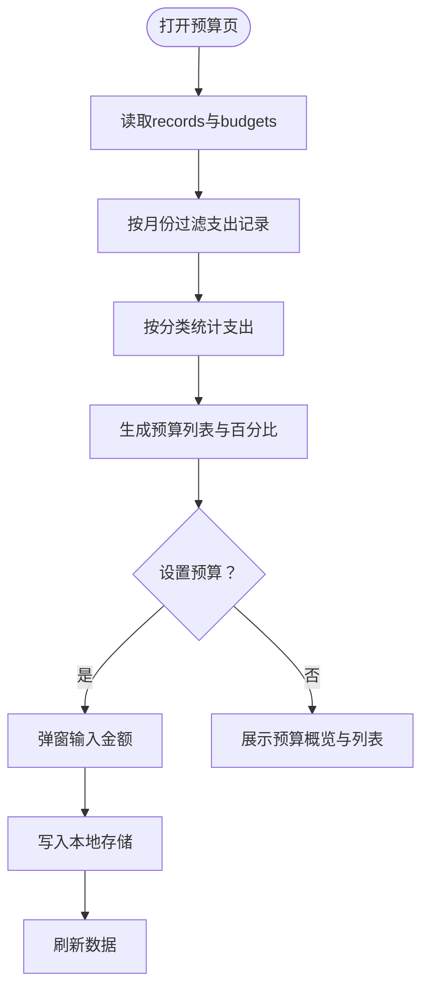
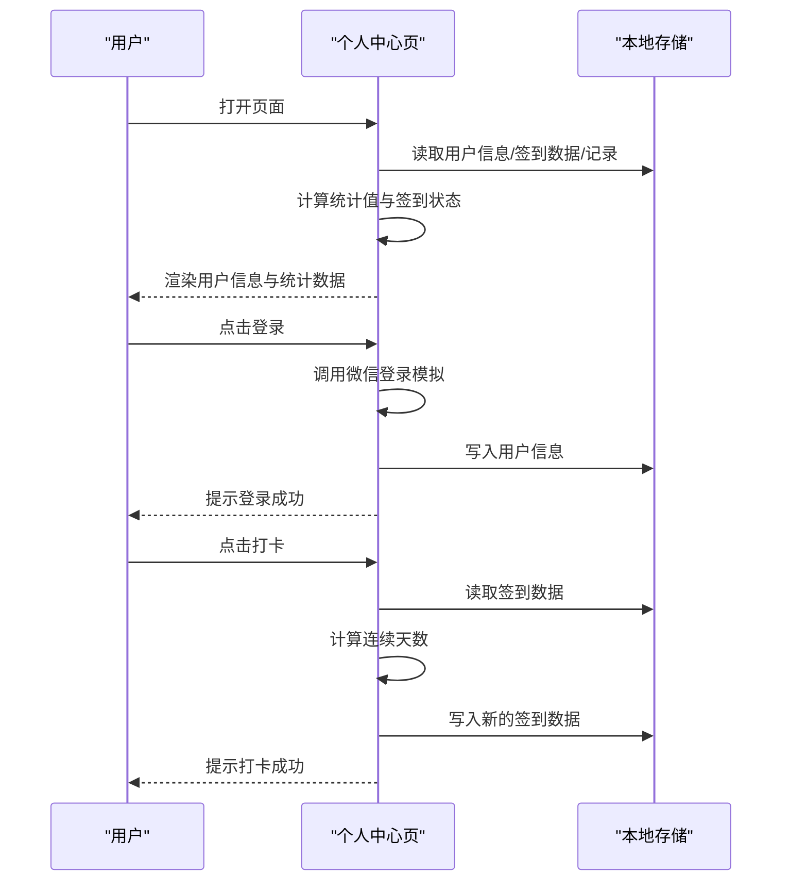
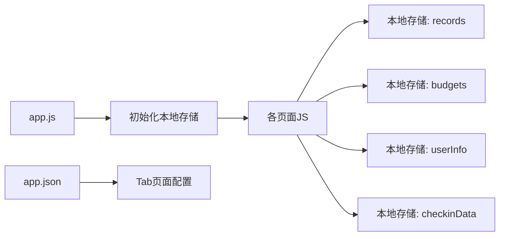

# 页面组件详解

<cite>
**本文引用的文件**
- [app.js](file://app.js)
- [app.json](file://app.json)
- [pages/index/index.js](file://pages/index/index.js)
- [pages/index/index.wxml](file://pages/index/index.wxml)
- [pages/index/index.wxss](file://pages/index/index.wxss)
- [pages/addRecord/addRecord.js](file://pages/addRecord/addRecord.js)
- [pages/addRecord/addRecord.wxml](file://pages/addRecord/addRecord.wxml)
- [pages/addRecord/addRecord.wxss](file://pages/addRecord/addRecord.wxss)
- [pages/statistics/statistics.js](file://pages/statistics/statistics.js)
- [pages/statistics/statistics.wxml](file://pages/statistics/statistics.wxml)
- [pages/statistics/statistics.wxss](file://pages/statistics/statistics.wxss)
- [pages/budget/budget.js](file://pages/budget/budget.js)
- [pages/budget/budget.wxml](file://pages/budget/budget.wxml)
- [pages/budget/budget.wxss](file://pages/budget/budget.wxss)
- [pages/mine/mine.js](file://pages/mine/mine.js)
- [pages/mine/mine.wxml](file://pages/mine/mine.wxml)
- [pages/mine/mine.wxss](file://pages/mine/mine.wxss)
</cite>

## 目录
1. [简介](#简介)
2. [项目结构](#项目结构)
3. [核心组件](#核心组件)
4. [架构总览](#架构总览)
5. [详细组件分析](#详细组件分析)
6. [依赖分析](#依赖分析)
7. [性能考虑](#性能考虑)
8. [故障排除指南](#故障排除指南)
9. [结论](#结论)
10. [附录](#附录)

## 简介
本文件面向"迷你记账"小程序的五个核心页面，系统性梳理其功能特性、实现逻辑与用户交互方式，覆盖首页统计、记账录入、历史明细与筛选、预算管理、个人中心五大模块。文档同时解释 WXML 结构、WXSS 样式与 JavaScript 逻辑之间的协作关系，给出页面间导航与数据传递机制说明，并提供可直接定位到源码位置的路径示例，便于开发者快速查阅与二次开发。

**更新** 本次更新重点反映了统计页面的功能增强，包括新增月度数据分析能力、改进的数据筛选和展示逻辑，以及提升用户体验的多项功能改进。

## 项目结构
小程序采用按页面分层的组织方式，主入口配置在全局配置文件中，定义了四个 Tab 页面以及导航栏样式。页面目录下分别包含对应的 WXML（结构）、WXSS（样式）与 JS（逻辑）文件。

**图示来源**
- [app.json:1-41](file://app.json#L1-L41)
- [app.js:1-24](file://app.js#L1-L24)

**章节来源**
- [app.json:1-41](file://app.json#L1-L41)
- [app.js:1-24](file://app.js#L1-L24)

## 核心组件
- 首页统计（图表页）
  - 职责：按月/年维度展示收支汇总、收支分类占比与可视化条形图；支持日期切换与周期跳转。
  - 关键逻辑：从本地存储读取全部记录，按当前选择的年/月进行过滤，计算总支出、总收入、结余，再对收支分类进行聚合与百分比计算。
  - 数据来源：本地存储中的 records 键。
- 记账页面（新增记录）
  - 职责：支持收入/支出类型切换、分类选择、金额输入（含小数点限制与退格删除）、日期选择、备注弹窗、保存并自动跳转至明细页。
  - 关键逻辑：金额输入校验、必填项校验、构造记录对象并写入本地存储；保存后清空部分输入并跳转。
- 统计页面（历史明细）
  - 职责：按"全部/今天/本周/本月"筛选记录，按日期分组展示交易明细，计算当月收支与结余，**新增月度数据分析能力**。
  - 关键逻辑：时间筛选器、记录过滤与排序、按日期分组、当日结余计算，**新增月份选择器与月度统计功能**。
- 预算管理页面
  - 职责：按月查看预算概览（总预算、已使用、剩余），逐项查看分类预算与进度条，设置预算金额与预算提醒阈值。
  - 关键逻辑：读取 records 与 budgets，按分类统计当月支出，生成预算列表并计算百分比；支持设置提醒开关与阈值。
- 个人中心页面
  - 职责：展示用户信息、打卡状态与统计指标（连续打卡天数、记账总天数、总笔数），提供功能入口占位。
  - 关键逻辑：读取本地存储中的用户信息、签到数据与记录统计，模拟登录流程与打卡逻辑。

**章节来源**
- [pages/index/index.js:1-189](file://pages/index/index.js#L1-L189)
- [pages/addRecord/addRecord.js:1-190](file://pages/addRecord/addRecord.js#L1-L190)
- [pages/statistics/statistics.js:1-272](file://pages/statistics/statistics.js#L1-L272)
- [pages/budget/budget.js:1-182](file://pages/budget/budget.js#L1-L182)
- [pages/mine/mine.js:1-257](file://pages/mine/mine.js#L1-L257)

## 架构总览
页面间通过底部 Tab 栏进行导航，首页与明细页互为常用入口。记账页作为新增入口，保存后通常跳转回明细页以便查看最新记录。预算页与个人中心提供辅助功能入口。

**图示来源**
- [app.json:16-39](file://app.json#L16-L39)
- [pages/addRecord/addRecord.js:185-188](file://pages/addRecord/addRecord.js#L185-L188)

**章节来源**
- [app.json:16-39](file://app.json#L16-L39)

## 详细组件分析

### 首页统计（图表页）分析
- 功能要点
  - 视图模式：支持"月账单/年账单"切换，影响日期选择器粒度与显示文案。
  - 日期控制：左右箭头按钮用于跳转上一周期或下一周期；日期选择器绑定 change 事件更新当前日期。
  - 统计卡片：展示总支出、总收入与结余，正负值采用不同颜色标识。
  - 分类占比：按支出与收入两类分别统计各分类金额与占比，以条形图形式展示。
- 数据流
  - 读取本地 records，根据 viewMode 与 currentDate 过滤目标周期记录。
  - 对过滤结果进行聚合：按分类累加金额，计算百分比，排序后写入 expenseCategories 与 incomeCategories。
  - 同时计算 totalExpense、totalIncome、balance 并更新界面。
- 用户交互
  - 切换视图模式与日期变更会触发重新计算。
  - 当无记录时，分类列表显示"暂无记录"的提示。

**图示来源**
- [pages/index/index.js:102-188](file://pages/index/index.js#L102-L188)

**章节来源**
- [pages/index/index.js:1-189](file://pages/index/index.js#L1-L189)
- [pages/index/index.wxml:1-120](file://pages/index/index.wxml#L1-L120)
- [pages/index/index.wxss:1-257](file://pages/index/index.wxss#L1-L257)

### 记账页面（新增记录）分析
- 功能要点
  - 类型切换：支持"支出/收入"，切换时动态更新分类列表与默认分类。
  - 分类选择：网格布局展示分类与图标，选中态高亮。
  - 金额输入：内置数字键盘，支持整数与两位小数输入、清空与删除；保存前进行金额有效性校验。
  - 备注弹窗：点击备注项打开模态框，输入后确认保存。
  - 日期选择：picker 控件选择日期，默认当天。
  - 保存逻辑：构造记录对象（含 id、类型、金额、分类、备注、日期、时间、创建时间），写入本地存储；短暂提示后清空部分输入并跳转至明细页。
- 用户交互
  - 金额输入过程实时反馈，错误时通过 toast 提示。
  - 保存成功后自动跳转，提升操作闭环体验。

**图示来源**
- [pages/addRecord/addRecord.js:134-189](file://pages/addRecord/addRecord.js#L134-L189)

**章节来源**
- [pages/addRecord/addRecord.js:1-190](file://pages/addRecord/addRecord.js#L1-L190)
- [pages/addRecord/addRecord.wxml:1-118](file://pages/addRecord/addRecord.wxml#L1-L118)
- [pages/addRecord/addRecord.wxss:1-303](file://pages/addRecord/addRecord.wxss#L1-L303)

### 统计页面（历史明细）分析
- 功能要点
  - **月度数据分析**：新增月份选择器，支持按年份和月份精确筛选数据，提供更精细的时间维度分析。
  - 时间筛选：支持"全部/今天/本周/本月"，切换后重新加载与排序记录。
  - 日期分组：按日期升序分组，每组内按时间降序排列。
  - 当月统计：计算当月收入、支出与结余，直观展示。
  - 分类图标：根据分类名称映射对应图标，增强可读性。
  - **增强的用户界面**：现代化设计，包含渐变背景、圆角卡片、阴影效果等视觉元素。
- 数据流
  - 读取本地 records，按筛选条件过滤并排序。
  - 使用分组函数按日期聚合记录，计算当日结余。
  - 计算当月统计值并更新界面。
  - **新增月度统计计算**：专门的 calculateMonthStats 函数处理月度收支统计。
- 用户交互
  - 无记录时显示"暂无交易记录"的空状态提示。
  - **月份选择器交互**：点击月份显示器弹出选择器，支持年份和月份的独立选择。
  - **浮动添加按钮**：提供便捷的记账入口。

**图示来源**
- [pages/statistics/statistics.js:19-187](file://pages/statistics/statistics.js#L19-L187)

**章节来源**
- [pages/statistics/statistics.js:1-272](file://pages/statistics/statistics.js#L1-L272)
- [pages/statistics/statistics.wxml:1-96](file://pages/statistics/statistics.wxml#L1-L96)
- [pages/statistics/statistics.wxss:1-386](file://pages/statistics/statistics.wxss#L1-L386)

### 预算管理页面分析
- 功能要点
  - 月份选择：通过 month picker 切换查看月份，联动更新数据。
  - 预算概览：展示总预算、已使用、剩余金额。
  - 分类预算：逐项显示分类预算与使用进度条，超过预算时进度条颜色变化。
  - 预算设置：弹窗输入金额，支持更新或新增预算记录，写入本地存储。
  - 预算提醒：开关控制是否启用提醒，支持选择提醒阈值（50%-100%）。
- 数据流
  - 读取 records 与 budgets，按所选月份过滤支出记录。
  - 按分类统计支出并生成预算列表，计算百分比。
  - 保存预算与提醒设置到本地存储并刷新界面。

**图示来源**
- [pages/budget/budget.js:43-155](file://pages/budget/budget.js#L43-L155)

**章节来源**
- [pages/budget/budget.js:1-182](file://pages/budget/budget.js#L1-L182)
- [pages/budget/budget.wxml:1-84](file://pages/budget/budget.wxml#L1-L84)
- [pages/budget/budget.wxss:1-128](file://pages/budget/budget.wxss#L1-L128)

### 个人中心页面分析
- 功能要点
  - 用户信息：昵称与 openId 展示，支持模拟登录。
  - 打卡功能：基于上次签到日期与当前日期差计算连续打卡天数，今日可签到。
  - 统计指标：连续打卡天数、记账总天数、总笔数。
  - 功能入口：提供消息、徽章、积分、设置、我的账本、家庭账单、设置、安全中心、意见反馈、评分、关于等入口（部分为占位功能）。
- 数据流
  - 读取本地存储中的用户信息、签到数据与记录集合，计算统计值并更新界面。
  - 登录与签到均写入本地存储并提示。

**图示来源**
- [pages/mine/mine.js:31-167](file://pages/mine/mine.js#L31-L167)

**章节来源**
- [pages/mine/mine.js:1-257](file://pages/mine/mine.js#L1-L257)
- [pages/mine/mine.wxml:1-121](file://pages/mine/mine.wxml#L1-L121)
- [pages/mine/mine.wxss:1-211](file://pages/mine/mine.wxss#L1-L211)

## 依赖分析
- 应用级依赖
  - app.js 在启动时检查并初始化 records 与 budgets 的本地存储键，确保后续页面逻辑可用。
  - app.json 定义四个 Tab 页面与导航栏样式，决定页面间跳转与外观风格。
- 页面级依赖
  - 图表页依赖本地存储的 records 进行统计与分类聚合。
  - 记账页依赖本地存储的 records 写入新记录，并在保存后跳转明细页。
  - 明细页依赖本地存储的 records 进行筛选、分组与统计，**新增月度统计计算功能**。
  - 预算页依赖本地存储的 records 与 budgets 进行预算计算与进度展示。
  - 个人中心依赖本地存储的 userInfo、checkinData 与 records 进行统计与展示。

**图示来源**
- [app.js:7-19](file://app.js#L7-L19)
- [app.json:2-36](file://app.json#L2-L36)

**章节来源**
- [app.js:7-19](file://app.js#L7-L19)
- [app.json:2-36](file://app.json#L2-L36)

## 性能考虑
- 数据访问
  - 所有页面均通过本地存储一次性读取与写入，避免频繁 IO；建议在数据量增大时考虑分页或索引优化。
- 计算复杂度
  - 图表页与明细页的聚合与排序为 O(n) 级别，n 为记录数量；在大数据量下可考虑缓存中间结果或延迟计算。
  - **统计页面新增的月度统计计算**：calculateMonthStats 函数对所有记录进行遍历，复杂度为 O(n)，但只在月份切换时触发。
- 渲染优化
  - 使用 wx:for 与 key 建议配合，减少不必要的节点重排；合理拆分卡片与列表，降低长列表滚动压力。
  - **现代化样式优化**：使用 CSS 变量和现代布局技术，提升渲染性能。
- 交互体验
  - 金额输入与保存流程中加入即时反馈与短暂提示，有助于提升用户感知速度。
  - **月份选择器的防抖处理**：通过临时值与最终值分离，避免频繁的界面更新。

## 故障排除指南
- 无法看到任何记录
  - 检查本地存储中 records 是否存在且非空；若为空，可在应用启动时由 app.js 初始化。
  - **统计页面新增测试数据初始化**：initTestData 函数提供测试数据，确保页面正常显示。
  - 参考路径：[app.js:8-12](file://app.js#L8-L12)，[pages/statistics/statistics.js:28-70](file://pages/statistics/statistics.js#L28-L70)
- 保存记录后未跳转
  - 确认记账页保存逻辑已执行并调用跳转方法；检查跳转目标路径是否正确。
  - 参考路径：[pages/addRecord/addRecord.js:185-188](file://pages/addRecord/addRecord.js#L185-L188)
- 预算设置无效
  - 确认预算页已将设置写入本地存储并调用更新方法；检查 budgets 键是否存在。
  - 参考路径：[pages/budget/budget.js:146-149](file://pages/budget/budget.js#L146-L149)
- 个人中心统计异常
  - 检查 userInfo、checkinData 与 records 的本地存储内容是否完整；关注日期格式与差值计算逻辑。
  - 参考路径：[pages/mine/mine.js:49-84](file://pages/mine/mine.js#L49-L84)
- **统计页面月份选择异常**
  - 检查 showMonthPicker 状态与 pickerValue 数组；确认年份和月份数组长度一致。
  - 参考路径：[pages/statistics/statistics.js:189-228](file://pages/statistics/statistics.js#L189-L228)

**章节来源**
- [app.js:8-12](file://app.js#L8-L12)
- [pages/addRecord/addRecord.js:185-188](file://pages/addRecord/addRecord.js#L185-L188)
- [pages/budget/budget.js:146-149](file://pages/budget/budget.js#L146-L149)
- [pages/mine/mine.js:49-84](file://pages/mine/mine.js#L49-L84)
- [pages/statistics/statistics.js:189-228](file://pages/statistics/statistics.js#L189-L228)

## 结论
本项目以简洁清晰的页面划分与本地存储为核心，实现了从记账录入到统计分析的完整闭环。图表页提供直观的收支概览，记账页优化了输入体验，**统计页通过新增月度数据分析能力**，支持更精细的时间维度分析，明细页支持灵活的时间筛选与分组展示，预算页提供了实用的预算控制能力，个人中心则承载了用户信息与运营入口。整体架构易于扩展，适合在此基础上增加数据导出、多账本、云同步等功能。

**更新** 本次更新显著增强了统计页面的功能，特别是月度数据分析能力的引入，为用户提供了更全面的财务分析视角。现代化的界面设计和改进的交互逻辑进一步提升了用户体验。

## 附录
- 页面间导航与数据传递
  - 图表页 → 明细页：通过 Tab 栏切换或业务跳转。
  - 记账页 → 明细页：保存成功后自动跳转。
  - 个人中心 → 预算页：通过功能入口跳转。
  - **统计页 → 图表页**：通过 Tab 栏切换。
  - **统计页 → 记账页**：通过浮动添加按钮。
  - 参考路径：[app.json:16-39](file://app.json#L16-L39)，[pages/addRecord/addRecord.js:185-188](file://pages/addRecord/addRecord.js#L185-L188)