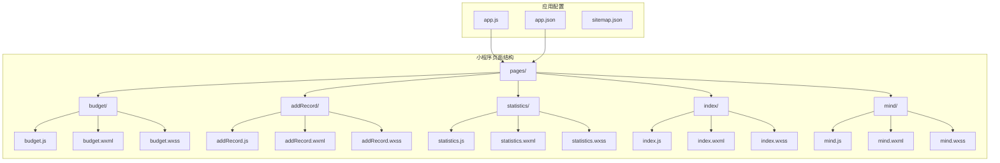
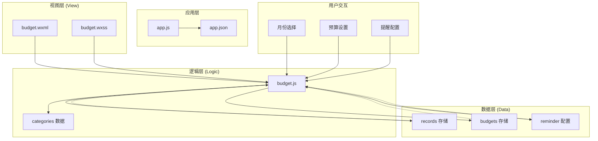
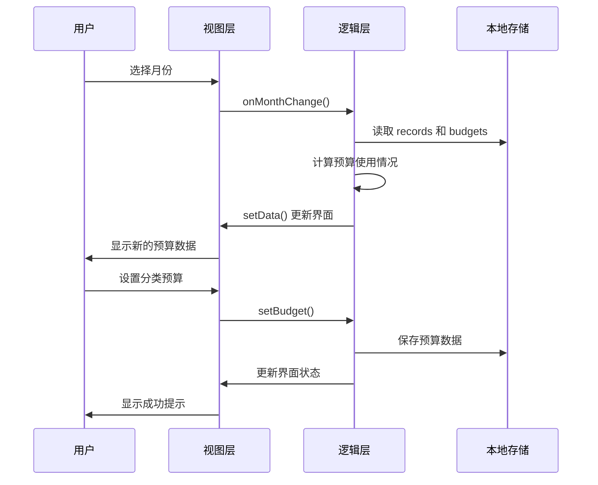
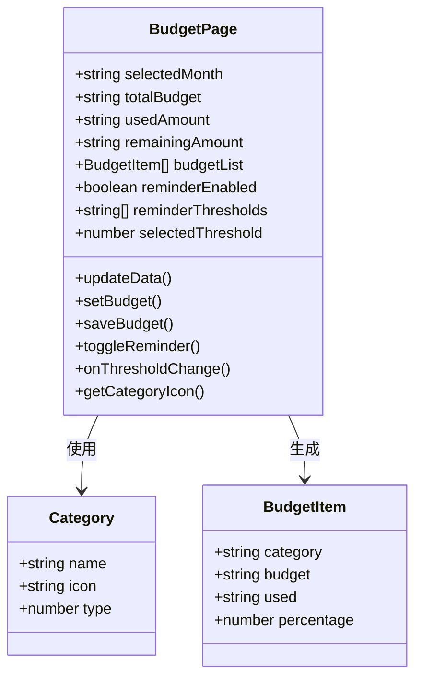
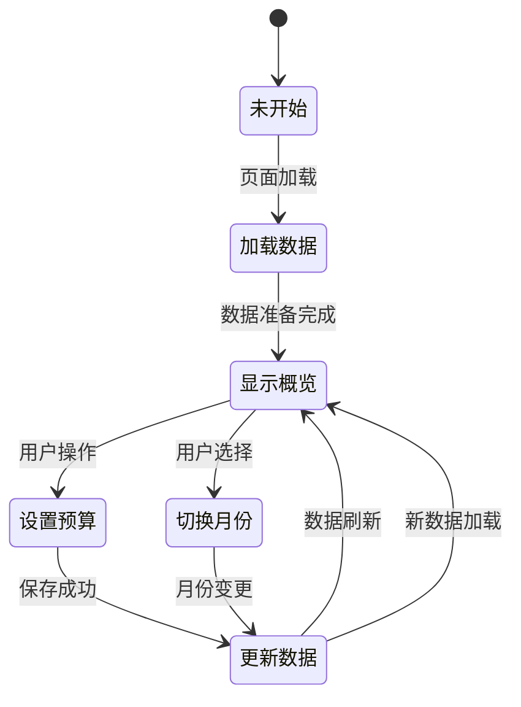
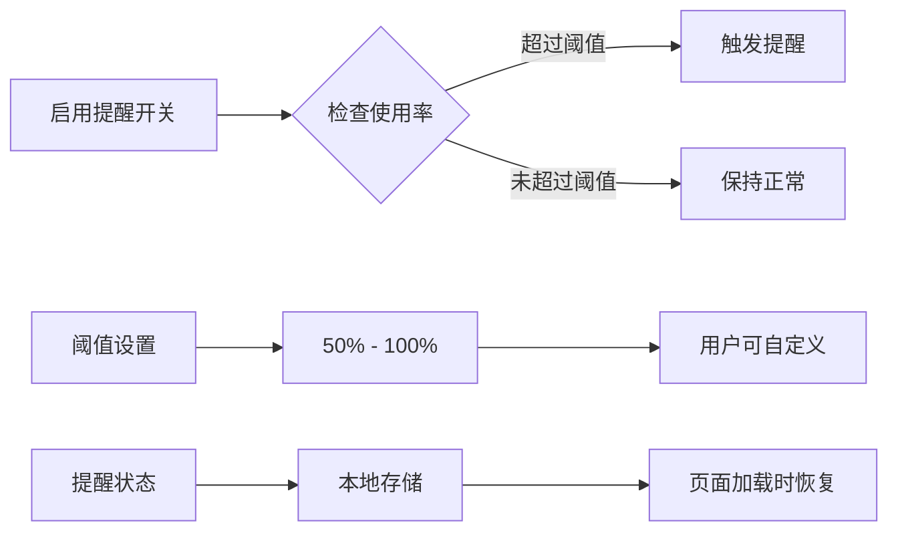
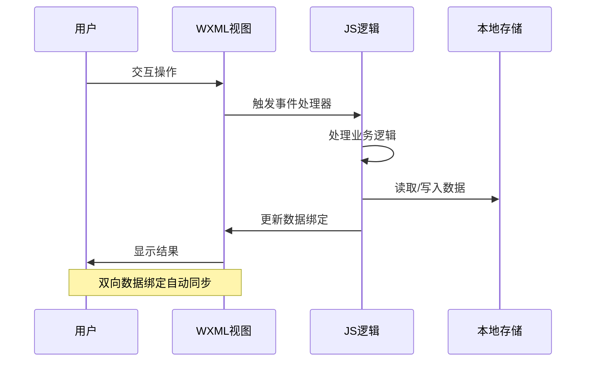
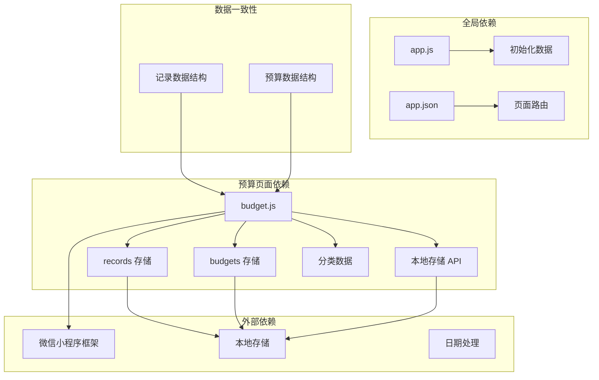
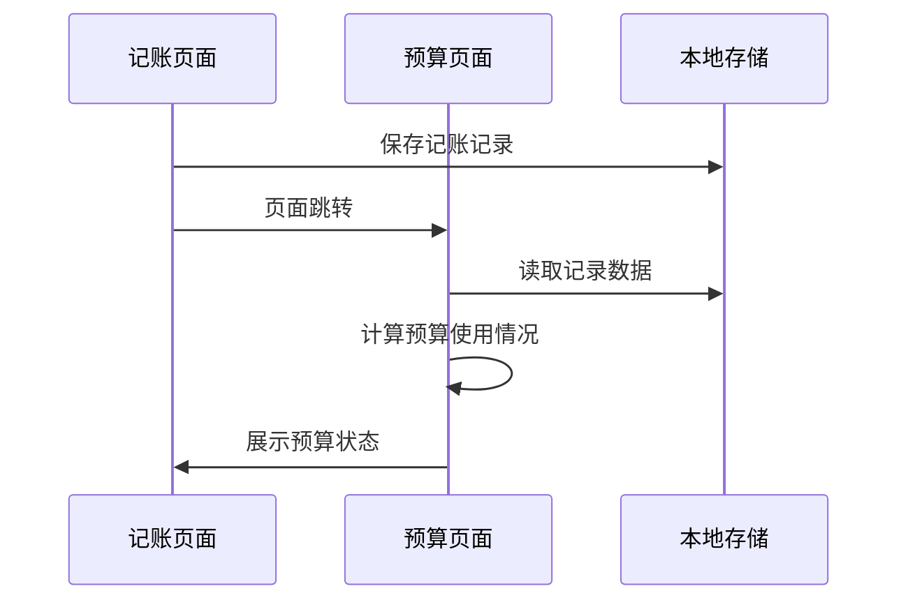

# 预算管理页面

<cite>
**本文档引用的文件**
- [pages/budget/budget.js](file://pages/budget/budget.js)
- [pages/budget/budget.wxml](file://pages/budget/budget.wxml)
- [pages/budget/budget.wxss](file://pages/budget/budget.wxss)
- [pages/addRecord/addRecord.js](file://pages/addRecord/addRecord.js)
- [pages/addRecord/addRecord.wxml](file://pages/addRecord/addRecord.wxml)
- [app.js](file://app.js)
- [app.json](file://app.json)
- [.trae/documents/记账小程序技术架构文档.md](file://.trae/documents/记账小程序技术架构文档.md)
</cite>

## 目录
1. [简介](#简介)
2. [项目结构](#项目结构)
3. [核心组件](#核心组件)
4. [架构概览](#架构概览)
5. [详细组件分析](#详细组件分析)
6. [依赖关系分析](#依赖关系分析)
7. [性能考虑](#性能考虑)
8. [故障排除指南](#故障排除指南)
9. [结论](#结论)
10. [附录](#附录)

## 简介

预算管理页面是 Miaobill 微信小程序中的核心功能模块，为用户提供全面的预算设置和跟踪能力。该页面实现了分类预算管理、预算金额设置、使用情况跟踪、预算计算逻辑、使用率统计和预警机制等功能。系统采用微信小程序原生开发框架，使用本地存储进行数据持久化，提供直观的用户界面和流畅的交互体验。

## 项目结构

Miaobill 小程序采用模块化的页面组织方式，预算管理页面位于 `pages/budget/` 目录下，与记账、统计、我的等页面并列。



**图表来源**
- [app.json:1-39](file://app.json#L1-L39)
- [app.js:1-24](file://app.js#L1-L24)

**章节来源**
- [app.json:1-39](file://app.json#L1-L39)
- [app.js:1-24](file://app.js#L1-L24)

## 核心组件

预算管理页面由三个主要组件构成：JavaScript 逻辑层、WXML 视图层和 WXSS 样式层。

### JavaScript 逻辑层 (budget.js)

预算页面的核心逻辑集中在 `budget.js` 文件中，实现了以下关键功能：

- **数据初始化**：设置默认月份、预算概览数据和提醒配置
- **数据更新**：实时计算预算使用情况和统计数据
- **预算设置**：支持按分类设置和修改预算金额
- **本地存储**：使用微信本地存储 API 进行数据持久化
- **事件处理**：处理用户交互事件和页面生命周期

### WXML 视图层

视图层采用微信小程序的 WXML 语法，构建了三层结构：

1. **月份选择器**：允许用户选择要查看的月份
2. **预算概览卡片**：显示总预算、已使用和剩余金额
3. **分类预算列表**：展示每个分类的预算详情和进度条
4. **预算提醒设置**：配置预算提醒功能

### WXSS 样式层

样式层提供了响应式的布局设计，包括：
- 卡片式设计风格
- 渐变色进度条
- 月份选择器样式
- 分类图标显示
- 响应式布局适配

**章节来源**
- [pages/budget/budget.js:14-182](file://pages/budget/budget.js#L14-L182)
- [pages/budget/budget.wxml:1-84](file://pages/budget/budget.wxml#L1-L84)
- [pages/budget/budget.wxss:1-128](file://pages/budget/budget.wxss#L1-L128)

## 架构概览

预算管理页面采用典型的三层架构模式，实现了清晰的关注点分离。



**图表来源**
- [pages/budget/budget.js:14-182](file://pages/budget/budget.js#L14-L182)
- [app.js:1-24](file://app.js#L1-L24)

### 数据流分析

预算页面的数据流遵循单向数据流原则，从本地存储流向视图层：



**图表来源**
- [pages/budget/budget.js:43-94](file://pages/budget/budget.js#L43-L94)
- [pages/budget/budget.js:96-155](file://pages/budget/budget.js#L96-L155)

## 详细组件分析

### 分类预算管理

系统预定义了8个支出分类，每个分类都有对应的图标和类型标识：



**图表来源**
- [pages/budget/budget.js:2-12](file://pages/budget/budget.js#L2-L12)
- [pages/budget/budget.js:67-82](file://pages/budget/budget.js#L67-L82)

#### 分类数据结构

每个分类包含以下属性：
- `name`: 分类名称（如"餐饮"、"交通"）
- `icon`: 对应的表情符号图标
- `type`: 分类类型（2表示支出）

#### 预算计算逻辑

预算计算采用以下步骤：

1. **筛选当月记录**：根据选择的月份过滤支出记录
2. **计算总支出**：对当月所有支出记录求和
3. **分类汇总**：按分类统计支出金额
4. **生成预算列表**：结合预算数据和实际支出生成显示数据

**章节来源**
- [pages/budget/budget.js:48-94](file://pages/budget/budget.js#L48-L94)

### 预算金额设置

预算设置功能提供了灵活的配置选项：

```mermaid
flowchart TD
A[用户点击分类项] --> B[显示模态框]
B --> C[输入预算金额]
C --> D{验证输入}
D --> |有效| E[保存到本地存储]
D --> |无效| F[显示错误提示]
E --> G[更新页面数据]
G --> H[显示成功提示]
F --> I[保持当前状态]
E --> J[触发 updateData()]
J --> K[重新计算统计数据]
K --> L[更新界面显示]
```

**图表来源**
- [pages/budget/budget.js:96-155](file://pages/budget/budget.js#L96-L155)

#### 输入验证机制

系统实现了多层次的输入验证：
- **数值验证**：确保输入为有效数字
- **范围验证**：确保预算金额不为负数
- **格式验证**：自动格式化为两位小数

#### 数据持久化策略

预算数据采用 JSON 格式存储在本地存储中，每个预算项包含：
- `category`: 分类名称
- `amount`: 预算金额
- `month`: 所属月份
- `createTime`: 创建时间戳

**章节来源**
- [pages/budget/budget.js:122-155](file://pages/budget/budget.js#L122-L155)

### 使用情况跟踪

使用情况跟踪功能提供了实时的预算执行监控：



**图表来源**
- [pages/budget/budget.js:26-32](file://pages/budget/budget.js#L26-L32)
- [pages/budget/budget.js:35-40](file://pages/budget/budget.js#L35-L40)

#### 实时计算功能

系统在每次数据更新时执行以下计算：
- **总预算计算**：所有分类预算金额求和
- **已使用金额**：当月实际支出总额
- **剩余金额**：总预算减去已使用金额
- **使用率统计**：已使用金额占总预算的百分比

#### 进度条可视化

使用率统计通过进度条直观展示：
- **绿色进度条**：使用率小于等于100%
- **红色进度条**：使用率超过100%
- **百分比显示**：精确到整数的使用率

**章节来源**
- [pages/budget/budget.js:84-94](file://pages/budget/budget.js#L84-L94)

### 预算提醒机制

预算提醒功能提供了灵活的预警通知机制：



**图表来源**
- [pages/budget/budget.js:157-175](file://pages/budget/budget.js#L157-L175)

#### 预警阈值配置

系统支持6个预设阈值：
- 50%、60%、70%、80%、90%、100%

用户可以选择合适的预警时机，提前收到预算接近上限的通知。

#### 提醒状态管理

提醒功能的状态通过本地存储进行持久化：
- `reminderEnabled`: 是否启用提醒
- `reminderThreshold`: 当前选择的阈值

**章节来源**
- [pages/budget/budget.js:158-175](file://pages/budget/budget.js#L158-L175)

### 数据绑定与事件处理

预算页面采用了双向数据绑定和事件驱动的设计模式：



**图表来源**
- [pages/budget/budget.wxml:4-8](file://pages/budget/budget.wxml#L4-L8)
- [pages/budget/budget.js:35-40](file://pages/budget/budget.js#L35-L40)

#### 事件处理机制

页面实现了多种事件处理：
- **生命周期事件**：`onLoad`、`onShow` 自动更新数据
- **用户交互事件**：月份选择、预算设置、开关切换
- **数据更新事件**：自动响应数据变化

#### 数据绑定策略

采用微信小程序的数据绑定机制：
- **单项绑定**：`{{variable}}` 显示数据
- **事件绑定**：`bindchange`、`bindtap` 处理用户操作
- **双向绑定**：`value="{{data}}"` 实现数据同步

**章节来源**
- [pages/budget/budget.wxml:1-84](file://pages/budget/budget.wxml#L1-L84)
- [pages/budget/budget.js:26-32](file://pages/budget/budget.js#L26-L32)

## 依赖关系分析

预算管理页面与其他模块存在紧密的依赖关系：



**图表来源**
- [pages/budget/budget.js:43-46](file://pages/budget/budget.js#L43-L46)
- [app.js:7-19](file://app.js#L7-L19)

### 数据结构依赖

预算页面依赖于以下数据结构：

#### 记账记录结构
```javascript
{
  id: String,           // 唯一标识符
  type: Number,         // 类型：1-收入，2-支出
  amount: Number,       // 金额
  category: String,     // 分类
  remark: String,       // 备注
  date: String,         // 日期，格式：YYYY-MM-DD
  time: String,         // 时间，格式：HH:MM
  createdAt: String     // 创建时间
}
```

#### 预算设置结构
```javascript
{
  category: String,     // 分类名称
  amount: Number,       // 预算金额
  month: String,        // 所属月份
  createTime: Number    // 创建时间戳
}
```

**章节来源**
- [.trae/documents/记账小程序技术架构文档.md:42-55](file://.trae/documents/记账小程序技术架构文档.md#L42-L55)

### 页面间数据传递

预算页面与记账页面存在数据交互：



**图表来源**
- [pages/addRecord/addRecord.js:167-170](file://pages/addRecord/addRecord.js#L167-L170)
- [pages/budget/budget.js:44-45](file://pages/budget/budget.js#L44-L45)

**章节来源**
- [pages/addRecord/addRecord.js:134-190](file://pages/addRecord/addRecord.js#L134-L190)

## 性能考虑

预算管理页面在设计时充分考虑了性能优化：

### 数据处理优化

1. **内存使用优化**：只在需要时加载和处理数据
2. **计算复杂度控制**：使用高效的数组方法进行数据处理
3. **渲染性能优化**：避免不必要的页面重绘

### 存储策略优化

1. **增量更新**：只更新发生变化的数据
2. **批量操作**：减少本地存储的读写次数
3. **数据压缩**：存储结构化的数据格式

### 用户体验优化

1. **响应式设计**：适配不同屏幕尺寸
2. **加载状态**：提供数据加载反馈
3. **错误处理**：优雅处理异常情况

## 故障排除指南

### 常见问题及解决方案

#### 预算数据显示异常

**问题现象**：预算使用率显示不正确或计算错误

**可能原因**：
1. 本地存储数据格式不正确
2. 日期格式处理错误
3. 分类名称不匹配

**解决方法**：
1. 检查本地存储中的数据格式
2. 验证日期字符串的格式
3. 确认分类名称的一致性

#### 预算设置无法保存

**问题现象**：设置预算后数据没有更新

**可能原因**：
1. 本地存储权限问题
2. 数据验证失败
3. 页面数据绑定错误

**解决方法**：
1. 检查本地存储的可用性
2. 验证输入数据的有效性
3. 确认数据绑定的正确性

#### 预算提醒不生效

**问题现象**：设置了提醒但没有收到通知

**可能原因**：
1. 提醒功能未启用
2. 阈值设置不当
3. 页面状态未正确加载

**解决方法**：
1. 确认提醒开关已启用
2. 检查阈值设置的合理性
3. 重新加载页面确认状态

**章节来源**
- [pages/budget/budget.js:105-118](file://pages/budget/budget.js#L105-L118)
- [pages/budget/budget.js:163-175](file://pages/budget/budget.js#L163-L175)

## 结论

预算管理页面是一个功能完整、设计合理的财务管理工具。它成功地实现了预算设置、使用跟踪、数据分析和预警提醒等核心功能，为用户提供了直观易用的预算管理体验。

### 主要优势

1. **功能完整性**：涵盖了预算管理的所有关键环节
2. **用户体验优秀**：界面简洁、操作流畅
3. **数据持久化**：基于本地存储，无需网络连接
4. **扩展性强**：模块化设计便于功能扩展

### 技术特点

1. **架构清晰**：采用分层设计，职责明确
2. **性能优化**：合理的数据处理和存储策略
3. **错误处理**：完善的异常处理机制
4. **兼容性好**：适配多种设备和屏幕尺寸

### 改进建议

1. **数据同步**：考虑添加云端备份功能
2. **报表功能**：增加预算执行报表生成
3. **多账本支持**：支持多个预算账本管理
4. **导入导出**：提供数据导入导出功能

## 附录

### 最佳实践建议

#### 预算配置最佳实践

1. **合理设置阈值**：建议设置50%-80%的预警阈值
2. **定期调整预算**：根据实际消费情况调整预算金额
3. **分类细化**：根据个人习惯细化分类设置
4. **及时更新**：养成及时记录消费的习惯

#### 用户体验设计建议

1. **界面简洁**：保持界面清爽，突出关键信息
2. **操作便捷**：提供一键设置和快速编辑功能
3. **视觉反馈**：及时提供操作结果的视觉反馈
4. **帮助引导**：为新用户提供使用指导

#### 开发维护建议

1. **代码规范**：保持一致的代码风格和命名规范
2. **测试覆盖**：完善单元测试和集成测试
3. **文档维护**：及时更新技术文档和用户手册
4. **性能监控**：建立性能监控和异常告警机制