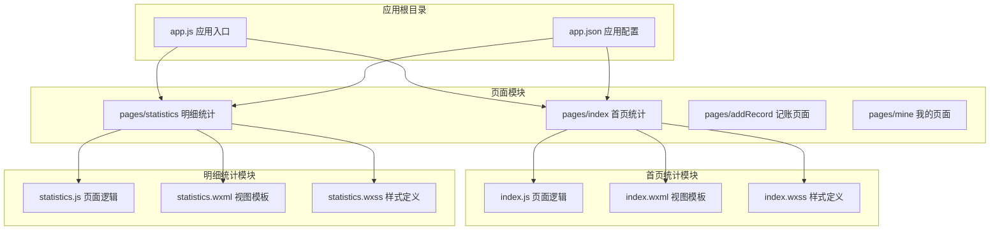
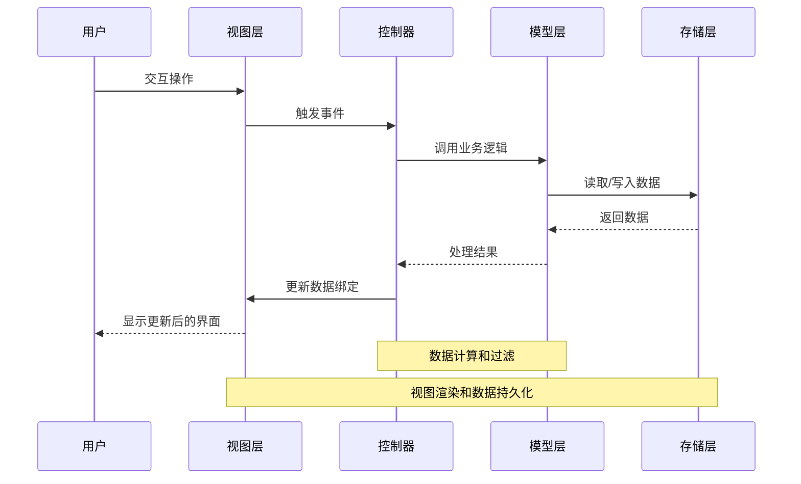
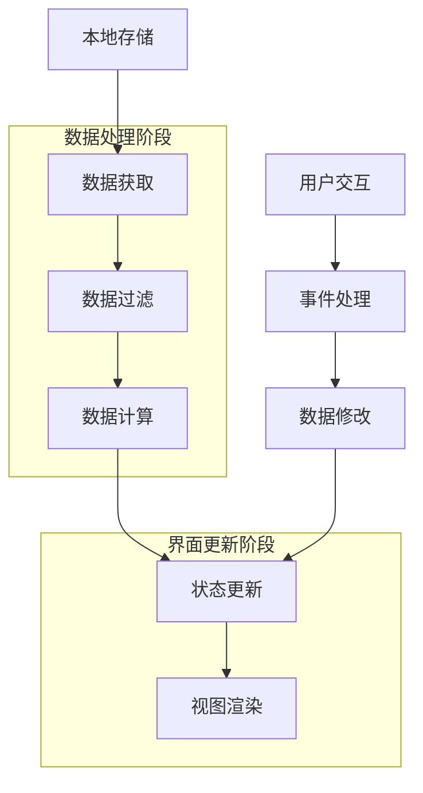
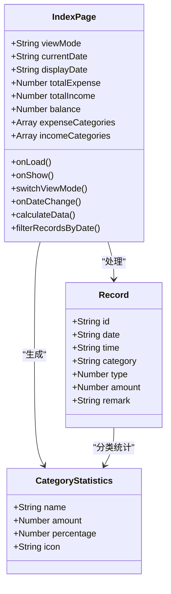
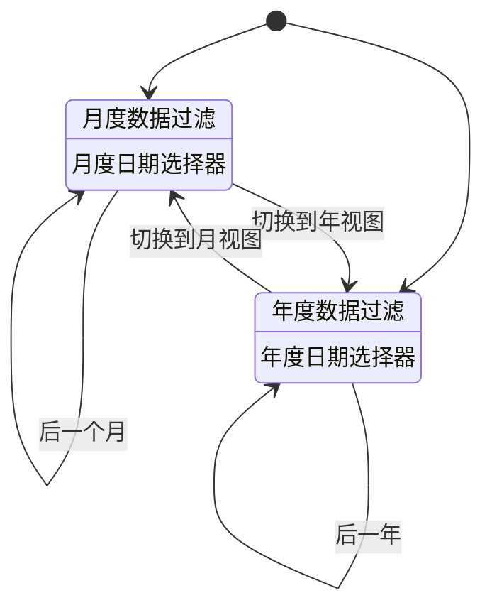
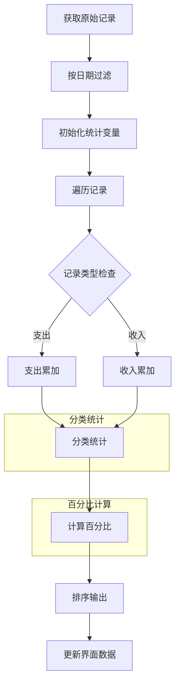
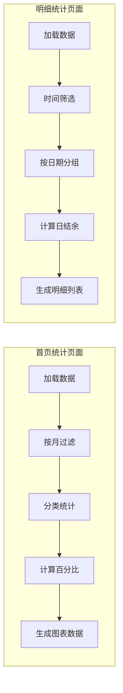
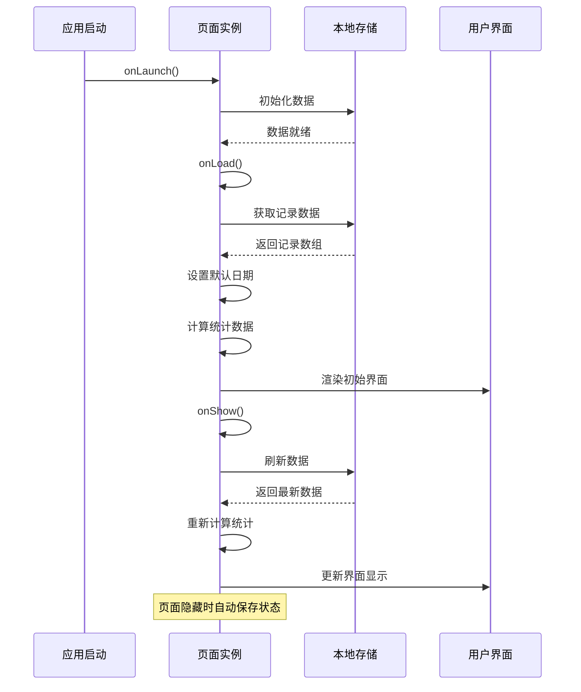
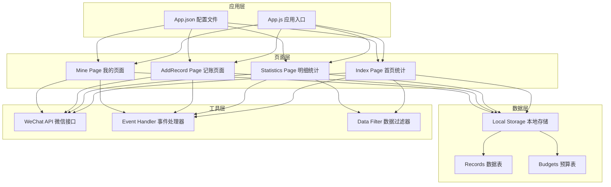

# 首页统计页面

<cite>
**本文档引用的文件**
- [index.js](file://pages/index/index.js)
- [index.wxml](file://pages/index/index.wxml)
- [index.wxss](file://pages/index/index.wxss)
- [statistics.js](file://pages/statistics/statistics.js)
- [statistics.wxml](file://pages/statistics/statistics.wxml)
- [statistics.wxss](file://pages/statistics/statistics.wxss)
- [app.js](file://app.js)
- [app.json](file://app.json)
</cite>

## 目录
1. [简介](#简介)
2. [项目结构](#项目结构)
3. [核心组件](#核心组件)
4. [架构概览](#架构概览)
5. [详细组件分析](#详细组件分析)
6. [依赖关系分析](#依赖关系分析)
7. [性能考虑](#性能考虑)
8. [故障排除指南](#故障排除指南)
9. [结论](#结论)

## 简介

首页统计页面是 Miaobill 记账小程序的核心功能模块，主要负责提供直观的财务数据可视化和统计分析。该页面实现了月度/年度视图切换、收支计算、分类统计和余额显示等核心功能，为用户提供全面的财务管理概览。

页面采用微信小程序原生框架开发，通过数据绑定机制实现实时更新，结合事件处理逻辑提供流畅的用户体验。系统支持本地数据存储，确保用户数据的安全性和离线可用性。

## 项目结构

Miaobill 项目采用模块化组织方式，首页统计页面位于 `pages/index` 目录下，与明细统计页面形成完整的统计分析体系。

**图表来源**
- [app.js:1-24](file://app.js#L1-L24)
- [app.json:1-39](file://app.json#L1-L39)
- [index.js:1-189](file://pages/index/index.js#L1-L189)
- [statistics.js:1-160](file://pages/statistics/statistics.js#L1-L160)

**章节来源**
- [app.js:1-24](file://app.js#L1-L24)
- [app.json:1-39](file://app.json#L1-L39)

## 核心组件

首页统计页面由三个核心组件构成：数据管理组件、视图展示组件和样式控制组件。每个组件都有明确的职责分工和协作关系。

### 数据管理组件

数据管理组件负责处理所有业务逻辑，包括数据获取、过滤、计算和状态管理。该组件采用 Page 构造函数模式，提供了完整的生命周期管理和事件处理机制。

### 视图展示组件

视图展示组件使用 WXML 模板语言构建用户界面，实现了响应式的布局设计和动态内容渲染。组件支持多种视图模式，包括月度和年度统计视图。

### 样式控制组件

样式控制组件采用 WXSS 语法，提供了丰富的视觉效果和动画过渡。组件支持渐变色彩、阴影效果和响应式设计，确保在不同设备上的良好显示效果。

**章节来源**
- [index.js:1-189](file://pages/index/index.js#L1-L189)
- [index.wxml:1-120](file://pages/index/index.wxml#L1-L120)
- [index.wxss:1-257](file://pages/index/index.wxss#L1-L257)

## 架构概览

首页统计页面采用 MVVM 架构模式，实现了数据层、视图层和控制层的有效分离。系统通过数据绑定机制实现双向数据同步，确保界面状态与业务数据的一致性。

**图表来源**
- [index.js:102-170](file://pages/index/index.js#L102-L170)
- [index.js:172-188](file://pages/index/index.js#L172-L188)

### 数据流架构

页面的数据流遵循单向数据流原则，从存储层到视图层的完整路径确保了数据的一致性和可预测性。

**图表来源**
- [index.js:102-188](file://pages/index/index.js#L102-L188)

## 详细组件分析

### 首页统计页面核心功能

首页统计页面实现了完整的财务数据分析功能，包括实时收支统计、分类占比分析和趋势展示。

#### 数据绑定机制

页面采用微信小程序的双向数据绑定机制，通过 setData 方法实现数据与视图的自动同步。数据绑定机制确保了界面状态的实时更新和用户交互的即时反馈。

**图表来源**
- [index.js:2-11](file://pages/index/index.js#L2-L11)
- [index.js:102-170](file://pages/index/index.js#L102-L170)

#### 月度/年度视图切换

页面支持灵活的视图切换功能，用户可以通过点击切换按钮在月度视图和年度视图之间自由切换。视图切换不仅改变了显示范围，还影响了日期选择器的行为和数据过滤逻辑。

**图表来源**
- [index.js:29-87](file://pages/index/index.js#L29-L87)
- [index.js:89-100](file://pages/index/index.js#L89-L100)

#### 收支计算算法

页面实现了精确的收支计算算法，支持多种数据类型的处理和边界情况的处理。计算过程包括数据过滤、金额累加、分类统计和百分比计算。

**图表来源**
- [index.js:102-170](file://pages/index/index.js#L102-L170)

**章节来源**
- [index.js:102-188](file://pages/index/index.js#L102-L188)

### 明细统计页面对比分析

为了更好地理解首页统计页面的功能特性，我们将其与明细统计页面进行对比分析。

#### 功能差异对比

| 功能特性 | 首页统计页面 | 明细统计页面 |
|---------|-------------|-------------|
| 视图模式 | 月度/年度切换 | 时间筛选（全部/今日/本周/本月） |
| 统计维度 | 分类占比分析 | 日期分组明细 |
| 数据展示 | 概览信息 | 详细记录列表 |
| 交互方式 | 导航切换 | 时间筛选 |

#### 数据处理流程对比

**图表来源**
- [index.js:102-188](file://pages/index/index.js#L102-L188)
- [statistics.js:19-32](file://pages/statistics/statistics.js#L19-L32)

**章节来源**
- [statistics.js:19-160](file://pages/statistics/statistics.js#L19-L160)

### 页面生命周期管理

首页统计页面充分利用了微信小程序的生命周期钩子函数，实现了高效的页面管理和资源优化。

#### 生命周期函数详解

**图表来源**
- [index.js:13-27](file://pages/index/index.js#L13-L27)
- [app.js:7-19](file://app.js#L7-L19)

#### 最佳实践建议

1. **数据缓存策略**：在页面显示时刷新数据，在页面隐藏时保持当前状态
2. **内存管理**：避免在页面生命周期中创建不必要的全局变量
3. **性能优化**：对大量数据的计算操作进行节流处理
4. **错误处理**：对本地存储访问失败的情况进行降级处理

**章节来源**
- [index.js:13-27](file://pages/index/index.js#L13-L27)
- [app.js:7-19](file://app.js#L7-L19)

## 依赖关系分析

首页统计页面与其他模块存在紧密的依赖关系，形成了完整的应用生态系统。

**图表来源**
- [app.js:1-24](file://app.js#L1-L24)
- [app.json:1-39](file://app.json#L1-L39)
- [index.js:102-188](file://pages/index/index.js#L102-L188)
- [statistics.js:19-32](file://pages/statistics/statistics.js#L19-L32)

### 外部依赖分析

页面主要依赖微信小程序平台提供的 API 和本地存储服务。这些依赖关系确保了页面功能的完整性和跨平台兼容性。

**章节来源**
- [app.js:1-24](file://app.js#L1-L24)
- [app.json:1-39](file://app.json#L1-L39)

## 性能考虑

首页统计页面在设计时充分考虑了性能优化，采用了多种策略来提升用户体验和运行效率。

### 数据处理优化

1. **懒加载策略**：只在需要时才进行数据计算和过滤操作
2. **缓存机制**：利用 setData 的数据绑定特性减少重复渲染
3. **批量更新**：通过一次 setData 调用更新多个数据字段

### 内存管理优化

1. **对象复用**：避免频繁创建和销毁临时对象
2. **循环优化**：使用高效的循环结构处理大量数据
3. **垃圾回收**：及时释放不再使用的变量和引用

### 界面渲染优化

1. **条件渲染**：使用 wx:if 条件渲染减少 DOM 节点数量
2. **虚拟列表**：对于大量数据采用虚拟滚动技术
3. **图片优化**：使用合适的图片格式和尺寸

## 故障排除指南

### 常见问题及解决方案

#### 数据显示异常

**问题描述**：页面显示的统计数据不正确或出现 NaN 值

**可能原因**：
1. 本地存储中的数据格式不正确
2. 记录数据缺少必要的字段
3. 数值转换过程中出现异常

**解决步骤**：
1. 检查本地存储中的 records 数据格式
2. 验证每条记录都包含必需的字段
3. 添加数据验证和异常处理逻辑

#### 图表渲染问题

**问题描述**：分类统计图表无法正常显示或显示异常

**可能原因**：
1. 分类数据为空或格式不正确
2. 百分比计算出现除零错误
3. 图标映射表缺失对应的分类

**解决步骤**：
1. 确保分类统计数据非空且格式正确
2. 添加除零保护和边界值检查
3. 完善图标映射表的覆盖范围

#### 性能问题

**问题描述**：页面加载缓慢或操作响应迟缓

**可能原因**：
1. 数据量过大导致计算耗时
2. 频繁的 setData 调用造成重绘
3. 未优化的循环和递归操作

**解决步骤**：
1. 实现数据分页和延迟加载
2. 合并多次 setData 调用
3. 使用更高效的数据结构和算法

**章节来源**
- [index.js:102-188](file://pages/index/index.js#L102-L188)

## 结论

首页统计页面作为 Miaobill 记账小程序的核心功能模块，成功实现了财务数据的可视化展示和智能分析。通过精心设计的数据绑定机制、事件处理逻辑和数据过滤算法，页面为用户提供了直观、准确的财务概览。

页面采用的 MVVM 架构模式和模块化设计理念，确保了系统的可维护性和扩展性。同时，完善的生命周期管理和性能优化策略，为用户提供了流畅的使用体验。

未来可以考虑的功能增强包括：图表交互功能、数据导出功能、多维度分析功能等，这些改进将进一步提升页面的价值和用户体验。