# 项目概述

<cite>
**本文档引用的文件**
- [app.js](file://app.js)
- [app.json](file://app.json)
- [project.config.json](file://project.config.json)
- [sitemap.json](file://sitemap.json)
- [pages/index/index.js](file://pages/index/index.js)
- [pages/index/index.wxml](file://pages/index/index.wxml)
- [pages/index/index.wxss](file://pages/index/index.wxss)
- [pages/addRecord/addRecord.js](file://pages/addRecord/addRecord.js)
- [pages/addRecord/addRecord.wxml](file://pages/addRecord/addRecord.wxml)
- [pages/statistics/statistics.js](file://pages/statistics/statistics.js)
- [pages/statistics/statistics.wxml](file://pages/statistics/statistics.wxml)
- [pages/budget/budget.js](file://pages/budget/budget.js)
- [pages/budget/budget.wxml](file://pages/budget/budget.wxml)
- [pages/mine/mine.js](file://pages/mine/mine.js)
- [pages/mine/mine.wxml](file://pages/mine/mine.wxml)
- [app.wxss](file://app.wxss)
</cite>

## 目录
1. [项目简介](#项目简介)
2. [项目结构](#项目结构)
3. [核心组件](#核心组件)
4. [架构概览](#架构概览)
5. [详细组件分析](#详细组件分析)
6. [依赖关系分析](#依赖关系分析)
7. [性能考虑](#性能考虑)
8. [故障排除指南](#故障排除指南)
9. [结论](#结论)

## 项目简介

杪记是一款基于微信小程序框架开发的个人记账应用，旨在为用户提供简洁易用的日常收支记录和数据分析功能。该项目采用原生小程序开发技术栈，通过本地存储实现数据持久化，为用户提供了完整的个人财务管理解决方案。

### 项目特色
- **简洁直观的用户体验**：采用绿色主题设计，提供流畅的交互体验
- **完整的财务管理体系**：涵盖记账、统计、预算管理、个人中心四大核心模块
- **本地化数据存储**：使用微信小程序本地存储API，确保数据安全性和隐私性
- **响应式布局设计**：适配不同尺寸的移动设备屏幕

## 项目结构

项目采用标准的微信小程序目录结构，按照功能模块进行组织：

```mermaid
graph TB
subgraph "项目根目录"
A[app.js 应用入口]
B[app.json 配置文件]
C[app.wxss 全局样式]
D[project.config.json 项目配置]
E[sitemap.json 站点地图]
end
subgraph "页面模块"
F[pages/]
subgraph "首页模块 pages/index/"]
F1[index.js 页面逻辑]
F2[index.wxml 视图结构]
F3[index.wxss 样式定义]
end
subgraph "记账模块 pages/addRecord/"]
G1[addRecord.js 页面逻辑]
G2[addRecord.wxml 视图结构]
G3[addRecord.wxss 样式定义]
end
subgraph "统计模块 pages/statistics/"]
H1[statistics.js 页面逻辑]
H2[statistics.wxml 视图结构]
H3[statistics.wxss 样式定义]
end
subgraph "预算模块 pages/budget/"]
I1[budget.js 页面逻辑]
I2[budget.wxml 视图结构]
I3[budget.wxss 样式定义]
end
subgraph "我的模块 pages/mine/"]
J1[mine.js 页面逻辑]
J2[mine.wxml 视图结构]
J3[mine.wxss 样式定义]
end
end
A --> F
B --> F
C --> F
D --> F
E --> F
```

**图表来源**
- [app.js:1-24](file://app.js#L1-L24)
- [app.json:1-39](file://app.json#L1-L39)
- [project.config.json:1-77](file://project.config.json#L1-L77)

### 技术架构特点
- **MVVM架构模式**：采用微信小程序的MVVM框架，实现数据驱动视图更新
- **模块化设计**：每个页面独立封装，职责清晰，便于维护和扩展
- **本地存储策略**：使用wx.setStorageSync和wx.getStorageSync实现数据持久化
- **响应式设计**：通过rpx单位实现跨设备适配

**章节来源**
- [app.json:1-39](file://app.json#L1-L39)
- [project.config.json:50-52](file://project.config.json#L50-L52)

## 核心组件

### 应用初始化系统
应用在启动时自动检查并初始化必要的数据存储结构，确保应用正常运行的基础环境。

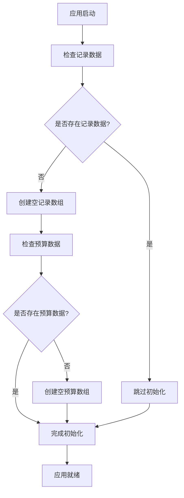

**图表来源**
- [app.js:7-19](file://app.js#L7-L19)

### 页面路由管理系统
应用采用底部导航栏的设计，提供四个主要功能模块的快速访问：

| 模块 | 页面路径 | 导航文本 | 功能描述 |
|------|----------|----------|----------|
| 统计明细 | pages/statistics/statistics | 明细 | 交易记录查看和筛选 |
| 图表分析 | pages/index/index | 图表 | 收支统计和分类分析 |
| 记账录入 | pages/addRecord/addRecord | 记账 | 日常收支记录录入 |
| 个人中心 | pages/mine/mine | 我的 | 用户信息和个人设置 |

**章节来源**
- [app.json:14-37](file://app.json#L14-L37)

## 架构概览

项目采用分层架构设计，从底层的数据存储到上层的用户界面，形成了清晰的技术层次：

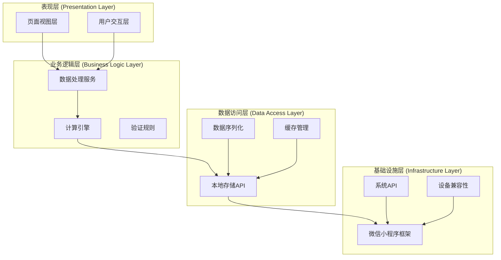

**图表来源**
- [app.js:1-24](file://app.js#L1-L24)
- [pages/index/index.js:102-170](file://pages/index/index.js#L102-L170)
- [pages/statistics/statistics.js:19-32](file://pages/statistics/statistics.js#L19-L32)

### 数据流架构
应用采用单向数据流的设计原则，确保数据的一致性和可预测性：

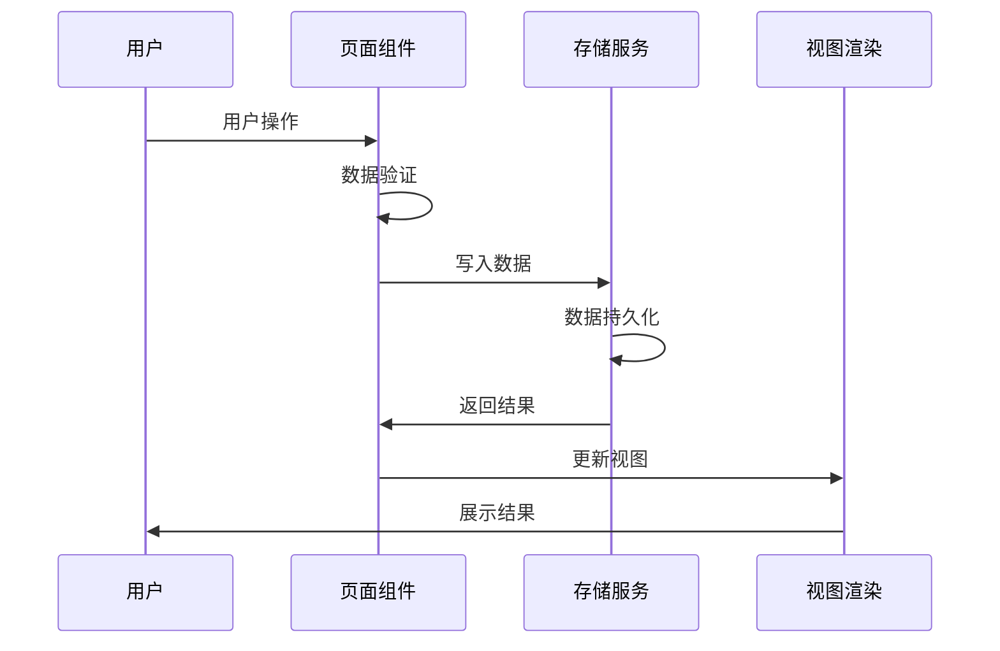

**图表来源**
- [pages/addRecord/addRecord.js:134-189](file://pages/addRecord/addRecord.js#L134-L189)
- [pages/statistics/statistics.js:19-32](file://pages/statistics/statistics.js#L19-L32)

## 详细组件分析

### 记账管理模块

记账管理模块是应用的核心功能之一，提供了完整的收支记录录入和管理能力。

#### 数据模型设计
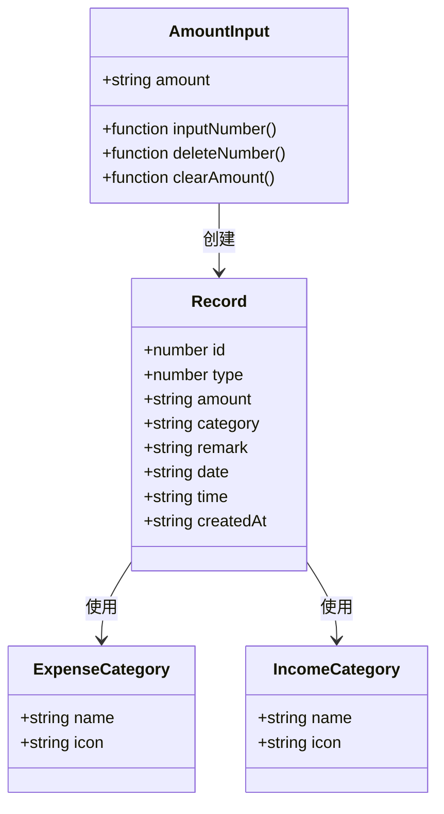

**图表来源**
- [pages/addRecord/addRecord.js:157-166](file://pages/addRecord/addRecord.js#L157-L166)
- [pages/addRecord/addRecord.js:12-30](file://pages/addRecord/addRecord.js#L12-L30)

#### 记账流程分析
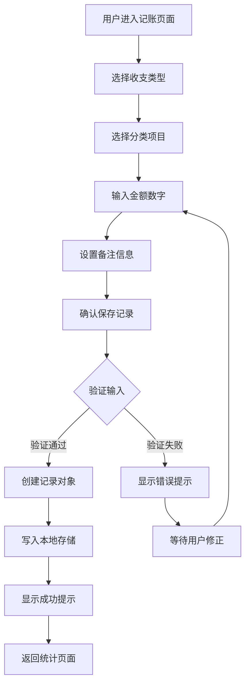

**图表来源**
- [pages/addRecord/addRecord.js:134-189](file://pages/addRecord/addRecord.js#L134-L189)
- [pages/addRecord/addRecord.js:64-95](file://pages/addRecord/addRecord.js#L64-L95)

**章节来源**
- [pages/addRecord/addRecord.js:1-190](file://pages/addRecord/addRecord.js#L1-L190)

### 数据统计模块

统计模块提供了丰富的数据分析功能，帮助用户了解自己的财务状况。

#### 统计算法实现
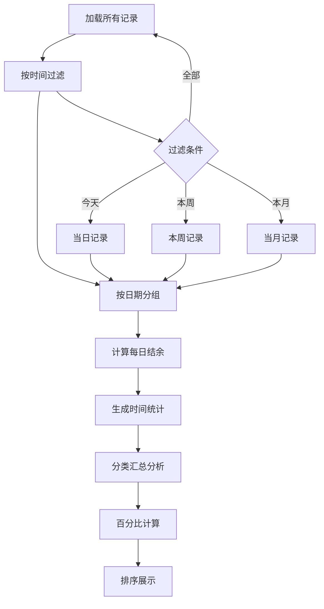

**图表来源**
- [pages/statistics/statistics.js:42-70](file://pages/statistics/statistics.js#L42-L70)
- [pages/statistics/statistics.js:72-107](file://pages/statistics/statistics.js#L72-L107)

#### 数据可视化设计
统计模块采用卡片式布局，提供直观的财务数据展示：

| 统计维度 | 数据指标 | 展示方式 |
|----------|----------|----------|
| 总体概览 | 收入、支出、结余 | 统计卡片 |
| 分类分析 | 各分类占比 | 进度条图表 |
| 时间趋势 | 月度统计 | 数字展示 |
| 日常明细 | 交易记录 | 列表分组 |

**章节来源**
- [pages/statistics/statistics.js:1-160](file://pages/statistics/statistics.js#L1-L160)

### 预算管理模块

预算管理模块为用户提供了财务规划和控制能力，帮助用户建立健康的消费习惯。

#### 预算计算逻辑
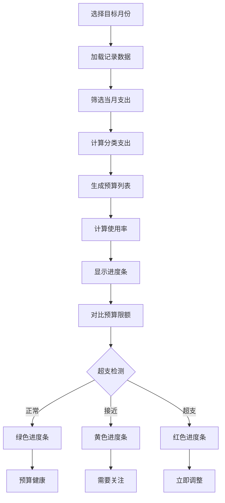

**图表来源**
- [pages/budget/budget.js:43-94](file://pages/budget/budget.js#L43-L94)
- [pages/budget/budget.js:67-82](file://pages/budget/budget.js#L67-L82)

#### 预算提醒机制
预算模块实现了智能提醒功能，帮助用户及时了解预算执行情况：

| 提醒阈值 | 触发条件 | 提醒状态 |
|----------|----------|----------|
| 50% | 使用率达到50% | 温馨提醒 |
| 60% | 使用率达到60% | 注意控制 |
| 70% | 使用率达到70% | 需要关注 |
| 80% | 使用率达到80% | 警告信号 |
| 90% | 使用率达到90% | 紧急提醒 |
| 100% | 超出预算限制 | 超支警告 |

**章节来源**
- [pages/budget/budget.js:1-182](file://pages/budget/budget.js#L1-L182)

### 个人中心模块

个人中心模块提供了用户信息管理和应用设置功能。

#### 用户统计功能
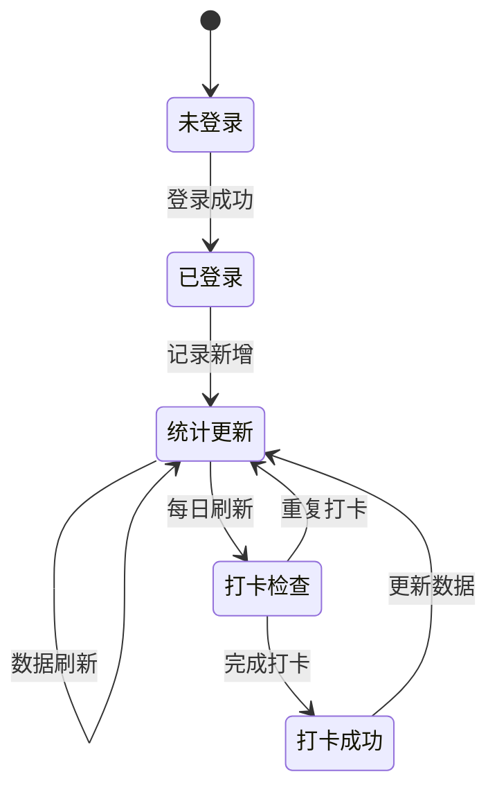

**图表来源**
- [pages/mine/mine.js:49-84](file://pages/mine/mine.js#L49-L84)
- [pages/mine/mine.js:120-167](file://pages/mine/mine.js#L120-L167)

#### 功能扩展预留
个人中心模块采用了模块化设计，为未来的功能扩展预留了接口：

| 功能类别 | 当前状态 | 开发状态 |
|----------|----------|----------|
| 用户登录 | 基础登录 | 完成 |
| 打卡签到 | 日常统计 | 完成 |
| VIP升级 | 功能预留 | 开发中 |
| 消息通知 | 功能预留 | 开发中 |
| 徽章系统 | 功能预留 | 开发中 |
| 积分体系 | 功能预留 | 开发中 |
| 设置管理 | 功能预留 | 开发中 |

**章节来源**
- [pages/mine/mine.js:1-257](file://pages/mine/mine.js#L1-L257)

## 依赖关系分析

### 模块间依赖关系
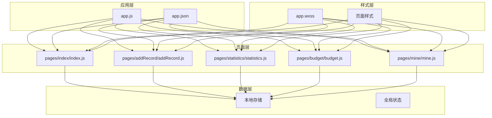

**图表来源**
- [app.js:1-24](file://app.js#L1-L24)
- [app.json:2-7](file://app.json#L2-L7)

### 数据依赖分析
应用采用松耦合的数据设计，各模块通过统一的存储接口进行数据交互：

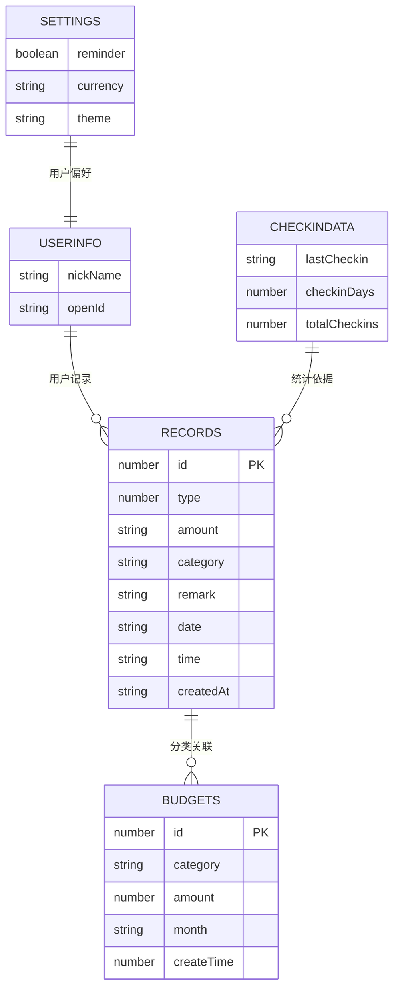

**图表来源**
- [pages/addRecord/addRecord.js:168-170](file://pages/addRecord/addRecord.js#L168-L170)
- [pages/budget/budget.js:123-146](file://pages/budget/budget.js#L123-L146)

**章节来源**
- [pages/index/index.js:102-170](file://pages/index/index.js#L102-L170)
- [pages/statistics/statistics.js:19-32](file://pages/statistics/statistics.js#L19-L32)

## 性能考虑

### 数据存储优化
应用采用本地存储策略，在保证数据安全性的同时优化了访问性能：

- **批量读取**：避免频繁的存储操作，减少I/O开销
- **数据缓存**：利用小程序的内存缓存机制提升响应速度
- **懒加载**：按需加载数据，减少初始加载时间

### 用户体验优化
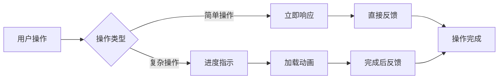

### 内存管理策略
- **及时清理**：页面卸载时清理不必要的数据引用
- **数据压缩**：对大量数据进行适当的压缩处理
- **异步处理**：耗时操作采用异步执行，避免阻塞UI线程

## 故障排除指南

### 常见问题诊断

#### 数据加载异常
**症状**：页面显示空白或数据不更新
**可能原因**：
- 本地存储损坏
- 数据格式不正确
- 权限问题

**解决方法**：
1. 检查本地存储状态
2. 重置应用数据
3. 重新登录

#### 记账功能异常
**症状**：无法保存记录或保存后不显示
**可能原因**：
- 金额输入格式错误
- 分类选择缺失
- 存储权限问题

**解决方法**：
1. 检查金额输入格式
2. 确认分类选择
3. 重新授权存储权限

#### 统计数据显示异常
**症状**：统计数据不准确或显示错误
**可能原因**：
- 时间过滤逻辑错误
- 数据计算异常
- 缓存数据过期

**解决方法**：
1. 刷新页面数据
2. 检查时间选择
3. 清除应用缓存

**章节来源**
- [pages/addRecord/addRecord.js:134-151](file://pages/addRecord/addRecord.js#L134-L151)
- [pages/statistics/statistics.js:42-70](file://pages/statistics/statistics.js#L42-L70)

## 结论

杪记小程序项目展现了优秀的软件工程实践，通过合理的架构设计和模块化开发，构建了一个功能完善、用户体验良好的个人记账应用。

### 项目优势
- **架构清晰**：采用分层设计，职责分离明确
- **扩展性强**：模块化结构便于功能扩展和维护
- **用户体验佳**：简洁直观的界面设计和流畅的操作体验
- **技术选型合理**：基于微信小程序框架，充分利用平台特性

### 技术亮点
- **数据驱动**：MVVM架构确保了数据的一致性和可维护性
- **本地化存储**：充分利用小程序本地存储能力，确保数据安全
- **响应式设计**：适配多种设备屏幕，提供一致的用户体验
- **渐进式功能**：预留扩展接口，支持未来功能增强

### 发展建议
1. **功能完善**：逐步实现个人中心的预留功能
2. **性能优化**：针对大数据量场景进行性能优化
3. **数据备份**：考虑增加数据导出和备份功能
4. **多端支持**：探索微信小程序云开发能力

该项目为微信小程序开发提供了良好的实践范例，无论是对于初学者还是有经验的开发者都具有重要的参考价值。