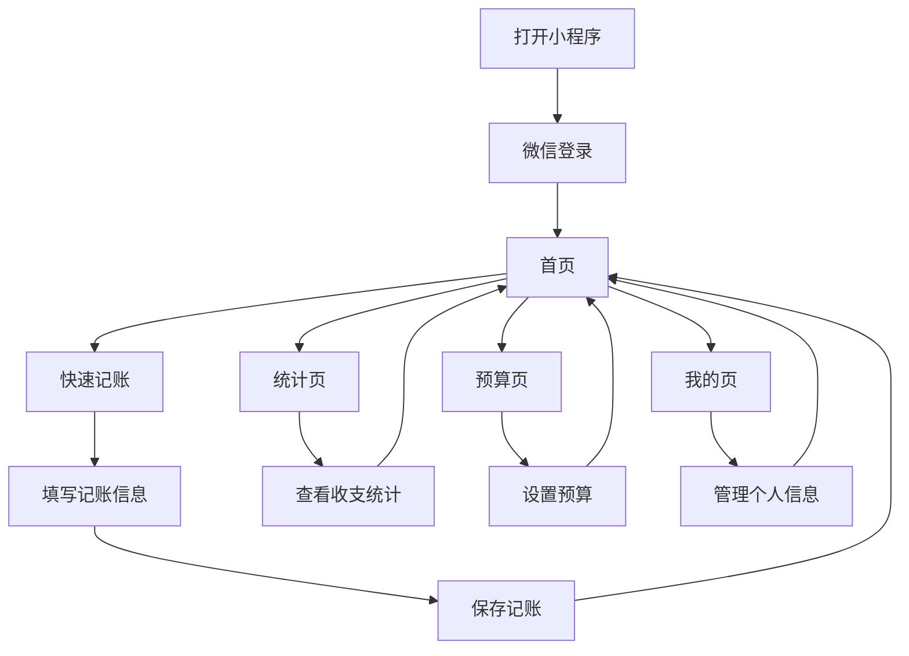

## 1. 产品概述
鲨鱼记账微信小程序是一个简洁易用的个人记账工具，帮助用户记录日常收支并提供数据分析功能。
- 主要用途：记录日常收支、查看消费统计、管理预算、导出数据
- 目标用户：需要管理个人财务的普通用户，注重简单易用的记账体验
- 市场价值：为用户提供便捷的财务管理工具，帮助用户养成良好的消费习惯

## 2. 核心功能

### 2.1 用户角色
| 角色 | 注册方式 | 核心权限 |
|------|---------|----------|
| 普通用户 | 微信登录 | 记录收支、查看统计、管理预算、导出数据 |

### 2.2 功能模块
1. **首页**：快速记账、收支概览、最近交易记录
2. **统计页**：收支统计图表、分类分析、月度对比
3. **预算页**：设置预算、预算使用情况、预算提醒
4. **我的页**：个人信息、数据管理、设置

### 2.3 页面详情
| 页面名称 | 模块名称 | 功能描述 |
|---------|---------|----------|
| 首页 | 快速记账 | 点击记账按钮进入记账页面，选择收支类型、金额、分类、日期、备注 |
| 首页 | 收支概览 | 显示当日、当月收支总额，收支对比
| 首页 | 最近交易 | 显示最近5-10条交易记录，包含金额、分类、日期 |
| 统计页 | 收支统计图表 | 饼图显示分类占比，折线图显示月度趋势
| 统计页 | 分类分析 | 按分类查看收支详情，支持筛选时间范围
| 统计页 | 月度对比 | 对比不同月份的收支情况
| 预算页 | 设置预算 | 为不同分类设置月度预算
| 预算页 | 预算使用情况 | 显示预算使用百分比，超预算提醒
| 预算页 | 预算提醒 | 当预算使用达到一定比例时发送提醒
| 我的页 | 个人信息 | 显示用户头像、昵称，支持修改个人信息
| 我的页 | 数据管理 | 导出数据、清除数据、备份数据
| 我的页 | 设置 | 记账提醒、货币单位、主题设置

## 3. 核心流程
用户打开小程序 → 微信登录 → 进入首页 → 点击记账按钮 → 填写记账信息 → 保存 → 查看统计分析 → 管理预算

## 4. 用户界面设计
### 4.1 设计风格
- 主色调：蓝色系 (#1E88E5) 和白色 (#FFFFFF)
- 辅助色：绿色 (#4CAF50) 表示收入，红色 (#F44336) 表示支出
- 按钮风格：圆角按钮，有轻微的阴影效果
- 字体：系统默认字体，标题 16-18px，正文 14px，辅助文字 12px
- 布局风格：卡片式布局，顶部导航栏，底部标签栏
- 图标风格：简约线性图标，搭配少量填充图标

### 4.2 页面设计概览
| 页面名称 | 模块名称 | UI元素 |
|---------|---------|--------|
| 首页 | 快速记账 | 底部中央突出的记账按钮，点击后弹出记账表单，包含金额输入、分类选择、日期选择、备注输入 |
| 首页 | 收支概览 | 顶部卡片显示当日和当月收支，使用对比色区分收入和支出 |
| 首页 | 最近交易 | 列表形式显示最近交易，每条包含分类图标、名称、金额、日期 |
| 统计页 | 收支统计图表 | 饼图显示分类占比，折线图显示月度趋势，支持切换查看方式 |
| 统计页 | 分类分析 | 列表形式显示各分类收支，包含占比、金额，支持点击查看详情 |
| 统计页 | 月度对比 | 柱状图显示不同月份收支对比，支持左右滑动查看 |
| 预算页 | 设置预算 | 列表形式显示各分类，支持点击设置预算金额 |
| 预算页 | 预算使用情况 | 进度条显示预算使用百分比，超预算时显示警告色 |
| 预算页 | 预算提醒 | 开关按钮控制提醒功能，设置提醒阈值 |
| 我的页 | 个人信息 | 顶部显示用户头像、昵称，点击可修改 |
| 我的页 | 数据管理 | 列表项包含导出数据、清除数据、备份数据功能 |
| 我的页 | 设置 | 列表项包含记账提醒、货币单位、主题设置等功能 |

### 4.3 响应式设计
- 移动端优先设计，适配不同尺寸的手机屏幕
- 触摸优化，按钮和可点击区域大小适合手指点击
- 横屏模式下自动调整布局，保持良好的用户体验

### 4.4 3D场景指导
- 无3D场景需求