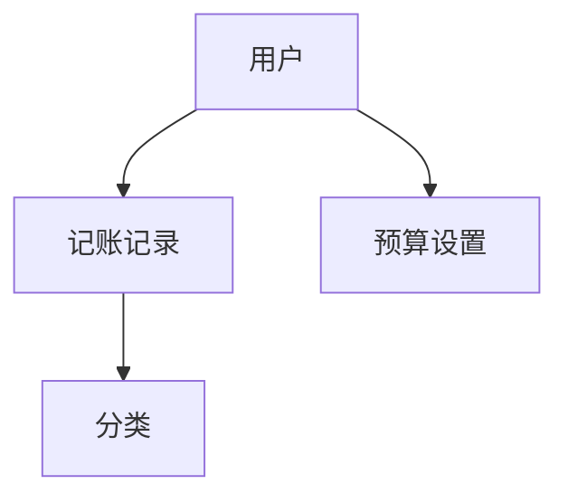

## 1. 架构设计
```mermaid
graph TD
  A[微信小程序前端] --> B[本地存储]
  A --> C[API接口层]
  C --> D[后端服务] (后续开发)
  D --> E[数据库]
```

## 2. 技术描述
- 前端：微信小程序原生开发 + Tailwind CSS
- 初始化工具：微信开发者工具
- 后端：None (后续开发)
- 数据存储：微信小程序本地存储 (wx.setStorageSync/wx.getStorageSync)
- 图表库：ECharts 或 wx-charts

## 3. 页面路由定义
| 页面路径 | 页面名称 | 用途 |
|---------|---------|------|
| /pages/index/index | 首页 | 快速记账、收支概览、最近交易记录 |
| /pages/statistics/statistics | 统计页 | 收支统计图表、分类分析、月度对比 |
| /pages/budget/budget | 预算页 | 设置预算、预算使用情况、预算提醒 |
| /pages/mine/mine | 我的页 | 个人信息、数据管理、设置 |
| /pages/addRecord/addRecord | 记账页 | 填写记账信息 |

## 4. API定义 (后续开发)
- 暂无API定义，后续开发后端服务时添加

## 5. 服务器架构图 (后续开发)
- 暂无服务器架构图，后续开发后端服务时添加

## 6. 数据模型
### 6.1 数据模型定义


### 6.2 数据结构
#### 记账记录
```javascript
{
  id: String,           // 唯一标识符
  type: Number,         // 类型：1-收入，2-支出
  amount: Number,       // 金额
  category: String,     // 分类
  categoryIcon: String, // 分类图标
  date: String,         // 日期，格式：YYYY-MM-DD
  time: String,         // 时间，格式：HH:MM
  remark: String,       // 备注
  createTime: Number    // 创建时间戳
}
```

#### 预算设置
```javascript
{
  category: String,     // 分类
  amount: Number,       // 预算金额
  month: String,        // 月份，格式：YYYY-MM
  createTime: Number    // 创建时间戳
}
```

#### 分类
```javascript
[
  // 收入分类
  { name: '工资', icon: 'wallet', type: 1 },
  { name: '奖金', icon: 'star', type: 1 },
  { name: '投资', icon: 'trending-up', type: 1 },
  { name: '其他', icon: 'plus-circle', type: 1 },
  
  // 支出分类
  { name: '餐饮', icon: 'coffee', type: 2 },
  { name: '交通', icon: 'car', type: 2 },
  { name: '购物', icon: 'shopping-bag', type: 2 },
  { name: '娱乐', icon: 'film', type: 2 },
  { name: '医疗', icon: 'heart', type: 2 },
  { name: '教育', icon: 'book', type: 2 },
  { name: '住房', icon: 'home', type: 2 },
  { name: '其他', icon: 'more-horizontal', type: 2 }
]
```